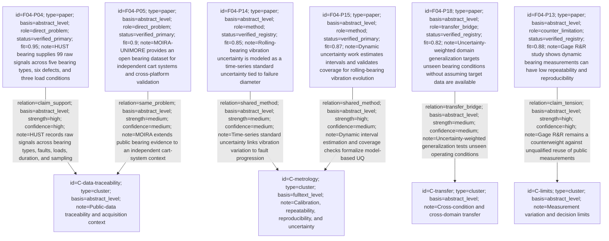

# F04 M1.2 Evidence Map

Lineage: `f04-public-bearing-measurement-uq-2026-08-06`
Topic: public rolling-bearing vibration data measurement, calibration, repeatability, reproducibility, and measurement uncertainty/UQ.

This map is a static evidence map generated from the accepted M1.2 bundle. Paper nodes are connected to evidence clusters; the `basis` field records metadata-, abstract-, or full-text-level reasoning. The JSON bundle contains the complete text fallback and the candidate-level verification ledger.

## Round 1: broad calibration

```mermaid
flowchart TD
  n0["id=F04-P01; type=paper; basis=abstract_level; role=direct_problem; status=verified_registry; fit=0.98; note=Open PoliTO bearing-rig data expose speed/load/damage regimes and an endurance acquisition"]
  n1["id=F04-P02; type=paper; basis=fulltext_level; role=direct_problem; status=verified_primary; fit=0.96; note=Ottawa open data link raw vibration to load, speed, temperature, sensor placement, and repeated bearing runs"]
  n2["id=F04-P03; type=paper; basis=abstract_level; role=direct_problem; status=verified_primary; fit=0.93; note=Rotating-machine data cover bearing faults, loads, sensor channels, units, and acquisition sampling"]
  n3["id=F04-P11; type=paper; basis=abstract_level; role=method; status=verified_primary; fit=0.9; note=Calibration study quantifies vibration uncertainty over 5 Hz to 10 kHz and links it to traceability"]
  n4["id=F04-P12; type=paper; basis=fulltext_level; role=method; status=verified_primary; fit=0.92; note=Bearing quality-control study separates clamp repeatability, refit reproducibility, sensor position, and band limits"]
  n5["id=F04-P06; type=paper; basis=abstract_level; role=transfer_bridge; status=verified_primary; fit=0.84; note=Wind-turbine bearing data combine accelerometers, tachometer, temperature, and environmental variation"]
  n6["id=F04-P17; type=paper; basis=abstract_level; role=transfer_bridge; status=verified_registry; fit=0.78; note=Cross-domain bearing diagnosis makes operating-condition distribution shift an explicit generalization boundary"]
  n7["id=F04-P13; type=paper; basis=abstract_level; role=counter_limitation; status=verified_registry; fit=0.88; note=Gage R&amp;R study shows dynamic bearing measurements can have low repeatability and reproducibility"]
  n8["id=C-data-traceability; type=cluster; basis=abstract_level; note=Public-data traceability and acquisition context"]
  n9["id=C-metrology; type=cluster; basis=fulltext_level; note=Calibration, repeatability, reproducibility, and uncertainty"]
  n10["id=C-transfer; type=cluster; basis=abstract_level; note=Cross-condition and cross-domain transfer"]
  n11["id=C-limits; type=cluster; basis=abstract_level; note=Measurement variation and decision limits"]
  n0 -- "relation=same_problem; basis=abstract_level; strength=medium; confidence=high; note=Open public rig data make speed, load, damage, and endurance context auditable" --> n8
  n1 -- "relation=same_problem; basis=fulltext_level; strength=high; confidence=high; note=Raw and processed records expose sensors, units, sampling, and replicated bearing runs" --> n8
  n2 -- "relation=same_problem; basis=abstract_level; strength=medium; confidence=high; note=Multi-sensor rotating-machine data expose load-dependent acquisition context" --> n8
  n3 -- "relation=shared_method; basis=abstract_level; strength=high; confidence=high; note=Calibration and uncertainty budgeting supply a traceability method bridge" --> n9
  n4 -- "relation=shared_method; basis=fulltext_level; strength=high; confidence=high; note=R&amp;R decomposes clamp, refit, sensor position, and frequency-band variation" --> n9
  n5 -- "relation=transfer_bridge; basis=abstract_level; strength=medium; confidence=medium; note=Heterogeneous sensors and environmental variation form a non-identical transfer context" --> n10
  n6 -- "relation=transfer_bridge; basis=abstract_level; strength=medium; confidence=medium; note=Cross-domain studies expose operating-condition distribution shift" --> n10
  n7 -- "relation=claim_tension; basis=abstract_level; strength=high; confidence=high; note=Gage R&amp;R identifies low repeatability and reproducibility as a decision limit" --> n11
```

Round 1 selected IDs: `F04-P01`, `F04-P02`, `F04-P03`, `F04-P11`, `F04-P12`, `F04-P06`, `F04-P17`, `F04-P13`.

## Round 2: feedback-calibrated narrowing

Round 2 selected IDs: `F04-P04`, `F04-P05`, `F04-P14`, `F04-P15`, `F04-P18`, `F04-P13`.

## Interpretation boundary

The map supports a measurement-provenance and uncertainty-screening direction, but it does not establish that any public dataset is calibrated to a common traceable standard. Missing calibration certificates, sensor mounting details, repeat-run pairs, and compatible frequency bands remain explicit gates. Transfer links are hypotheses until a target-domain decisive test is confirmed by the user.
