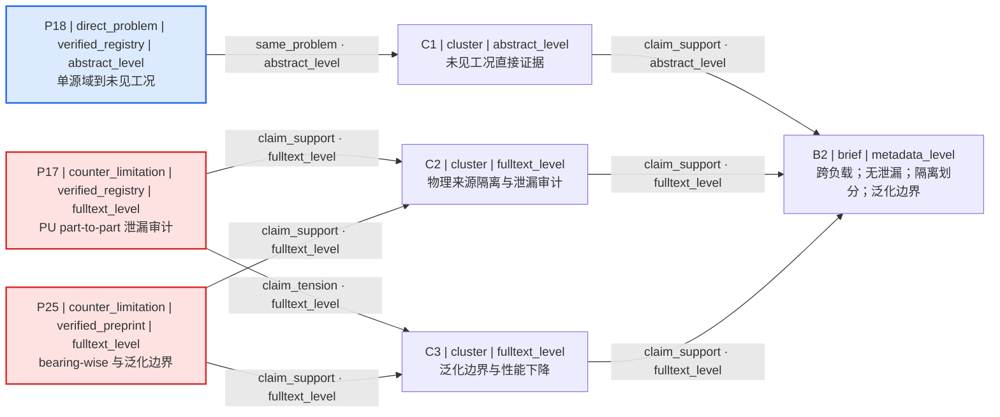

# M1 Case B clean second-round forward test — rerun 2

- 基线 commit: `123a03779d001198c895e60949fa7b9c53e2f56d`
- 执行分支: 当前工作树（未提交）
- 冻结 prior 来源: `evals/m1/results/2026-08-04-bearing-fault.md`
- 冻结读取范围: 仅第 `1–215` 行；未读取第 216 行及以后
- 第二轮权威核验窗口（北京时间）: `2026-08-04T19:28:20.6672107+08:00` 至 `2026-08-04T19:32:45.3964721+08:00`
- 本文件定稿时间（北京时间）: `2026-08-04T19:33:41.3281906+08:00`
- 工作流: `multi-source-search` + `citation-verification`
- 最终状态: `WAITING_FOR_EVIDENCE_DECISION`
- 最终分类: `evidence_incomplete`

## 唯一新增用户输入（原样）

> 第二轮请明确排除依赖随机切分造成数据泄漏的研究设计，也不要把单一工况下的高准确率当作主要适配证据。优先保留能支持跨负载评估、按工况或设备隔离划分以及泛化边界分析的证据。请显示这些要求如何改变检索计划和第一轮论文的处置。

## 输入与执行边界

- 继承自冻结 prior 的对象、数据和资源边界：滚动轴承；CWRU 与 PU 公开振动数据；无试验台；单 GPU；10 周；排除私有数据与复杂硬件依赖。
- 第一轮冻结入选 ID：`P1, P2, P3, P8, P9, P6, P7, P17`。
- 第一轮可见部分没有 `SearchPlan` 原文；未读取禁区来恢复它。第二轮查询全部作为新增查询，`before` 留空，并显式重置不可见的旧查询表达式。
- 搜索结果、普通网页和 SciSpace 摘要仅用于发现。候选进入池前必须有当前 Crossref 或 arXiv 官方记录；推理 basis 另行按实际打开的摘要或全文标注。
- 未读取 `evals/m1/forward-cases.md`、`forward-audit.md`、任何 `*rerun*.md` 或其他 case 文件。
- 未进入方向排序、方向卡、实验路线、模型下载、服务、RRC、M2 或 M3。

## FeedbackDelta

```yaml
feedback_delta:
  from_brief_version: 1
  to_brief_version: 2
  inherited:
    - "滚动轴承故障诊断"
    - "仅使用 CWRU 与 PU 等公开振动数据"
    - "无试验台，不依赖新增实验采集"
    - "单张 GPU，10 周"
    - "排除私有数据和复杂硬件依赖"
    - "重点关注跨负载泛化"
  rejected:
    - object_id: "random-split-dependent-designs"
      reason: "明确排除依赖随机切分、随机窗口或同一物理轴承/采集运行跨训练与测试而造成数据泄漏的研究设计"
    - object_id: "single-condition-high-accuracy-as-primary-fit"
      reason: "不把单一工况内的高准确率当作主要适配证据"
  reset:
    - object_id: "round-one-query-expressions"
      reason: "冻结可读范围未包含第一轮 SearchPlan；不推测旧查询原文，第二轮以新增、可追溯查询取代"
    - object_id: "round-one-title-level-fit"
      reason: "第一轮 metadata_level 的题名相关性不足以判定隔离划分、泄漏控制或泛化边界"
  added:
    - object_id: "leakage-free-split-gate"
      value: "推荐资格要求不得依赖随机切分造成的数据泄漏"
    - object_id: "cross-load-evaluation-priority"
      value: "优先跨负载或未见工况评估"
    - object_id: "condition-or-device-isolation-priority"
      value: "优先按工况、轴承、设备或采集运行隔离划分"
    - object_id: "generalization-boundary-analysis-priority"
      value: "优先报告或分析泛化边界、性能下降或失效条件"
  allocation:
    exploit: 40
    explore: 60
  query_changes:
    - query_id: "Q1-R2"
      reason: "把跨负载/未见工况从题名相关性提升为实验评估证据"
      cause_refs:
        - "feedback_delta.rejected[1]"
        - "feedback_delta.reset[0]"
        - "feedback_delta.reset[1]"
        - "feedback_delta.added[1]"
      before: ""
      after: "rolling bearing fault diagnosis held-out load unseen operating condition domain generalization"
    - query_id: "Q2-R2"
      reason: "加入按轴承、设备、工况或采集运行隔离的无泄漏划分"
      cause_refs:
        - "feedback_delta.rejected[0]"
        - "feedback_delta.added[0]"
        - "feedback_delta.added[2]"
      before: ""
      after: "bearing fault diagnosis data leakage bearing-wise device-wise condition-wise split random segmentation"
    - query_id: "Q3-R2"
      reason: "把 CWRU/PU 跨数据集或跨个体证据作为优先桥接来源"
      cause_refs:
        - "feedback_delta.added[1]"
        - "feedback_delta.added[2]"
      before: ""
      after: "CWRU Paderborn cross-dataset cross-individual bearing fault diagnosis generalization"
    - query_id: "Q4-R2"
      reason: "单独查找泛化下降、边界和失败条件，而非只查最高准确率"
      cause_refs:
        - "feedback_delta.rejected[1]"
        - "feedback_delta.added[3]"
      before: ""
      after: "bearing fault diagnosis generalization boundary performance drop leakage unseen bearing load limitation"
```

### 变更摘要（搜索前显示）

- Inherited：滚动轴承、CWRU/PU、公开数据、无试验台、单 GPU、10 周、跨负载关注及既有排除项。
- Rejected：依赖随机切分造成泄漏的设计；把单一工况高准确率当主要适配证据。
- Reset：不可见且不可安全推断的第一轮查询表达式；第一轮题名级 fit 判断。
- Added：无泄漏划分门槛、跨负载/未见工况、按工况/轴承/设备隔离、泛化边界分析。
- Search allocation：`40% exploit / 60% explore`，用于查询与候选预算，不代表概率或置信度。

## 修订后的 ResearchBrief

```yaml
research_brief:
  brief_version: 2
  branch_id: "branch-a"
  engineering_object: "滚动轴承"
  target_problem: "基于公开振动数据的滚动轴承故障诊断，重点判断跨负载、未见工况与跨设备/轴承泛化"
  target_metric: "未指定；不得以单一工况准确率替代泛化指标"
  available_data:
    - "CWRU 公开振动数据"
    - "Paderborn University (PU) 公开振动数据"
  resources:
    - "单张 GPU"
    - "无试验台"
  time_budget: "10 周"
  preferred_routes:
    - "跨负载或未见工况评估"
    - "按工况、轴承、设备或采集运行隔离划分"
    - "CWRU/PU 跨数据集证据"
    - "泛化边界、性能下降与失效条件分析"
  excluded_routes:
    - "私有数据"
    - "复杂硬件依赖"
    - "依赖随机切分或混合同一物理来源造成数据泄漏的设计"
    - "仅以单一工况高准确率作为主要适配证据"
  hard_constraints:
    - "仅使用公开数据"
    - "无试验台，不依赖新增实验采集"
    - "计算资源限于单张 GPU"
    - "研究周期为 10 周"
    - "排除复杂硬件依赖"
    - "推荐证据不得依赖随机切分造成的数据泄漏"
  soft_preferences:
    - "优先跨负载、未见工况、按工况/设备/轴承隔离和泛化边界证据"
  open_questions:
    - "未指定故障类别体系、诊断输出形式、目标指标或最低改进幅度"
    - "未说明目标负载是否允许少量有标签样本"
    - "未指定论文发表时间、语言或文献类型边界"
  evidence_needs:
    - "实际实验划分是否隔离负载、工况、轴承、设备或采集运行"
    - "随机切片/随机窗口是否把同一物理来源混入训练与测试"
    - "跨负载、未见工况或跨数据集结果"
    - "泛化下降、失败条件或边界分析"
    - "单 GPU、10 周内的资源可行性（本轮没有获得可核验运行成本）"
```

## SearchPlan

```yaml
search_plan:
  round: 2
  brief_version: 2
  branch_id: "branch-a"
  time_boundary: "未设年份下限或上限；检索截至 2026-08-04"
  language_boundary: ["English"]
  source_boundary:
    - "T1 discovery: Crossref-indexed literature and arXiv"
    - "supplemental discovery only: ordinary web search and SciSpace"
    - "authoritative metadata: Crossref REST and arXiv official API/record"
    - "reasoning basis: actually inspected publisher, official repository, or institutional repository abstract/full text"
  queries:
    - query_id: "Q1-R2"
      purpose: "direct_problem"
      query_text: "rolling bearing fault diagnosis held-out load unseen operating condition domain generalization"
      expected_evidence_role: "direct_problem"
      inclusion_terms: ["held-out load", "unseen operating condition", "domain generalization"]
      exclusion_terms: ["single-condition-only accuracy"]
    - query_id: "Q2-R2"
      purpose: "counter_limitation"
      query_text: "bearing fault diagnosis data leakage bearing-wise device-wise condition-wise split random segmentation"
      expected_evidence_role: "counter_limitation"
      inclusion_terms: ["bearing-wise", "part-to-part", "device-wise", "data leakage"]
      exclusion_terms: ["random-window-only validation"]
    - query_id: "Q3-R2"
      purpose: "transfer_bridge"
      query_text: "CWRU Paderborn cross-dataset cross-individual bearing fault diagnosis generalization"
      expected_evidence_role: "transfer_bridge"
      inclusion_terms: ["CWRU", "Paderborn", "cross-dataset", "cross-individual"]
      exclusion_terms: ["private-data-only"]
    - query_id: "Q4-R2"
      purpose: "counter_limitation"
      query_text: "bearing fault diagnosis generalization boundary performance drop leakage unseen bearing load limitation"
      expected_evidence_role: "counter_limitation"
      inclusion_terms: ["performance drop", "boundary", "unseen", "limitation"]
      exclusion_terms: ["accuracy-only claim"]
  limitations:
    - "第一轮 SearchPlan 不在获准冻结读取范围内，因此第二轮查询按新增查询记录，未声称知道旧查询原文。"
    - "搜索结果和 SciSpace 摘要只用于发现，未作为 metadata/abstract/fulltext 权威核验。"
    - "部分出版商页面返回 403、429 或需要 JavaScript；这些检查记为 unavailable。"
    - "Crossref 可核验书目信息，但不能证明实验划分、数据集、结果、算力或可复现性。"
    - "未做中文数据库检索；时间与文献类型没有用户硬边界。"
    - "达到 16 条候选池门槛后停止扩展；没有为达到 5 篇默认推荐数而补弱证据。"
```

## 检索与核验审计

### 发现层

- 普通 Web 四组查询与 SciSpace 自然语言查询用于发现候选；所有 snippet 均保持 `unverified_candidate`，未直接进入推荐。
- 发现到的错误 DOI `10.1109/TII.2021.3113338` 在 Crossref 于 `2026-08-04T19:29:26.863708+08:00` 返回 `404 Not Found`：记录为 `unavailable/not_found discovery`，不计入候选池。随后通过 Lancaster University 论文记录发现正确 DOI `10.1109/TII.2021.3078712`，并另行用 Crossref 当前记录核验。
- 额外发现的 DOI `10.1177/14759217251384919` 已在 Crossref 于 `2026-08-04T19:29:35.926214+08:00` 核验，但因停止点前未获得足以判断隔离划分的摘要/全文 basis，未纳入 16 条候选池；未用它补足推荐数。

### 访问失败（均不提升 basis）

- `https://doi.org/10.3390/machines13100960`：`429 Too Many Requests`，`publisher_landing: unavailable`。
- `https://www.mdpi.com/2076-3417/15/14/7932`：`429 Too Many Requests`，`publisher_landing: unavailable`。
- `https://www.sciencedirect.com/science/article/pii/S0957417423019570`：`403 Forbidden`，`publisher_landing: unavailable`。
- `https://doi.org/10.1016/j.ymssp.2026.114640`：`403 Forbidden`，`publisher_landing: unavailable`；该期刊版本未被用来替换 P25 的已核验 arXiv v5 记录。
- `https://eprints.lancs.ac.uk/155953/1/09428592.pdf`：全文抓取返回不可解析状态；P19 不提升为 fulltext_level。

## RoundBundle（规范完整对象）

```yaml
round_bundle:
  schema_version: "m1.1"
  round: 2
  research_brief:
    brief_version: 2
    branch_id: "branch-a"
    engineering_object: "滚动轴承"
    target_problem: "基于公开振动数据的滚动轴承故障诊断，重点判断跨负载、未见工况与跨设备/轴承泛化"
    target_metric: "未指定；不得以单一工况准确率替代泛化指标"
    available_data:
      - "CWRU 公开振动数据"
      - "Paderborn University (PU) 公开振动数据"
    resources:
      - "单张 GPU"
      - "无试验台"
    time_budget: "10 周"
    preferred_routes:
      - "跨负载或未见工况评估"
      - "按工况、轴承、设备或采集运行隔离划分"
      - "CWRU/PU 跨数据集证据"
      - "泛化边界、性能下降与失效条件分析"
    excluded_routes:
      - "私有数据"
      - "复杂硬件依赖"
      - "依赖随机切分或混合同一物理来源造成数据泄漏的设计"
      - "仅以单一工况高准确率作为主要适配证据"
    hard_constraints:
      - "仅使用公开数据"
      - "无试验台，不依赖新增实验采集"
      - "计算资源限于单张 GPU"
      - "研究周期为 10 周"
      - "排除复杂硬件依赖"
      - "推荐证据不得依赖随机切分造成的数据泄漏"
    soft_preferences:
      - "优先跨负载、未见工况、按工况/设备/轴承隔离和泛化边界证据"
    open_questions:
      - "未指定故障类别体系、诊断输出形式、目标指标或最低改进幅度"
      - "未说明目标负载是否允许少量有标签样本"
      - "未指定论文发表时间、语言或文献类型边界"
    evidence_needs:
      - "实际实验划分是否隔离负载、工况、轴承、设备或采集运行"
      - "随机切片/随机窗口是否把同一物理来源混入训练与测试"
      - "跨负载、未见工况或跨数据集结果"
      - "泛化下降、失败条件或边界分析"
      - "单 GPU、10 周内的资源可行性（本轮没有获得可核验运行成本）"
  search_plan:
    round: 2
    brief_version: 2
    branch_id: "branch-a"
    time_boundary: "未设年份下限或上限；检索截至 2026-08-04"
    language_boundary: ["English"]
    source_boundary:
      - "T1 discovery: Crossref-indexed literature and arXiv"
      - "supplemental discovery only: ordinary web search and SciSpace"
      - "authoritative metadata: Crossref REST and arXiv official API/record"
      - "reasoning basis: actually inspected publisher, official repository, or institutional repository abstract/full text"
    queries:
      - query_id: "Q1-R2"
        purpose: "direct_problem"
        query_text: "rolling bearing fault diagnosis held-out load unseen operating condition domain generalization"
        expected_evidence_role: "direct_problem"
        inclusion_terms: ["held-out load", "unseen operating condition", "domain generalization"]
        exclusion_terms: ["single-condition-only accuracy"]
      - query_id: "Q2-R2"
        purpose: "counter_limitation"
        query_text: "bearing fault diagnosis data leakage bearing-wise device-wise condition-wise split random segmentation"
        expected_evidence_role: "counter_limitation"
        inclusion_terms: ["bearing-wise", "part-to-part", "device-wise", "data leakage"]
        exclusion_terms: ["random-window-only validation"]
      - query_id: "Q3-R2"
        purpose: "transfer_bridge"
        query_text: "CWRU Paderborn cross-dataset cross-individual bearing fault diagnosis generalization"
        expected_evidence_role: "transfer_bridge"
        inclusion_terms: ["CWRU", "Paderborn", "cross-dataset", "cross-individual"]
        exclusion_terms: ["private-data-only"]
      - query_id: "Q4-R2"
        purpose: "counter_limitation"
        query_text: "bearing fault diagnosis generalization boundary performance drop leakage unseen bearing load limitation"
        expected_evidence_role: "counter_limitation"
        inclusion_terms: ["performance drop", "boundary", "unseen", "limitation"]
        exclusion_terms: ["accuracy-only claim"]
    limitations:
      - "第一轮 SearchPlan 不在获准冻结读取范围内，因此第二轮查询按新增查询记录，未声称知道旧查询原文。"
      - "搜索结果和 SciSpace 摘要只用于发现，未作为 metadata/abstract/fulltext 权威核验。"
      - "部分出版商页面返回 403、429 或需要 JavaScript；这些检查记为 unavailable。"
      - "Crossref 可核验书目信息，但不能证明实验划分、数据集、结果、算力或可复现性。"
      - "未做中文数据库检索；时间与文献类型没有用户硬边界。"
      - "达到 16 条候选池门槛后停止扩展；没有为达到 5 篇默认推荐数而补弱证据。"
  candidate_pool:
    - candidate_id: "P1"
      verification_status: "verified_registry"
      recommendation_eligible: false
      evidence_roles: ["direct_problem"]
      selection_role: "direct_problem"
      basis_level: "metadata_level"
      blocking_reasons: ["未核验按负载/工况隔离的实验划分与泛化边界"]
      verified_record:
        paper_id: "P1"
        title: "A Meta-Learning Method for Electric Machine Bearing Fault Diagnosis Under Varying Working Conditions With Limited Data"
        authors: ["Jianjun Chen", "Weihao Hu", "Di Cao", "Zhenyuan Zhang", "Zhe Chen", "Frede Blaabjerg"]
        year_online: null
        year_issue: 2023
        venue: "IEEE Transactions on Industrial Informatics"
        publication_type: "journal-article"
        doi: "10.1109/tii.2022.3165027"
        canonical_url: "https://doi.org/10.1109/tii.2022.3165027"
        alternate_id: null
        verification: {status: "verified_registry", checked_sources: [{source_type: "doi_registry", canonical_record: "https://api.crossref.org/works/10.1109%2FTII.2022.3165027", checked_at: "2026-08-04T19:29:10.968943+08:00", result: "match"}], title_match: "exact", author_match: "exact", version_relation: "same_work", recommendation_eligible: false, blocking_reasons: ["实验划分与跨负载结果未取得摘要/全文核验"]}
        evidence_role: "direct_problem"
        supports: "题名和书目元数据支持变工况、有限数据主题"
        does_not_support: "不支持无泄漏划分、跨负载增益或泛化边界结论"
        basis_level: "metadata_level"
    - candidate_id: "P2"
      verification_status: "verified_registry"
      recommendation_eligible: false
      evidence_roles: ["direct_problem"]
      selection_role: "direct_problem"
      basis_level: "metadata_level"
      blocking_reasons: ["不同工况题名不足以证明工况隔离或无泄漏"]
      verified_record:
        paper_id: "P2"
        title: "A Deep Transfer Model With Wasserstein Distance Guided Multi-Adversarial Networks for Bearing Fault Diagnosis Under Different Working Conditions"
        authors: ["Ming Zhang", "Duo Wang", "Weining Lu", "Jun Yang", "Zhiheng Li", "Bin Liang"]
        year_online: null
        year_issue: 2019
        venue: "IEEE Access"
        publication_type: "journal-article"
        doi: "10.1109/access.2019.2916935"
        canonical_url: "https://doi.org/10.1109/access.2019.2916935"
        alternate_id: null
        verification: {status: "verified_registry", checked_sources: [{source_type: "doi_registry", canonical_record: "https://api.crossref.org/works/10.1109%2FACCESS.2019.2916935", checked_at: "2026-08-04T19:29:12.512871+08:00", result: "match"}], title_match: "exact", author_match: "exact", version_relation: "same_work", recommendation_eligible: false, blocking_reasons: ["实验划分、目标域使用和泛化边界未核验"]}
        evidence_role: "direct_problem"
        supports: "题名支持不同工况下的轴承迁移诊断"
        does_not_support: "不证明目标工况隔离或避免随机切片泄漏"
        basis_level: "metadata_level"
    - candidate_id: "P3"
      verification_status: "verified_registry"
      recommendation_eligible: false
      evidence_roles: ["direct_problem"]
      selection_role: "direct_problem"
      basis_level: "metadata_level"
      blocking_reasons: ["仅题名级变工况证据"]
      verified_record:
        paper_id: "P3"
        title: "One-Dimensional Multi-Scale Domain Adaptive Network for Bearing-Fault Diagnosis under Varying Working Conditions"
        authors: ["Kai Wang", "Wei Zhao", "Aidong Xu", "Peng Zeng", "Shunkun Yang"]
        year_online: 2020
        year_issue: null
        venue: "Sensors"
        publication_type: "journal-article"
        doi: "10.3390/s20216039"
        canonical_url: "https://doi.org/10.3390/s20216039"
        alternate_id: null
        verification: {status: "verified_registry", checked_sources: [{source_type: "doi_registry", canonical_record: "https://api.crossref.org/works/10.3390%2Fs20216039", checked_at: "2026-08-04T19:29:14.507767+08:00", result: "match"}], title_match: "exact", author_match: "exact", version_relation: "same_work", recommendation_eligible: false, blocking_reasons: ["隔离划分与泛化边界未取得摘要/全文核验"]}
        evidence_role: "direct_problem"
        supports: "题名支持变工况轴承域适应"
        does_not_support: "不证明跨负载无泄漏评估"
        basis_level: "metadata_level"
    - candidate_id: "P8"
      verification_status: "verified_registry"
      recommendation_eligible: false
      evidence_roles: ["method"]
      selection_role: "method"
      basis_level: "metadata_level"
      blocking_reasons: ["有限数据并不等于跨负载或设备隔离"]
      verified_record:
        paper_id: "P8"
        title: "Metric-based meta-learning model for few-shot fault diagnosis under multiple limited data conditions"
        authors: ["Duo Wang", "Ming Zhang", "Yuchun Xu", "Weining Lu", "Jun Yang", "Tao Zhang"]
        year_online: null
        year_issue: 2021
        venue: "Mechanical Systems and Signal Processing"
        publication_type: "journal-article"
        doi: "10.1016/j.ymssp.2020.107510"
        canonical_url: "https://doi.org/10.1016/j.ymssp.2020.107510"
        alternate_id: null
        verification: {status: "verified_registry", checked_sources: [{source_type: "doi_registry", canonical_record: "https://api.crossref.org/works/10.1016%2Fj.ymssp.2020.107510", checked_at: "2026-08-04T19:29:15.791356+08:00", result: "match"}], title_match: "exact", author_match: "exact", version_relation: "same_work", recommendation_eligible: false, blocking_reasons: ["没有已核验的跨负载/设备隔离设计"]}
        evidence_role: "method"
        supports: "题名支持少样本方法候选"
        does_not_support: "不支持新增的泛化验证门槛"
        basis_level: "metadata_level"
    - candidate_id: "P9"
      verification_status: "verified_registry"
      recommendation_eligible: false
      evidence_roles: ["method"]
      selection_role: "method"
      basis_level: "metadata_level"
      blocking_reasons: ["未确认轴承数据、隔离划分和跨负载边界"]
      verified_record:
        paper_id: "P9"
        title: "Integrating Expert Knowledge With Domain Adaptation for Unsupervised Fault Diagnosis"
        authors: ["Qin Wang", "Cees Taal", "Olga Fink"]
        year_online: null
        year_issue: 2022
        venue: "IEEE Transactions on Instrumentation and Measurement"
        publication_type: "journal-article"
        doi: "10.1109/tim.2021.3127654"
        canonical_url: "https://doi.org/10.1109/tim.2021.3127654"
        alternate_id: null
        verification: {status: "verified_registry", checked_sources: [{source_type: "doi_registry", canonical_record: "https://api.crossref.org/works/10.1109%2FTIM.2021.3127654", checked_at: "2026-08-04T19:29:18.105028+08:00", result: "match"}], title_match: "exact", author_match: "exact", version_relation: "same_work", recommendation_eligible: false, blocking_reasons: ["目标问题与划分依据不足"]}
        evidence_role: "method"
        supports: "题名支持专家知识与无监督域适应方法"
        does_not_support: "不支持滚动轴承跨负载适配结论"
        basis_level: "metadata_level"
    - candidate_id: "P6"
      verification_status: "verified_registry"
      recommendation_eligible: false
      evidence_roles: ["transfer_bridge"]
      selection_role: "transfer_bridge"
      basis_level: "metadata_level"
      blocking_reasons: ["跨数据集题名未说明物理来源隔离与泄漏控制"]
      verified_record:
        paper_id: "P6"
        title: "A Novel Bearing Fault Diagnosis Method Based on Few-Shot Transfer Learning across Different Datasets"
        authors: ["Yizong Zhang", "Shaobo Li", "Ansi Zhang", "Chuanjiang Li", "Ling Qiu"]
        year_online: 2022
        year_issue: null
        venue: "Entropy"
        publication_type: "journal-article"
        doi: "10.3390/e24091295"
        canonical_url: "https://doi.org/10.3390/e24091295"
        alternate_id: null
        verification: {status: "verified_registry", checked_sources: [{source_type: "doi_registry", canonical_record: "https://api.crossref.org/works/10.3390%2Fe24091295", checked_at: "2026-08-04T19:29:19.374711+08:00", result: "match"}], title_match: "exact", author_match: "exact", version_relation: "same_work", recommendation_eligible: false, blocking_reasons: ["数据集、划分与结果未取得摘要/全文核验"]}
        evidence_role: "transfer_bridge"
        supports: "题名支持跨数据集少样本迁移"
        does_not_support: "不证明 CWRU/PU、轴承隔离或泛化边界"
        basis_level: "metadata_level"
    - candidate_id: "P7"
      verification_status: "verified_registry"
      recommendation_eligible: false
      evidence_roles: ["transfer_bridge"]
      selection_role: "transfer_bridge"
      basis_level: "metadata_level"
      blocking_reasons: ["跨域题名不足以通过无泄漏划分门槛"]
      verified_record:
        paper_id: "P7"
        title: "Transfer multiscale adaptive convolutional neural network for few-shot and cross-domain bearing fault diagnosis"
        authors: ["Fan Li", "Liping Wang", "Decheng Wang", "Jun Wu", "Hongjun Zhao"]
        year_online: 2023
        year_issue: 2023
        venue: "Measurement Science and Technology"
        publication_type: "journal-article"
        doi: "10.1088/1361-6501/aced5b"
        canonical_url: "https://doi.org/10.1088/1361-6501/aced5b"
        alternate_id: null
        verification: {status: "verified_registry", checked_sources: [{source_type: "doi_registry", canonical_record: "https://api.crossref.org/works/10.1088%2F1361-6501%2Faced5b", checked_at: "2026-08-04T19:29:21.678264+08:00", result: "match"}], title_match: "exact", author_match: "exact", version_relation: "same_work", recommendation_eligible: false, blocking_reasons: ["隔离单位、数据集和泛化边界未核验"]}
        evidence_role: "transfer_bridge"
        supports: "题名支持少样本跨域轴承诊断"
        does_not_support: "不证明跨负载或跨设备无泄漏评估"
        basis_level: "metadata_level"
    - candidate_id: "P17"
      verification_status: "verified_registry"
      recommendation_eligible: true
      evidence_roles: ["counter_limitation"]
      selection_role: "counter_limitation"
      basis_level: "fulltext_level"
      blocking_reasons: []
      verified_record:
        paper_id: "P17"
        title: "Impact of Data Leakage in Vibration Signals Used for Bearing Fault Diagnosis"
        authors: ["Lesley Wheat", "Martin V. Mohrenschildt", "Saeid Habibi", "Dhafar Al-Ani"]
        year_online: null
        year_issue: 2024
        venue: "IEEE Access"
        publication_type: "journal-article"
        doi: "10.1109/access.2024.3497716"
        canonical_url: "https://doi.org/10.1109/access.2024.3497716"
        alternate_id: null
        verification: {status: "verified_registry", checked_sources: [{source_type: "doi_registry", canonical_record: "https://api.crossref.org/works/10.1109%2FACCESS.2024.3497716", checked_at: "2026-08-04T19:29:23.955374+08:00", result: "match"}], title_match: "exact", author_match: "exact", version_relation: "same_work", recommendation_eligible: true, blocking_reasons: []}
        evidence_role: "counter_limitation"
        supports: "PU/KAt 上按 run-to-run 与 part-to-part 划分的性能差异，直接支持轴承隔离与泄漏风险门槛"
        does_not_support: "不证明某个深度模型在 CWRU/PU 跨负载任务上的优越性"
        basis_level: "fulltext_level"
      reasoning_evidence:
        source_url: "https://prod-ms-be.lib.mcmaster.ca/server/api/core/bitstreams/464bbf81-0c76-4adc-9942-f07cc5a05954/content"
        anchors: ["p.3 Table 1", "p.9 Section IV split definitions and Tables 5–6", "pp.9–11 Figures 9–10 and Tables 7–8", "p.13 Section VI Conclusion"]
        observed: "part-to-part 以 Bearing Code 隔离；相较 run-to-run，误差最高增加 0.47；作者明确警告 mixed/run-to-run 结果不应假定可泛化。"
    - candidate_id: "P18"
      verification_status: "verified_registry"
      recommendation_eligible: true
      evidence_roles: ["direct_problem"]
      selection_role: "direct_problem"
      basis_level: "abstract_level"
      blocking_reasons: []
      verified_record:
        paper_id: "P18"
        title: "Single domain generalizable and physically interpretable bearing fault diagnosis for unseen working conditions"
        authors: ["Iljeok Kim", "Sung Wook Kim", "Jeongsan Kim", "Hyunsuk Huh", "Iljoo Jeong", "Taegyu Choi", "Jeongchan Kim", "Seungchul Lee"]
        year_online: null
        year_issue: 2024
        venue: "Expert Systems with Applications"
        publication_type: "journal-article"
        doi: "10.1016/j.eswa.2023.122455"
        canonical_url: "https://doi.org/10.1016/j.eswa.2023.122455"
        alternate_id: null
        verification: {status: "verified_registry", checked_sources: [{source_type: "doi_registry", canonical_record: "https://api.crossref.org/works/10.1016%2Fj.eswa.2023.122455", checked_at: "2026-08-04T19:29:25.269556+08:00", result: "match"}, {source_type: "publisher_landing", canonical_record: "https://www.sciencedirect.com/science/article/pii/S0957417423019570", checked_at: "2026-08-04T19:31:00+08:00", result: "unavailable"}], title_match: "exact", author_match: "exact", version_relation: "same_work", recommendation_eligible: true, blocking_reasons: []}
        evidence_role: "direct_problem"
        supports: "已核验摘要明确把训练中未见工况作为测试对象，并报告多个未训练工况的性能与稳健性"
        does_not_support: "未核验具体负载表、随机窗口处理或 CWRU/PU 适用性；不能给出数值增益结论"
        basis_level: "abstract_level"
      reasoning_evidence:
        source_url: "https://pure.kaist.ac.kr/en/publications/single-domain-generalizable-and-physically-interpretable-bearing-/"
        anchor: "Abstract"
        observed: "摘要明确区分训练域与 unseen working conditions，并将 single-source domain generalization 作为问题设定。"
    - candidate_id: "P19"
      verification_status: "verified_registry"
      recommendation_eligible: false
      evidence_roles: ["method"]
      selection_role: "method"
      basis_level: "abstract_level"
      blocking_reasons: ["摘要未给出可核验的负载/设备隔离单位；全文抓取失败"]
      verified_record:
        paper_id: "P19"
        title: "Adversarial Domain-Invariant Generalization: A Generic Domain-Regressive Framework for Bearing Fault Diagnosis Under Unseen Conditions"
        authors: ["Liang Chen", "Qi Li", "Changqing Shen", "Jun Zhu", "Dong Wang", "Min Xia"]
        year_online: null
        year_issue: 2022
        venue: "IEEE Transactions on Industrial Informatics"
        publication_type: "journal-article"
        doi: "10.1109/tii.2021.3078712"
        canonical_url: "https://doi.org/10.1109/tii.2021.3078712"
        alternate_id: null
        verification: {status: "verified_registry", checked_sources: [{source_type: "doi_registry", canonical_record: "https://api.crossref.org/works/10.1109%2FTII.2021.3078712", checked_at: "2026-08-04T19:30:02.573653+08:00", result: "match"}], title_match: "exact", author_match: "exact", version_relation: "same_work", recommendation_eligible: false, blocking_reasons: ["具体隔离划分与泛化边界未核验"]}
        evidence_role: "method"
        supports: "摘要支持多源域训练后诊断未见目标工况的域泛化设定"
        does_not_support: "不支持具体负载隔离、设备隔离或泄漏控制判断"
        basis_level: "abstract_level"
    - candidate_id: "P20"
      verification_status: "verified_registry"
      recommendation_eligible: false
      evidence_roles: ["method"]
      selection_role: "method"
      basis_level: "metadata_level"
      blocking_reasons: ["发现摘要不能作为权威 abstract basis；全文未核验"]
      verified_record:
        paper_id: "P20"
        title: "Domain augmentation generalization network for real-time fault diagnosis under unseen working conditions"
        authors: ["Yaowei Shi", "Aidong Deng", "Minqiang Deng", "Meng Xu", "Yang Liu", "Xue Ding", "Wenbin Bian"]
        year_online: null
        year_issue: 2023
        venue: "Reliability Engineering & System Safety"
        publication_type: "journal-article"
        doi: "10.1016/j.ress.2023.109188"
        canonical_url: "https://doi.org/10.1016/j.ress.2023.109188"
        alternate_id: null
        verification: {status: "verified_registry", checked_sources: [{source_type: "doi_registry", canonical_record: "https://api.crossref.org/works/10.1016%2Fj.ress.2023.109188", checked_at: "2026-08-04T19:29:29.022875+08:00", result: "match"}], title_match: "exact", author_match: "exact", version_relation: "same_work", recommendation_eligible: false, blocking_reasons: ["只有元数据级权威核验"]}
        evidence_role: "method"
        supports: "题名支持未见工况域泛化方法"
        does_not_support: "不支持具体轴承、负载、划分或边界结论"
        basis_level: "metadata_level"
    - candidate_id: "P21"
      verification_status: "verified_registry"
      recommendation_eligible: false
      evidence_roles: ["direct_problem"]
      selection_role: "direct_problem"
      basis_level: "metadata_level"
      blocking_reasons: ["MDPI 页面 429；搜索摘要不能升级 basis"]
      verified_record:
        paper_id: "P21"
        title: "Domain Generalization for Bearing Fault Diagnosis via Meta-Learning with Gradient Alignment and Data Augmentation"
        authors: ["Gang Chen", "Jun Ye", "Dengke Li", "Lai Hu", "Zixi Wang", "Mengchen Zi", "Chao Liang", "Jiahao Zhang"]
        year_online: 2025
        year_issue: null
        venue: "Machines"
        publication_type: "journal-article"
        doi: "10.3390/machines13100960"
        canonical_url: "https://doi.org/10.3390/machines13100960"
        alternate_id: null
        verification: {status: "verified_registry", checked_sources: [{source_type: "doi_registry", canonical_record: "https://api.crossref.org/works/10.3390%2Fmachines13100960", checked_at: "2026-08-04T19:29:31.268897+08:00", result: "match"}, {source_type: "publisher_landing", canonical_record: "https://doi.org/10.3390/machines13100960", checked_at: "2026-08-04T19:31:00+08:00", result: "unavailable"}], title_match: "exact", author_match: "exact", version_relation: "same_work", recommendation_eligible: false, blocking_reasons: ["无法核验全文中的留一负载设计"]}
        evidence_role: "direct_problem"
        supports: "题名支持轴承域泛化"
        does_not_support: "搜索 snippet 所述留一负载与 98.89% 不作为权威证据"
        basis_level: "metadata_level"
    - candidate_id: "P22"
      verification_status: "verified_registry"
      recommendation_eligible: false
      evidence_roles: ["method"]
      selection_role: "method"
      basis_level: "metadata_level"
      blocking_reasons: ["目标域正常样本使用、公开/私有数据和隔离划分未核验"]
      verified_record:
        paper_id: "P22"
        title: "Learn Then Adapt: A Novel Test-Time Adaptation Method for Cross-Domain Fault Diagnosis of Rolling Bearings"
        authors: ["Wei Li", "Yan Chen", "Jiazhu Li", "Jiajin Wen", "Jian Chen"]
        year_online: 2024
        year_issue: null
        venue: "Electronics"
        publication_type: "journal-article"
        doi: "10.3390/electronics13193898"
        canonical_url: "https://doi.org/10.3390/electronics13193898"
        alternate_id: null
        verification: {status: "verified_registry", checked_sources: [{source_type: "doi_registry", canonical_record: "https://api.crossref.org/works/10.3390%2Felectronics13193898", checked_at: "2026-08-04T19:29:32.538233+08:00", result: "match"}], title_match: "exact", author_match: "exact", version_relation: "same_work", recommendation_eligible: false, blocking_reasons: ["关键适配前提未取得权威摘要/全文核验"]}
        evidence_role: "method"
        supports: "题名支持跨域轴承测试时适配"
        does_not_support: "不证明符合无目标域标签或公开数据约束"
        basis_level: "metadata_level"
    - candidate_id: "P23"
      verification_status: "verified_registry"
      recommendation_eligible: false
      evidence_roles: ["direct_problem"]
      selection_role: "direct_problem"
      basis_level: "metadata_level"
      blocking_reasons: ["跨工况题名不足以判断划分和泄漏"]
      verified_record:
        paper_id: "P23"
        title: "Bearing fault diagnosis method based on multi-scale domain adaptative network across operating conditions"
        authors: ["Gongxian Wang", "Ze Fu", "Zhihui Hu", "Miao Zhang", "Guanghao Lu"]
        year_online: 2022
        year_issue: 2023
        venue: "Measurement Science and Technology"
        publication_type: "journal-article"
        doi: "10.1088/1361-6501/aca422"
        canonical_url: "https://doi.org/10.1088/1361-6501/aca422"
        alternate_id: null
        verification: {status: "verified_registry", checked_sources: [{source_type: "doi_registry", canonical_record: "https://api.crossref.org/works/10.1088%2F1361-6501%2Faca422", checked_at: "2026-08-04T19:29:33.817874+08:00", result: "match"}], title_match: "exact", author_match: "exact", version_relation: "same_work", recommendation_eligible: false, blocking_reasons: ["具体实验隔离和数据来源未核验"]}
        evidence_role: "direct_problem"
        supports: "题名支持跨工况轴承诊断"
        does_not_support: "不支持无泄漏跨负载结果"
        basis_level: "metadata_level"
    - candidate_id: "P24"
      verification_status: "verified_registry"
      recommendation_eligible: false
      evidence_roles: ["transfer_bridge"]
      selection_role: "transfer_bridge"
      basis_level: "metadata_level"
      blocking_reasons: ["MDPI 页面 429；跨个体划分细节未核验"]
      verified_record:
        paper_id: "P24"
        title: "KACFormer: A Novel Domain Generalization Model for Cross-Individual Bearing Fault Diagnosis"
        authors: ["Shimin Shu", "Muchen Xu", "Peifeng Liu", "Peize Yang", "Tianyi Wu", "Jie Yang"]
        year_online: 2025
        year_issue: null
        venue: "Applied Sciences"
        publication_type: "journal-article"
        doi: "10.3390/app15147932"
        canonical_url: "https://doi.org/10.3390/app15147932"
        alternate_id: null
        verification: {status: "verified_registry", checked_sources: [{source_type: "doi_registry", canonical_record: "https://api.crossref.org/works/10.3390%2Fapp15147932", checked_at: "2026-08-04T19:29:37.285993+08:00", result: "match"}, {source_type: "publisher_landing", canonical_record: "https://www.mdpi.com/2076-3417/15/14/7932", checked_at: "2026-08-04T19:31:00+08:00", result: "unavailable"}], title_match: "exact", author_match: "exact", version_relation: "same_work", recommendation_eligible: false, blocking_reasons: ["cross-individual 的物理隔离单位未取得正文核验"]}
        evidence_role: "transfer_bridge"
        supports: "题名支持跨个体轴承域泛化"
        does_not_support: "搜索 snippet 中的 PU/CWRU 数据说明不作为权威 basis"
        basis_level: "metadata_level"
    - candidate_id: "P25"
      verification_status: "verified_preprint"
      recommendation_eligible: true
      evidence_roles: ["counter_limitation", "transfer_bridge"]
      selection_role: "counter_limitation"
      basis_level: "fulltext_level"
      blocking_reasons: []
      verified_record:
        paper_id: "P25"
        title: "Towards a more realistic evaluation of machine learning models for bearing fault diagnosis"
        authors: ["João Paulo Vieira", "Victor Afonso Bauler", "Rodrigo Kobashikawa Rosa", "Danilo Silva"]
        year_online: 2025
        year_issue: null
        venue: "arXiv"
        publication_type: "preprint"
        doi: null
        canonical_url: "https://arxiv.org/abs/2509.22267v5"
        alternate_id: {authority: "arXiv", value: "2509.22267v5"}
        verification: {status: "verified_preprint", checked_sources: [{source_type: "official_repository", canonical_record: "https://export.arxiv.org/api/query?id_list=2509.22267", checked_at: "2026-08-04T19:32:45.3964721+08:00", result: "match"}], title_match: "exact", author_match: "exact", version_relation: "same_work", recommendation_eligible: true, blocking_reasons: []}
        evidence_role: "counter_limitation"
        supports: "全文直接比较 segment-wise、condition-wise 与 bearing-wise 泄漏风险，并在 CWRU、PU 等数据上分析训练轴承多样性与泛化边界"
        does_not_support: "v5 是预印本；不单独支撑主方向或安全结论，也不证明任一复杂模型适合单 GPU/10 周"
        basis_level: "fulltext_level"
      reasoning_evidence:
        source_url: "https://arxiv.org/html/2509.22267v5"
        anchors: ["Section 3.1–3.3", "Section 3.3 Table 1", "Section 3.4", "Section 6.2 PU dataset"]
        observed: "正文把 segment-wise、condition-wise 与 repetition-wise 视为可能保留轴承身份信息的划分，并以 bearing-wise 为无物理部件重叠的评估核心；还分析独立训练轴承数量对泛化的影响。"
        preprint_notice: "官方记录为 arXiv v5（updated 2026-07-06）；虽显示期刊关联信息，本轮不把期刊版本与预印本合并。"
  selected_ids: ["P17", "P18", "P25"]
  round_one_dispositions:
    - round_one_id: "P1"
      disposition: "replaced"
      round_two_id: "P18"
      reason: "P18 的已核验摘要直接讨论未训练工况；P1 仍只有题名级变工况相关性"
      cause_type: "feedback_delta"
      cause_ref: "feedback_delta.added[1]"
    - round_one_id: "P2"
      disposition: "downgraded"
      round_two_id: null
      reason: "不同工况题名不能证明工况隔离、无泄漏或泛化边界"
      cause_type: "feedback_delta"
      cause_ref: "feedback_delta.added[2]"
    - round_one_id: "P3"
      disposition: "downgraded"
      round_two_id: null
      reason: "变工况题名级依据不足以通过新增隔离划分门槛"
      cause_type: "feedback_delta"
      cause_ref: "feedback_delta.reset[1]"
    - round_one_id: "P8"
      disposition: "removed"
      round_two_id: null
      reason: "有限数据方法并非跨负载/设备隔离证据，且无新增摘要或全文核验"
      cause_type: "feedback_delta"
      cause_ref: "feedback_delta.rejected[1]"
    - round_one_id: "P9"
      disposition: "removed"
      round_two_id: null
      reason: "未核验为滚动轴承跨负载任务，也未核验隔离划分"
      cause_type: "feedback_delta"
      cause_ref: "feedback_delta.added[1]"
    - round_one_id: "P6"
      disposition: "downgraded"
      round_two_id: null
      reason: "跨数据集题名相关，但物理轴承/设备隔离和泄漏控制未取得正文核验"
      cause_type: "feedback_delta"
      cause_ref: "feedback_delta.added[2]"
    - round_one_id: "P7"
      disposition: "downgraded"
      round_two_id: null
      reason: "跨域题名不足以证明按工况或设备隔离及泛化边界"
      cause_type: "feedback_delta"
      cause_ref: "feedback_delta.added[3]"
    - round_one_id: "P17"
      disposition: "retained"
      round_two_id: "P17"
      reason: "新检查的全文直接比较 run-to-run 与 part-to-part，并量化泄漏导致的性能高估"
      cause_type: "new_evidence"
      cause_ref: "round_bundle.candidate_pool[candidate_id=P17].reasoning_evidence[0]"
  paper_map:
    round: 2
    node_size_basis: "user_fit"
    legend:
      evidence_roles: ["direct_problem", "method", "transfer_bridge", "counter_limitation"]
      basis_levels: ["metadata_level", "abstract_level", "fulltext_level"]
    nodes:
      - {id: "B2", node_type: "brief", basis_level: "metadata_level", short_note: "滚动轴承跨负载；无随机切分泄漏；工况/轴承/设备隔离；泛化边界"}
      - {id: "C1", node_type: "cluster", basis_level: "abstract_level", short_note: "未见工况直接证据"}
      - {id: "C2", node_type: "cluster", basis_level: "fulltext_level", short_note: "物理来源隔离与泄漏审计"}
      - {id: "C3", node_type: "cluster", basis_level: "fulltext_level", short_note: "泛化边界与性能下降"}
      - {id: "P18", node_type: "paper", fit_score: 0.82, evidence_role: "direct_problem", verification_status: "verified_registry", basis_level: "abstract_level", short_note: "单源域到未见工况；具体划分仍未核"}
      - {id: "P17", node_type: "paper", fit_score: 0.96, evidence_role: "counter_limitation", verification_status: "verified_registry", basis_level: "fulltext_level", short_note: "PU part-to-part 揭示随机/运行级混合的高估"}
      - {id: "P25", node_type: "paper", fit_score: 0.94, evidence_role: "counter_limitation", verification_status: "verified_preprint", basis_level: "fulltext_level", short_note: "bearing-wise 划分与 CWRU/PU 泛化边界；预印本"}
    edges:
      - {source: "P18", target: "C1", relation: "same_problem", strength: "medium", confidence: "medium", basis_level: "abstract_level", note: "摘要明确测试未训练工况，但未核具体负载表"}
      - {source: "P17", target: "C2", relation: "claim_support", strength: "strong", confidence: "high", basis_level: "fulltext_level", note: "part-to-part 与 run-to-run 对照直接约束泄漏判断"}
      - {source: "P17", target: "C3", relation: "claim_tension", strength: "strong", confidence: "high", basis_level: "fulltext_level", note: "混合物理来源会产生最高 0.47 的误差差异"}
      - {source: "P25", target: "C2", relation: "claim_support", strength: "strong", confidence: "medium", basis_level: "fulltext_level", note: "bearing-wise 划分避免同一物理轴承跨集合"}
      - {source: "P25", target: "C3", relation: "claim_support", strength: "strong", confidence: "medium", basis_level: "fulltext_level", note: "分析数据多样性和独立轴承数对泛化的限制"}
      - {source: "C1", target: "B2", relation: "claim_support", strength: "medium", confidence: "medium", basis_level: "abstract_level", note: "支持未见工况需求，但不足以完成五篇门槛"}
      - {source: "C2", target: "B2", relation: "claim_support", strength: "strong", confidence: "high", basis_level: "fulltext_level", note: "直接落实隔离划分与无泄漏要求"}
      - {source: "C3", target: "B2", relation: "claim_support", strength: "strong", confidence: "medium", basis_level: "fulltext_level", note: "把适配判断从最高准确率转向边界与下降"}
    text_fallback:
      - {entry_type: "node", id: "B2", node_type: "brief", basis_level: "metadata_level", text: "B2: 滚动轴承跨负载；无随机切分泄漏；工况/轴承/设备隔离；泛化边界"}
      - {entry_type: "node", id: "C1", node_type: "cluster", basis_level: "abstract_level", text: "C1: 未见工况直接证据"}
      - {entry_type: "node", id: "C2", node_type: "cluster", basis_level: "fulltext_level", text: "C2: 物理来源隔离与泄漏审计"}
      - {entry_type: "node", id: "C3", node_type: "cluster", basis_level: "fulltext_level", text: "C3: 泛化边界与性能下降"}
      - {entry_type: "node", id: "P18", node_type: "paper", evidence_role: "direct_problem", verification_status: "verified_registry", basis_level: "abstract_level", text: "P18: 单源域到未见工况；具体划分仍未核"}
      - {entry_type: "node", id: "P17", node_type: "paper", evidence_role: "counter_limitation", verification_status: "verified_registry", basis_level: "fulltext_level", text: "P17: PU part-to-part 揭示随机/运行级混合的高估"}
      - {entry_type: "node", id: "P25", node_type: "paper", evidence_role: "counter_limitation", verification_status: "verified_preprint", basis_level: "fulltext_level", text: "P25: bearing-wise 划分与 CWRU/PU 泛化边界；预印本"}
      - {entry_type: "edge", source: "P18", target: "C1", relation: "same_problem", basis_level: "abstract_level", text: "P18 --same_problem--> C1: 摘要明确测试未训练工况，但未核具体负载表"}
      - {entry_type: "edge", source: "P17", target: "C2", relation: "claim_support", basis_level: "fulltext_level", text: "P17 --claim_support--> C2: part-to-part 与 run-to-run 对照直接约束泄漏判断"}
      - {entry_type: "edge", source: "P17", target: "C3", relation: "claim_tension", basis_level: "fulltext_level", text: "P17 --claim_tension--> C3: 混合物理来源会产生最高 0.47 的误差差异"}
      - {entry_type: "edge", source: "P25", target: "C2", relation: "claim_support", basis_level: "fulltext_level", text: "P25 --claim_support--> C2: bearing-wise 划分避免同一物理轴承跨集合"}
      - {entry_type: "edge", source: "P25", target: "C3", relation: "claim_support", basis_level: "fulltext_level", text: "P25 --claim_support--> C3: 分析数据多样性和独立轴承数对泛化的限制"}
      - {entry_type: "edge", source: "C1", target: "B2", relation: "claim_support", basis_level: "abstract_level", text: "C1 --claim_support--> B2: 支持未见工况需求，但不足以完成五篇门槛"}
      - {entry_type: "edge", source: "C2", target: "B2", relation: "claim_support", basis_level: "fulltext_level", text: "C2 --claim_support--> B2: 直接落实隔离划分与无泄漏要求"}
      - {entry_type: "edge", source: "C3", target: "B2", relation: "claim_support", basis_level: "fulltext_level", text: "C3 --claim_support--> B2: 把适配判断从最高准确率转向边界与下降"}
  evidence_gaps:
    - "默认第二轮至少需要 5 篇；当前只有 3 篇具实际推荐资格，缺 2 篇。"
    - "P17 与 P25 支持泄漏/隔离/泛化边界，P18 仅到摘要层；尚无 5 篇共同覆盖跨负载、设备隔离和边界分析。"
    - "未获得任何候选的可核验单 GPU 运行成本或 10 周复现成本。"
    - "多篇强相关候选只有 Crossref 元数据；403、429 或全文抓取失败阻止划分细节核验。"
  search_limitations:
    - "16 条已入池、去重且有本轮权威记录；另 1 条正确元数据记录在停止点前未取得 reasoning basis，未入池。"
    - "搜索 snippet 和 SciSpace 结果仅发现；没有据此升级 basis。"
    - "错误 DOI 的 404 被保留为 unavailable discovery，不计候选。"
    - "无用户授权的 round_two_request；未扩展到 7–10 篇。"
```

## 第二轮静态 Paper Evidence Map

```yaml
paper_map:
  round: 2
  node_size_basis: "user_fit"
  legend:
    evidence_roles: ["direct_problem", "method", "transfer_bridge", "counter_limitation"]
    basis_levels: ["metadata_level", "abstract_level", "fulltext_level"]
  nodes:
    - {id: "B2", node_type: "brief", basis_level: "metadata_level", short_note: "滚动轴承跨负载；无随机切分泄漏；工况/轴承/设备隔离；泛化边界"}
    - {id: "C1", node_type: "cluster", basis_level: "abstract_level", short_note: "未见工况直接证据"}
    - {id: "C2", node_type: "cluster", basis_level: "fulltext_level", short_note: "物理来源隔离与泄漏审计"}
    - {id: "C3", node_type: "cluster", basis_level: "fulltext_level", short_note: "泛化边界与性能下降"}
    - {id: "P18", node_type: "paper", fit_score: 0.82, evidence_role: "direct_problem", verification_status: "verified_registry", basis_level: "abstract_level", short_note: "单源域到未见工况；具体划分仍未核"}
    - {id: "P17", node_type: "paper", fit_score: 0.96, evidence_role: "counter_limitation", verification_status: "verified_registry", basis_level: "fulltext_level", short_note: "PU part-to-part 揭示随机/运行级混合的高估"}
    - {id: "P25", node_type: "paper", fit_score: 0.94, evidence_role: "counter_limitation", verification_status: "verified_preprint", basis_level: "fulltext_level", short_note: "bearing-wise 划分与 CWRU/PU 泛化边界；预印本"}
  edges:
    - {source: "P18", target: "C1", relation: "same_problem", strength: "medium", confidence: "medium", basis_level: "abstract_level", note: "摘要明确测试未训练工况，但未核具体负载表"}
    - {source: "P17", target: "C2", relation: "claim_support", strength: "strong", confidence: "high", basis_level: "fulltext_level", note: "part-to-part 与 run-to-run 对照直接约束泄漏判断"}
    - {source: "P17", target: "C3", relation: "claim_tension", strength: "strong", confidence: "high", basis_level: "fulltext_level", note: "混合物理来源会产生最高 0.47 的误差差异"}
    - {source: "P25", target: "C2", relation: "claim_support", strength: "strong", confidence: "medium", basis_level: "fulltext_level", note: "bearing-wise 划分避免同一物理轴承跨集合"}
    - {source: "P25", target: "C3", relation: "claim_support", strength: "strong", confidence: "medium", basis_level: "fulltext_level", note: "分析数据多样性和独立轴承数对泛化的限制"}
    - {source: "C1", target: "B2", relation: "claim_support", strength: "medium", confidence: "medium", basis_level: "abstract_level", note: "支持未见工况需求，但不足以完成五篇门槛"}
    - {source: "C2", target: "B2", relation: "claim_support", strength: "strong", confidence: "high", basis_level: "fulltext_level", note: "直接落实隔离划分与无泄漏要求"}
    - {source: "C3", target: "B2", relation: "claim_support", strength: "strong", confidence: "medium", basis_level: "fulltext_level", note: "把适配判断从最高准确率转向边界与下降"}
  text_fallback:
    - {entry_type: "node", id: "B2", node_type: "brief", basis_level: "metadata_level", text: "B2: 滚动轴承跨负载；无随机切分泄漏；工况/轴承/设备隔离；泛化边界"}
    - {entry_type: "node", id: "C1", node_type: "cluster", basis_level: "abstract_level", text: "C1: 未见工况直接证据"}
    - {entry_type: "node", id: "C2", node_type: "cluster", basis_level: "fulltext_level", text: "C2: 物理来源隔离与泄漏审计"}
    - {entry_type: "node", id: "C3", node_type: "cluster", basis_level: "fulltext_level", text: "C3: 泛化边界与性能下降"}
    - {entry_type: "node", id: "P18", node_type: "paper", evidence_role: "direct_problem", verification_status: "verified_registry", basis_level: "abstract_level", text: "P18: 单源域到未见工况；具体划分仍未核"}
    - {entry_type: "node", id: "P17", node_type: "paper", evidence_role: "counter_limitation", verification_status: "verified_registry", basis_level: "fulltext_level", text: "P17: PU part-to-part 揭示随机/运行级混合的高估"}
    - {entry_type: "node", id: "P25", node_type: "paper", evidence_role: "counter_limitation", verification_status: "verified_preprint", basis_level: "fulltext_level", text: "P25: bearing-wise 划分与 CWRU/PU 泛化边界；预印本"}
    - {entry_type: "edge", source: "P18", target: "C1", relation: "same_problem", basis_level: "abstract_level", text: "P18 --same_problem--> C1: 摘要明确测试未训练工况，但未核具体负载表"}
    - {entry_type: "edge", source: "P17", target: "C2", relation: "claim_support", basis_level: "fulltext_level", text: "P17 --claim_support--> C2: part-to-part 与 run-to-run 对照直接约束泄漏判断"}
    - {entry_type: "edge", source: "P17", target: "C3", relation: "claim_tension", basis_level: "fulltext_level", text: "P17 --claim_tension--> C3: 混合物理来源会产生最高 0.47 的误差差异"}
    - {entry_type: "edge", source: "P25", target: "C2", relation: "claim_support", basis_level: "fulltext_level", text: "P25 --claim_support--> C2: bearing-wise 划分避免同一物理轴承跨集合"}
    - {entry_type: "edge", source: "P25", target: "C3", relation: "claim_support", basis_level: "fulltext_level", text: "P25 --claim_support--> C3: 分析数据多样性和独立轴承数对泛化的限制"}
    - {entry_type: "edge", source: "C1", target: "B2", relation: "claim_support", basis_level: "abstract_level", text: "C1 --claim_support--> B2: 支持未见工况需求，但不足以完成五篇门槛"}
    - {entry_type: "edge", source: "C2", target: "B2", relation: "claim_support", basis_level: "fulltext_level", text: "C2 --claim_support--> B2: 直接落实隔离划分与无泄漏要求"}
    - {entry_type: "edge", source: "C3", target: "B2", relation: "claim_support", basis_level: "fulltext_level", text: "C3 --claim_support--> B2: 把适配判断从最高准确率转向边界与下降"}
```



## 精确 Citation Index（当前实际推荐资格 3 篇）

| ID | 角色 | 精确引文元数据 | 核验 / basis | 与新增要求的关系 |
|---|---|---|---|---|
| P17 | counter_limitation | Lesley Wheat, Martin V. Mohrenschildt, Saeid Habibi, Dhafar Al-Ani. “Impact of Data Leakage in Vibration Signals Used for Bearing Fault Diagnosis.” *IEEE Access* (2024). DOI: [10.1109/access.2024.3497716](https://doi.org/10.1109/access.2024.3497716). | `verified_registry` / `fulltext_level` | PU/KAt 的 part-to-part 与 run-to-run 对照直接揭示同一部件混入造成的高估；全文锚点见上。 |
| P18 | direct_problem | Iljeok Kim, Sung Wook Kim, Jeongsan Kim, Hyunsuk Huh, Iljoo Jeong, Taegyu Choi, Jeongchan Kim, Seungchul Lee. “Single domain generalizable and physically interpretable bearing fault diagnosis for unseen working conditions.” *Expert Systems with Applications* (2024). DOI: [10.1016/j.eswa.2023.122455](https://doi.org/10.1016/j.eswa.2023.122455). | `verified_registry` / `abstract_level` | 摘要支持从单源域面向未见工况；具体负载划分仍不能宣称已核验。 |
| P25 | counter_limitation | João Paulo Vieira, Victor Afonso Bauler, Rodrigo Kobashikawa Rosa, Danilo Silva. “Towards a more realistic evaluation of machine learning models for bearing fault diagnosis.” arXiv:2509.22267v5 (2025; updated 2026-07-06). Official record: [arXiv:2509.22267v5](https://arxiv.org/abs/2509.22267v5). | `verified_preprint` / `fulltext_level` | bearing-wise 划分、CWRU/PU 等多数据集和训练轴承多样性直接服务于泄漏与泛化边界判断；不得作为主方向或安全结论的唯一证据。 |

## Counts、gaps 与 deviations

```yaml
counts:
  frozen_round_one_selected: 8
  authoritative_metadata_matches_in_candidate_pool: 15
  official_repository_matches_in_candidate_pool: 1
  candidate_pool_total: 16
  additional_verified_but_not_admitted: 1
  unavailable_or_not_found_discovery_identifiers: 1
  round_two_recommendation_eligible: 3
  round_two_selected: 3
  default_round_two_minimum: 5
  missing_to_default_minimum: 2
  round_one_dispositions: 8
gaps:
  - "缺 2 篇具实际推荐资格的论文，不能达到默认 5–6 篇。"
  - "跨负载/未见工况的强候选多停留在 metadata 或 abstract；隔离单位、窗口来源与边界表格未核。"
  - "设备级独立划分证据仍不足；现有强证据主要是轴承/部件级隔离。"
  - "没有候选提供本轮可核验的单 GPU/10 周成本。"
deviations:
  - "未返回默认 5–6 篇：严格执行不足 5 篇即 evidence_incomplete，不凑数。"
  - "未添加 round_two_request：用户没有明确请求 8 篇。"
  - "P25 保持 verified_preprint，不用关联期刊信息把预印本静默升级为期刊记录。"
  - "因没有兼容 JSON 输出文件，validator_result 为 not_run。"
```

## 最终判定与停止条件

- 已完成：16 条候选的本轮权威元数据/官方仓储核验；强弱 basis 分离；8 条第一轮处置；结构化图、同源 Mermaid 与等价文本 fallback；引文索引；访问失败与错误 DOI 保留。
- 未完成：默认至少 5 篇的第二轮推荐门槛。只有 `P17, P18, P25` 具实际推荐资格，缺 2 篇。
- 因此结果为 `evidence_incomplete`，状态为 `WAITING_FOR_EVIDENCE_DECISION`；不进入 `ROUND_TWO_READY` 或 `M1_COMPLETE`。
- 继续所需用户决定：提供/授权检查强候选全文，授权一次有边界的全文补核验，或修改“至少 5 篇且需能判断隔离划分”的要求。未获决定前不继续搜索、不补弱证据。
- `validator_result: not_run`（没有独立兼容 JSON 输出）。
