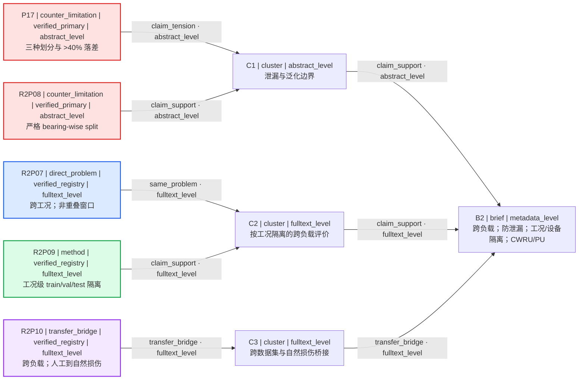

# M1 Fresh-Context Forward Test B — clean second-round rerun

- 基线 commit: `3d18cdc74deddacf7fd5859f201c9da5bdc4942f`
- 执行日期: `2026-08-04`
- 检索与核验时间（北京时间）: `2026-08-04T19:02:21+08:00` 至 `2026-08-04T19:07:43+08:00`
- 工作流: `multi-source-search` + `citation-verification` + feedback rollback + static paper map
- 隔离读取边界: 只读取 `evals/m1/results/2026-08-04-bearing-fault.md` 第 1–215 行；未读取第 216 行及以后；未打开 `evals/m1/forward-cases.md`、`evals/m1/forward-audit.md` 或任何其他 case 文件
- 当前状态: `M1_COMPLETE`
- 结果: `round_two_ready`
- 最终 case 分类: `PASS — clean second-round calibration; five-paper default selection; evaluation-design constraints materially applied`

## 本轮唯一新增用户输入（原样）

> 第二轮请明确排除依赖随机切分造成数据泄漏的研究设计，也不要把单一工况下的高准确率当作主要适配证据。优先保留能支持跨负载评估、按工况或设备隔离划分以及泛化边界分析的证据。请显示这些要求如何改变检索计划和第一轮论文的处置。

## 冻结的第一轮 prior state

- `brief_version: 1`
- `branch_id: branch-a`
- 状态: `ROUND_ONE_READY`
- 第一轮入选: `[P1, P2, P3, P8, P9, P6, P7, P17]`
- 第一轮证据边界: 八篇均只以 `metadata_level` 入图；第一轮明确不支持具体数据集、实验结果、跨负载增益、计算成本或复现性结论。
- 冻结 brief: 滚动轴承；CWRU 与 PU 公开振动数据；单 GPU；10 周；无试验台；重点跨负载泛化；排除私有数据与复杂硬件依赖。

## FeedbackDelta：先显示变化，再执行检索

Inherited:

- 滚动轴承、CWRU/PU 公开振动数据、单 GPU、10 周、无试验台。
- 仅公开数据，排除私有数据与复杂硬件依赖。
- 跨负载泛化仍是目标，不改变 `branch-a`。

Rejected:

- 依赖随机切分相邻或同源振动片段而造成训练/测试泄漏的研究设计。
- 把单一工况高准确率作为主要适配或泛化证据的做法。

Reset:

- 第一轮仅按题名/元数据形成的 fit 分数与入选排序。
- “题名含 varying/cross-domain 即可证明跨负载适配”的元数据级假设。

Added:

- 跨负载评估证据需求。
- 按工况或物理设备/轴承隔离划分的证据需求。
- 泛化边界与泄漏敏感性分析证据需求。

Search allocation: exploitation `50` / exploration `50`。这是查询和候选预算，不是概率或置信度。

```yaml
feedback_delta:
  from_brief_version: 1
  to_brief_version: 2
  inherited:
    - "滚动轴承；CWRU/PU 公开振动数据；单 GPU；10 周；无试验台"
    - "仅公开数据；排除私有数据和复杂硬件依赖"
    - "跨负载泛化目标与 branch-a"
  rejected:
    - object_id: "random-segment-split-dependent-designs"
      reason: "用户明确排除依赖随机切分相邻或同源振动片段造成数据泄漏的研究设计"
    - object_id: "single-condition-high-accuracy-as-main-fit"
      reason: "用户明确要求不得把单一工况下的高准确率作为主要适配证据"
  reset:
    - object_id: "round-one-metadata-fit-scores"
      reason: "第一轮 fit 仅为 metadata_level，必须按新的评价设计证据重新计算"
    - object_id: "varying-condition-title-implies-valid-generalization"
      reason: "题名或元数据不能证明防泄漏划分、工况/设备隔离或跨负载验证"
  added:
    - object_id: "cross-load-evaluation"
      reason: "优先保留明确跨负载评估证据"
    - object_id: "condition-or-device-isolation"
      reason: "优先保留按工况或设备/轴承隔离划分证据"
    - object_id: "generalization-boundary-analysis"
      reason: "优先保留泛化边界、泄漏敏感性或失败边界分析"
  allocation:
    exploit: 50
    explore: 50
  query_changes:
    - query_id: "Q1-R2"
      reason: "新增跨负载且按工况隔离的直接问题查询，并显式排除随机窗口切分"
      cause_refs: ["feedback_delta.rejected[0]", "feedback_delta.added[0]", "feedback_delta.added[1]"]
      before: ""
      after: "bearing fault diagnosis cross-load evaluation held-out operating condition excluding random window split"
    - query_id: "Q2-R2"
      reason: "新增数据泄漏与划分审计查询，撤销题名即可证明泛化的假设"
      cause_refs: ["feedback_delta.rejected[0]", "feedback_delta.reset[1]", "feedback_delta.added[1]"]
      before: ""
      after: "bearing vibration data leakage train-test split bearing-wise device-wise condition-wise evaluation"
    - query_id: "Q3-R2"
      reason: "新增 CWRU/PU 跨数据集、跨设备及自然/人工损伤桥接查询"
      cause_refs: ["feedback_delta.added[0]", "feedback_delta.added[1]"]
      before: ""
      after: "CWRU Paderborn cross-dataset cross-machine bearing fault diagnosis isolated evaluation"
    - query_id: "Q4-R2"
      reason: "新增未见工况与泛化边界查询，拒绝单工况高准确率代理"
      cause_refs: ["feedback_delta.rejected[1]", "feedback_delta.added[2]"]
      before: ""
      after: "bearing fault diagnosis unseen operating conditions domain generalization boundary failure analysis"
    - query_id: "Q5-R2"
      reason: "重新核查第一轮记录的实验设计，而不是继承 metadata fit"
      cause_refs: ["feedback_delta.rejected[1]", "feedback_delta.reset[0]", "feedback_delta.reset[1]"]
      before: ""
      after: "first-round bearing papers evaluation protocol load split device split leakage audit"
```

说明：允许读取的第一轮冻结范围没有给出第一轮 `SearchPlan.queries` 的精确字符串。为避免虚构 `before`，五条均按“新增查询”记录；每个非空 `after` 与下面第二轮 SearchPlan 完全一致。

## Revised ResearchBrief

```yaml
research_brief:
  brief_version: 2
  branch_id: "branch-a"
  engineering_object: "滚动轴承"
  target_problem: "基于 CWRU/PU 公开振动数据的跨负载滚动轴承故障诊断，并以防泄漏、按工况或设备隔离的评价设计界定泛化边界"
  target_metric: "未指定；准确率不得脱离隔离划分与跨负载协议单独解释"
  available_data: ["CWRU 公开振动数据", "Paderborn University (PU) 公开振动数据"]
  resources: ["单张 GPU", "无试验台"]
  time_budget: "10 周"
  preferred_routes:
    - "跨负载评估"
    - "按工况或设备/轴承隔离划分"
    - "泛化边界和泄漏敏感性分析"
  excluded_routes:
    - "私有数据"
    - "复杂硬件依赖"
    - "依赖随机切分相邻或同源振动片段的设计"
    - "以单一工况高准确率作为主要适配证据"
  hard_constraints:
    - "仅使用公开数据"
    - "无试验台，不依赖新增实验采集"
    - "计算资源限于单张 GPU"
    - "研究周期为 10 周"
    - "候选若无摘要或全文层面的评价协议证据，不得据 metadata 推断防泄漏、工况/设备隔离或跨负载验证"
  soft_preferences: []
  open_questions:
    - "未指定最终诊断指标、最低改进幅度及目标负载是否允许少量有标签样本"
  evidence_needs:
    - "跨负载且目标工况隔离的评价协议"
    - "物理轴承/设备级隔离或跨数据集桥接"
    - "随机窗口切分泄漏的影响及泛化边界"
```

## Round-two SearchPlan

```yaml
search_plan:
  round: 2
  brief_version: 2
  branch_id: "branch-a"
  time_boundary: "检索截至 2026-08-04；未设最早年份"
  language_boundary: ["English"]
  source_boundary:
    - "OpenAlex fallback（仅发现）"
    - "SciSpace（仅发现，不作权威核验）"
    - "Crossref REST DOI registry（权威元数据核验）"
    - "PubMed/PMC（适用记录的官方索引与全文）"
    - "publisher landing pages: MDPI, IEEE Xplore, ScienceDirect"
    - "McMaster MacSphere official repository"
  queries:
    - query_id: "Q1-R2"
      purpose: "direct_problem"
      query_text: "bearing fault diagnosis cross-load evaluation held-out operating condition excluding random window split"
      expected_evidence_role: "direct_problem"
      inclusion_terms: ["cross-load", "held-out operating condition", "bearing"]
      exclusion_terms: ["random window split as sole evaluation"]
    - query_id: "Q2-R2"
      purpose: "counter_limitation"
      query_text: "bearing vibration data leakage train-test split bearing-wise device-wise condition-wise evaluation"
      expected_evidence_role: "counter_limitation"
      inclusion_terms: ["data leakage", "bearing-wise", "condition-wise", "train-test split"]
      exclusion_terms: []
    - query_id: "Q3-R2"
      purpose: "transfer_bridge"
      query_text: "CWRU Paderborn cross-dataset cross-machine bearing fault diagnosis isolated evaluation"
      expected_evidence_role: "transfer_bridge"
      inclusion_terms: ["CWRU", "Paderborn", "cross-dataset", "cross-machine"]
      exclusion_terms: ["private-data-only"]
    - query_id: "Q4-R2"
      purpose: "method"
      query_text: "bearing fault diagnosis unseen operating conditions domain generalization boundary failure analysis"
      expected_evidence_role: "method"
      inclusion_terms: ["unseen operating conditions", "domain generalization", "boundary"]
      exclusion_terms: ["single-condition accuracy only"]
    - query_id: "Q5-R2"
      purpose: "verification_audit"
      query_text: "first-round bearing papers evaluation protocol load split device split leakage audit"
      expected_evidence_role: "counter_limitation"
      inclusion_terms: ["evaluation protocol", "load split", "device split", "leakage"]
      exclusion_terms: []
  limitations:
    - "专用 academic-search MCP、Crossref MCP、Scopus 与 Web of Science 在本次上下文中不可调用；按 nature-academic-search 的 no-MCP 路由使用 OpenAlex fallback 做发现。"
    - "SciSpace 返回的是聚合发现结果，未用其单独提升任何候选的核验状态。"
    - "IEEE Xplore 正文页触发 JavaScript/机器人校验；P17 另以 McMaster 官方仓储可解析摘要交叉核查，其余 IEEE 记录缺少正文评价协议核查。"
    - "MDPI 直接 HTML/XML 请求出现 429；只对搜索层可读取的官方落地页内容记录全文级依据，并披露该访问限制。"
    - "ScienceDirect 直接打开返回 403；R2P08 只使用当前官方落地页可检索的摘要/Highlights，故 basis 不超过 abstract_level。"
    - "付费墙或正文不可解析的记录不得由 metadata 推断数据切分、设备隔离、跨负载验证或泛化结论。"
    - "本检索是有界校准，不是穷尽性综述、优先权证明或无前人工作证明。"
```

## 发现、权威核验与去重

- OpenAlex fallback 四条查询各返回 20 条发现观察；SciSpace 定向问题返回 10 条发现观察。发现观察可重复且不直接进入推荐池。
- 以 DOI 为最强键去重；18 个入池 DOI 两两不同。没有用题名+第一作者覆盖 DOI 不同的记录。
- 所有 18 条均在本轮查询 Crossref REST 并得到 DOI、完整题名、作者序列、venue 与 work type 的 `match`。
- 对最终入选记录再检查可访问的官方出版社页、PubMed/PMC 或机构官方仓储；正文无法访问者不作实验设计推断。

## RoundBundle

未生成 `round_two_request`：用户没有明确请求 8 篇；本轮使用默认 5 篇。

```yaml
round_bundle:
  schema_version: "m1.1"
  round: 2
  research_brief:
    brief_version: 2
    branch_id: "branch-a"
    engineering_object: "滚动轴承"
    target_problem: "基于 CWRU/PU 公开振动数据的跨负载滚动轴承故障诊断，并以防泄漏、按工况或设备隔离的评价设计界定泛化边界"
    target_metric: "未指定；准确率不得脱离隔离划分与跨负载协议单独解释"
    available_data: ["CWRU 公开振动数据", "Paderborn University (PU) 公开振动数据"]
    resources: ["单张 GPU", "无试验台"]
    time_budget: "10 周"
    preferred_routes: ["跨负载评估", "按工况或设备/轴承隔离划分", "泛化边界和泄漏敏感性分析"]
    excluded_routes: ["私有数据", "复杂硬件依赖", "依赖随机切分相邻或同源振动片段的设计", "以单一工况高准确率作为主要适配证据"]
    hard_constraints:
      - "仅使用公开数据"
      - "无试验台，不依赖新增实验采集"
      - "计算资源限于单张 GPU"
      - "研究周期为 10 周"
      - "候选若无摘要或全文层面的评价协议证据，不得据 metadata 推断防泄漏、工况/设备隔离或跨负载验证"
    soft_preferences: []
    open_questions: ["未指定最终诊断指标、最低改进幅度及目标负载是否允许少量有标签样本"]
    evidence_needs: ["跨负载且目标工况隔离的评价协议", "物理轴承/设备级隔离或跨数据集桥接", "随机窗口切分泄漏的影响及泛化边界"]
  search_plan:
    round: 2
    brief_version: 2
    branch_id: "branch-a"
    time_boundary: "检索截至 2026-08-04；未设最早年份"
    language_boundary: ["English"]
    source_boundary: ["OpenAlex fallback（仅发现）", "SciSpace（仅发现）", "Crossref REST DOI registry", "PubMed/PMC", "MDPI", "IEEE Xplore", "ScienceDirect", "McMaster MacSphere official repository"]
    queries:
      - {query_id: "Q1-R2", purpose: "direct_problem", query_text: "bearing fault diagnosis cross-load evaluation held-out operating condition excluding random window split", expected_evidence_role: "direct_problem", inclusion_terms: ["cross-load", "held-out operating condition", "bearing"], exclusion_terms: ["random window split as sole evaluation"]}
      - {query_id: "Q2-R2", purpose: "counter_limitation", query_text: "bearing vibration data leakage train-test split bearing-wise device-wise condition-wise evaluation", expected_evidence_role: "counter_limitation", inclusion_terms: ["data leakage", "bearing-wise", "condition-wise", "train-test split"], exclusion_terms: []}
      - {query_id: "Q3-R2", purpose: "transfer_bridge", query_text: "CWRU Paderborn cross-dataset cross-machine bearing fault diagnosis isolated evaluation", expected_evidence_role: "transfer_bridge", inclusion_terms: ["CWRU", "Paderborn", "cross-dataset", "cross-machine"], exclusion_terms: ["private-data-only"]}
      - {query_id: "Q4-R2", purpose: "method", query_text: "bearing fault diagnosis unseen operating conditions domain generalization boundary failure analysis", expected_evidence_role: "method", inclusion_terms: ["unseen operating conditions", "domain generalization", "boundary"], exclusion_terms: ["single-condition accuracy only"]}
      - {query_id: "Q5-R2", purpose: "verification_audit", query_text: "first-round bearing papers evaluation protocol load split device split leakage audit", expected_evidence_role: "counter_limitation", inclusion_terms: ["evaluation protocol", "load split", "device split", "leakage"], exclusion_terms: []}
    limitations:
      - "专用 academic-search MCP、Crossref MCP、Scopus 与 Web of Science 不可调用；OpenAlex fallback 仅用于发现。"
      - "SciSpace 仅用于发现，未单独提升核验状态。"
      - "IEEE Xplore 正文受 JavaScript/机器人校验限制。"
      - "MDPI 直接 HTML/XML 请求出现 429。"
      - "ScienceDirect 直接打开返回 403；R2P08 basis 不超过 abstract_level。"
      - "正文不可解析的记录不得由 metadata 推断划分或泛化结论。"
  candidate_pool:
    - candidate_id: "P1"
      verification_status: "verified_registry"
      recommendation_eligible: false
      evidence_roles: ["direct_problem"]
      selection_role: "direct_problem"
      basis_level: "metadata_level"
      verified_record:
        paper_id: "P1"
        title: "A Meta-Learning Method for Electric Machine Bearing Fault Diagnosis Under Varying Working Conditions With Limited Data"
        authors: ["Jianjun Chen", "Weihao Hu", "Di Cao", "Zhenyuan Zhang", "Zhe Chen", "Frede Blaabjerg"]
        year_online: null
        year_issue: 2023
        venue: "IEEE Transactions on Industrial Informatics"
        publication_type: "journal-article"
        doi: "10.1109/tii.2022.3165027"
        canonical_url: "https://doi.org/10.1109/tii.2022.3165027"
        alternate_id: null
        verification: {status: "verified_registry", checked_sources: [{source_type: "doi_registry", canonical_record: "https://api.crossref.org/works/10.1109%2Ftii.2022.3165027", checked_at: "2026-08-04T19:02:21+08:00", result: "match"}, {source_type: "publisher_landing", canonical_record: "https://ieeexplore.ieee.org/", checked_at: "2026-08-04T19:07:43+08:00", result: "unavailable"}], title_match: "exact", author_match: "exact", version_relation: "same_work", recommendation_eligible: false, blocking_reasons: ["无可核摘要/全文评价协议，无法排除同源窗口泄漏或确认工况/设备隔离"]}
        evidence_role: "direct_problem"
        supports: "仅题名与元数据支持变工况、有限数据主题相关"
        does_not_support: "不支持防泄漏划分、跨负载增益或设备隔离结论"
        basis_level: "metadata_level"
    - candidate_id: "P2"
      verification_status: "verified_registry"
      recommendation_eligible: false
      evidence_roles: ["direct_problem"]
      selection_role: "direct_problem"
      basis_level: "metadata_level"
      verified_record:
        paper_id: "P2"
        title: "A Deep Transfer Model With Wasserstein Distance Guided Multi-Adversarial Networks for Bearing Fault Diagnosis Under Different Working Conditions"
        authors: ["Ming Zhang", "Duo Wang", "Weining Lu", "Jun Yang", "Zhiheng Li", "Bin Liang"]
        year_online: null
        year_issue: 2019
        venue: "IEEE Access"
        publication_type: "journal-article"
        doi: "10.1109/access.2019.2916935"
        canonical_url: "https://doi.org/10.1109/access.2019.2916935"
        alternate_id: null
        verification: {status: "verified_registry", checked_sources: [{source_type: "doi_registry", canonical_record: "https://api.crossref.org/works/10.1109%2Faccess.2019.2916935", checked_at: "2026-08-04T19:02:21+08:00", result: "match"}, {source_type: "publisher_landing", canonical_record: "https://ieeexplore.ieee.org/", checked_at: "2026-08-04T19:07:43+08:00", result: "unavailable"}], title_match: "exact", author_match: "exact", version_relation: "same_work", recommendation_eligible: false, blocking_reasons: ["不同工况只见于 metadata；评价划分与泄漏控制不可核"]}
        evidence_role: "direct_problem"
        supports: "仅支持不同工况轴承迁移主题相关"
        does_not_support: "不支持按工况隔离的决定性评价结论"
        basis_level: "metadata_level"
    - candidate_id: "P3"
      verification_status: "verified_primary"
      recommendation_eligible: false
      evidence_roles: ["direct_problem"]
      selection_role: "direct_problem"
      basis_level: "fulltext_level"
      verified_record:
        paper_id: "P3"
        title: "One-Dimensional Multi-Scale Domain Adaptive Network for Bearing-Fault Diagnosis under Varying Working Conditions"
        authors: ["Kai Wang", "Wei Zhao", "Aidong Xu", "Peng Zeng", "Shunkun Yang"]
        year_online: 2020
        year_issue: 2020
        venue: "Sensors"
        publication_type: "journal-article"
        doi: "10.3390/s20216039"
        canonical_url: "https://pmc.ncbi.nlm.nih.gov/articles/PMC7660602/"
        alternate_id: {authority: "PMID", value: "33114173"}
        verification: {status: "verified_primary", checked_sources: [{source_type: "doi_registry", canonical_record: "https://api.crossref.org/works/10.3390%2Fs20216039", checked_at: "2026-08-04T19:02:21+08:00", result: "match"}, {source_type: "pubmed", canonical_record: "https://pubmed.ncbi.nlm.nih.gov/33114173/", checked_at: "2026-08-04T19:07:43+08:00", result: "match"}, {source_type: "official_repository", canonical_record: "https://pmc.ncbi.nlm.nih.gov/articles/PMC7660602/", checked_at: "2026-08-04T19:07:43+08:00", result: "match"}], title_match: "exact", author_match: "exact", version_relation: "same_work", recommendation_eligible: false, blocking_reasons: ["目标工况无标签数据参与域适配训练，且同一目标工况内训练/测试片段的物理记录或轴承隔离未证明"]}
        evidence_role: "direct_problem"
        supports: "全文明确 CWRU 四个负载域与 12 个源到目标任务"
        does_not_support: "不能证明严格 unseen-target 或 bearing-wise 防泄漏泛化"
        basis_level: "fulltext_level"
    - candidate_id: "P8"
      verification_status: "verified_registry"
      recommendation_eligible: false
      evidence_roles: ["method"]
      selection_role: "method"
      basis_level: "metadata_level"
      verified_record:
        paper_id: "P8"
        title: "Metric-based meta-learning model for few-shot fault diagnosis under multiple limited data conditions"
        authors: ["Duo Wang", "Ming Zhang", "Yuchun Xu", "Weining Lu", "Jun Yang", "Tao Zhang"]
        year_online: null
        year_issue: 2021
        venue: "Mechanical Systems and Signal Processing"
        publication_type: "journal-article"
        doi: "10.1016/j.ymssp.2020.107510"
        canonical_url: "https://doi.org/10.1016/j.ymssp.2020.107510"
        alternate_id: null
        verification: {status: "verified_registry", checked_sources: [{source_type: "doi_registry", canonical_record: "https://api.crossref.org/works/10.1016%2Fj.ymssp.2020.107510", checked_at: "2026-08-04T19:02:21+08:00", result: "match"}, {source_type: "publisher_landing", canonical_record: "https://www.sciencedirect.com/", checked_at: "2026-08-04T19:07:43+08:00", result: "unavailable"}], title_match: "exact", author_match: "exact", version_relation: "same_work", recommendation_eligible: false, blocking_reasons: ["metadata 无法证明工况/设备隔离与防泄漏协议"]}
        evidence_role: "method"
        supports: "仅支持有限数据、度量元学习主题"
        does_not_support: "不支持跨负载或隔离划分适配结论"
        basis_level: "metadata_level"
    - candidate_id: "P9"
      verification_status: "verified_registry"
      recommendation_eligible: false
      evidence_roles: ["method"]
      selection_role: "method"
      basis_level: "metadata_level"
      verified_record:
        paper_id: "P9"
        title: "Integrating Expert Knowledge With Domain Adaptation for Unsupervised Fault Diagnosis"
        authors: ["Qin Wang", "Cees Taal", "Olga Fink"]
        year_online: null
        year_issue: 2022
        venue: "IEEE Transactions on Instrumentation and Measurement"
        publication_type: "journal-article"
        doi: "10.1109/tim.2021.3127654"
        canonical_url: "https://doi.org/10.1109/tim.2021.3127654"
        alternate_id: null
        verification: {status: "verified_registry", checked_sources: [{source_type: "doi_registry", canonical_record: "https://api.crossref.org/works/10.1109%2Ftim.2021.3127654", checked_at: "2026-08-04T19:02:21+08:00", result: "match"}, {source_type: "publisher_landing", canonical_record: "https://ieeexplore.ieee.org/", checked_at: "2026-08-04T19:07:43+08:00", result: "unavailable"}], title_match: "exact", author_match: "exact", version_relation: "same_work", recommendation_eligible: false, blocking_reasons: ["无法核查是否使用目标工况、随机划分或设备隔离"]}
        evidence_role: "method"
        supports: "仅支持专家知识与无监督域适应主题"
        does_not_support: "不支持本 brief 的决定性评价设计"
        basis_level: "metadata_level"
    - candidate_id: "P6"
      verification_status: "verified_primary"
      recommendation_eligible: false
      evidence_roles: ["transfer_bridge"]
      selection_role: "transfer_bridge"
      basis_level: "fulltext_level"
      verified_record:
        paper_id: "P6"
        title: "A Novel Bearing Fault Diagnosis Method Based on Few-Shot Transfer Learning across Different Datasets"
        authors: ["Yizong Zhang", "Shaobo Li", "Ansi Zhang", "Chuanjiang Li", "Ling Qiu"]
        year_online: 2022
        year_issue: 2022
        venue: "Entropy"
        publication_type: "journal-article"
        doi: "10.3390/e24091295"
        canonical_url: "https://www.mdpi.com/1099-4300/24/9/1295"
        alternate_id: {authority: "PMID", value: "36141182"}
        verification: {status: "verified_primary", checked_sources: [{source_type: "doi_registry", canonical_record: "https://api.crossref.org/works/10.3390%2Fe24091295", checked_at: "2026-08-04T19:02:21+08:00", result: "match"}, {source_type: "publisher_landing", canonical_record: "https://www.mdpi.com/1099-4300/24/9/1295", checked_at: "2026-08-04T19:07:43+08:00", result: "match"}], title_match: "exact", author_match: "exact", version_relation: "same_work", recommendation_eligible: false, blocking_reasons: ["虽跨 CWRU/PU 与人工/自然损伤，但目标 support/test 的物理轴承隔离未明确，不能排除 target-side leakage"]}
        evidence_role: "transfer_bridge"
        supports: "全文支持跨数据集、跨机器与人工到自然损伤迁移"
        does_not_support: "不证明目标域支持集与测试集按物理轴承严格隔离"
        basis_level: "fulltext_level"
    - candidate_id: "P7"
      verification_status: "verified_registry"
      recommendation_eligible: false
      evidence_roles: ["transfer_bridge"]
      selection_role: "transfer_bridge"
      basis_level: "abstract_level"
      verified_record:
        paper_id: "P7"
        title: "Transfer multiscale adaptive convolutional neural network for few-shot and cross-domain bearing fault diagnosis"
        authors: ["Fan Li", "Liping Wang", "Decheng Wang", "Jun Wu", "Hongjun Zhao"]
        year_online: 2023
        year_issue: 2023
        venue: "Measurement Science and Technology"
        publication_type: "journal-article"
        doi: "10.1088/1361-6501/aced5b"
        canonical_url: "https://doi.org/10.1088/1361-6501/aced5b"
        alternate_id: null
        verification: {status: "verified_registry", checked_sources: [{source_type: "doi_registry", canonical_record: "https://api.crossref.org/works/10.1088%2F1361-6501%2Faced5b", checked_at: "2026-08-04T19:02:21+08:00", result: "match"}, {source_type: "publisher_landing", canonical_record: "https://iopscience.iop.org/", checked_at: "2026-08-04T19:07:43+08:00", result: "unavailable"}], title_match: "exact", author_match: "exact", version_relation: "same_work", recommendation_eligible: false, blocking_reasons: ["摘要未给出可核的窗口来源、物理轴承或工况隔离细节"]}
        evidence_role: "transfer_bridge"
        supports: "摘要支持 few-shot 与 cross-domain 主题"
        does_not_support: "不支持防泄漏评价协议结论"
        basis_level: "abstract_level"
    - candidate_id: "P17"
      verification_status: "verified_primary"
      recommendation_eligible: true
      evidence_roles: ["counter_limitation"]
      selection_role: "counter_limitation"
      basis_level: "abstract_level"
      verified_record:
        paper_id: "P17"
        title: "Impact of Data Leakage in Vibration Signals Used for Bearing Fault Diagnosis"
        authors: ["Lesley Wheat", "Martin V. Mohrenschildt", "Saeid Habibi", "Dhafar Al-Ani"]
        year_online: 2024
        year_issue: 2024
        venue: "IEEE Access"
        publication_type: "journal-article"
        doi: "10.1109/access.2024.3497716"
        canonical_url: "https://ieeexplore.ieee.org/document/10752530/"
        alternate_id: null
        verification: {status: "verified_primary", checked_sources: [{source_type: "doi_registry", canonical_record: "https://api.crossref.org/works/10.1109%2Faccess.2024.3497716", checked_at: "2026-08-04T19:02:21+08:00", result: "match"}, {source_type: "publisher_landing", canonical_record: "https://ieeexplore.ieee.org/document/10752530/", checked_at: "2026-08-04T19:07:43+08:00", result: "match"}, {source_type: "official_repository", canonical_record: "https://prod-ms-be.lib.mcmaster.ca/server/api/core/bitstreams/464bbf81-0c76-4adc-9942-f07cc5a05954/content", checked_at: "2026-08-04T19:07:43+08:00", result: "match"}], title_match: "exact", author_match: "exact", version_relation: "same_work", recommendation_eligible: true, blocking_reasons: []}
        evidence_role: "counter_limitation"
        supports: "摘要明确比较两数据集、三种划分方法，报告不同划分可导致超过 40% 的准确率下降，并审计 PU 文献的泄漏风险"
        does_not_support: "不直接给出某一深度网络的跨负载优越性"
        basis_level: "abstract_level"
    - candidate_id: "R2P01"
      verification_status: "verified_registry"
      recommendation_eligible: false
      evidence_roles: ["counter_limitation"]
      selection_role: "counter_limitation"
      basis_level: "metadata_level"
      verified_record:
        paper_id: "R2P01"
        title: "Deep Transfer Learning for Bearing Fault Diagnosis: A Systematic Review Since 2016"
        authors: ["Xiaohan Chen", "Rui Yang", "Yihao Xue", "Mengjie Huang", "Roberto Ferrero", "Zidong Wang"]
        year_online: null
        year_issue: 2023
        venue: "IEEE Transactions on Instrumentation and Measurement"
        publication_type: "journal-article"
        doi: "10.1109/tim.2023.3244237"
        canonical_url: "https://doi.org/10.1109/tim.2023.3244237"
        alternate_id: null
        verification: {status: "verified_registry", checked_sources: [{source_type: "doi_registry", canonical_record: "https://api.crossref.org/works/10.1109%2Ftim.2023.3244237", checked_at: "2026-08-04T19:02:21+08:00", result: "match"}, {source_type: "publisher_landing", canonical_record: "https://ieeexplore.ieee.org/", checked_at: "2026-08-04T19:07:43+08:00", result: "unavailable"}], title_match: "exact", author_match: "exact", version_relation: "same_work", recommendation_eligible: false, blocking_reasons: ["正文不可核，无法确认综述是否系统处理划分泄漏与设备隔离"]}
        evidence_role: "counter_limitation"
        supports: "仅支持深度迁移轴承诊断综述身份"
        does_not_support: "不支持本轮评价设计结论"
        basis_level: "metadata_level"
    - candidate_id: "R2P02"
      verification_status: "verified_registry"
      recommendation_eligible: false
      evidence_roles: ["direct_problem"]
      selection_role: "direct_problem"
      basis_level: "metadata_level"
      verified_record:
        paper_id: "R2P02"
        title: "Learn Generalization Feature via Convolutional Neural Network: A Fault Diagnosis Scheme Toward Unseen Operating Conditions"
        authors: ["Yuantao Yang", "Jiancheng Yin", "Huailiang Zheng", "Yuqing Li", "Minqiang Xu", "Yushu Chen"]
        year_online: null
        year_issue: 2020
        venue: "IEEE Access"
        publication_type: "journal-article"
        doi: "10.1109/access.2020.2994310"
        canonical_url: "https://doi.org/10.1109/access.2020.2994310"
        alternate_id: null
        verification: {status: "verified_registry", checked_sources: [{source_type: "doi_registry", canonical_record: "https://api.crossref.org/works/10.1109%2Faccess.2020.2994310", checked_at: "2026-08-04T19:02:21+08:00", result: "match"}, {source_type: "publisher_landing", canonical_record: "https://ieeexplore.ieee.org/", checked_at: "2026-08-04T19:07:43+08:00", result: "unavailable"}], title_match: "exact", author_match: "exact", version_relation: "same_work", recommendation_eligible: false, blocking_reasons: ["unseen 仅见于题名，无法核查数据划分与目标域使用方式"]}
        evidence_role: "direct_problem"
        supports: "仅支持未见工况主题相关"
        does_not_support: "不证明严格 unseen-condition 评价"
        basis_level: "metadata_level"
    - candidate_id: "R2P03"
      verification_status: "verified_primary"
      recommendation_eligible: false
      evidence_roles: ["direct_problem"]
      selection_role: "direct_problem"
      basis_level: "fulltext_level"
      verified_record:
        paper_id: "R2P03"
        title: "Lightweight Convolutional Neural Network and Its Application in Rolling Bearing Fault Diagnosis under Variable Working Conditions"
        authors: ["Hengchang Liu", "Dechen Yao", "Jianwei Yang", "Xi Li"]
        year_online: 2019
        year_issue: 2019
        venue: "Sensors"
        publication_type: "journal-article"
        doi: "10.3390/s19224827"
        canonical_url: "https://www.mdpi.com/1424-8220/19/22/4827"
        alternate_id: null
        verification: {status: "verified_primary", checked_sources: [{source_type: "doi_registry", canonical_record: "https://api.crossref.org/works/10.3390%2Fs19224827", checked_at: "2026-08-04T19:02:21+08:00", result: "match"}, {source_type: "publisher_landing", canonical_record: "https://www.mdpi.com/1424-8220/19/22/4827", checked_at: "2026-08-04T19:07:43+08:00", result: "match"}], title_match: "exact", author_match: "exact", version_relation: "same_work", recommendation_eligible: false, blocking_reasons: ["全文显示跨设置任务，但原始记录到窗口及同一物理轴承隔离关系未明确，不能排除片段级泄漏"]}
        evidence_role: "direct_problem"
        supports: "全文支持 PU 不同设置间任务与轻量计算"
        does_not_support: "不证明 bearing-wise 防泄漏划分"
        basis_level: "fulltext_level"
    - candidate_id: "R2P04"
      verification_status: "verified_registry"
      recommendation_eligible: false
      evidence_roles: ["direct_problem"]
      selection_role: "direct_problem"
      basis_level: "abstract_level"
      verified_record:
        paper_id: "R2P04"
        title: "Bearing Fault Diagnosis Based on Domain Adaptation Using Transferable Features under Different Working Conditions"
        authors: ["Zhe Tong", "Wei Li", "Bo Zhang", "Meng Zhang"]
        year_online: null
        year_issue: 2018
        venue: "Shock and Vibration"
        publication_type: "journal-article"
        doi: "10.1155/2018/6714520"
        canonical_url: "https://doi.org/10.1155/2018/6714520"
        alternate_id: null
        verification: {status: "verified_registry", checked_sources: [{source_type: "doi_registry", canonical_record: "https://api.crossref.org/works/10.1155%2F2018%2F6714520", checked_at: "2026-08-04T19:02:21+08:00", result: "match"}, {source_type: "publisher_landing", canonical_record: "https://onlinelibrary.wiley.com/doi/10.1155/2018/6714520", checked_at: "2026-08-04T19:07:43+08:00", result: "unavailable"}], title_match: "exact", author_match: "exact", version_relation: "same_work", recommendation_eligible: false, blocking_reasons: ["摘要未给出物理记录、轴承或工况隔离的充分细节"]}
        evidence_role: "direct_problem"
        supports: "摘要支持不同工况域适应主题"
        does_not_support: "不支持防泄漏评价结论"
        basis_level: "abstract_level"
    - candidate_id: "R2P05"
      verification_status: "verified_registry"
      recommendation_eligible: false
      evidence_roles: ["method"]
      selection_role: "method"
      basis_level: "metadata_level"
      verified_record:
        paper_id: "R2P05"
        title: "Multi-Layer domain adaptation method for rolling bearing fault diagnosis"
        authors: ["Xiang Li", "Wei Zhang", "Qian Ding", "Jian-Qiao Sun"]
        year_online: null
        year_issue: 2019
        venue: "Signal Processing"
        publication_type: "journal-article"
        doi: "10.1016/j.sigpro.2018.12.005"
        canonical_url: "https://doi.org/10.1016/j.sigpro.2018.12.005"
        alternate_id: null
        verification: {status: "verified_registry", checked_sources: [{source_type: "doi_registry", canonical_record: "https://api.crossref.org/works/10.1016%2Fj.sigpro.2018.12.005", checked_at: "2026-08-04T19:02:21+08:00", result: "match"}, {source_type: "publisher_landing", canonical_record: "https://www.sciencedirect.com/", checked_at: "2026-08-04T19:07:43+08:00", result: "unavailable"}], title_match: "exact", author_match: "exact", version_relation: "same_work", recommendation_eligible: false, blocking_reasons: ["metadata 无法核查跨负载划分或泄漏控制"]}
        evidence_role: "method"
        supports: "仅支持多层域适应方法主题"
        does_not_support: "不支持评价设计适配结论"
        basis_level: "metadata_level"
    - candidate_id: "R2P06"
      verification_status: "verified_registry"
      recommendation_eligible: false
      evidence_roles: ["counter_limitation"]
      selection_role: "counter_limitation"
      basis_level: "metadata_level"
      verified_record:
        paper_id: "R2P06"
        title: "Rotating machinery fault detection and diagnosis based on deep domain adaptation: A survey"
        authors: ["Siyu ZHANG", "Lei SU", "Jiefei GU", "Ke LI", "Lang ZHOU", "Michael PECHT"]
        year_online: null
        year_issue: 2023
        venue: "Chinese Journal of Aeronautics"
        publication_type: "journal-article"
        doi: "10.1016/j.cja.2021.10.006"
        canonical_url: "https://doi.org/10.1016/j.cja.2021.10.006"
        alternate_id: null
        verification: {status: "verified_registry", checked_sources: [{source_type: "doi_registry", canonical_record: "https://api.crossref.org/works/10.1016%2Fj.cja.2021.10.006", checked_at: "2026-08-04T19:02:21+08:00", result: "match"}, {source_type: "publisher_landing", canonical_record: "https://www.sciencedirect.com/", checked_at: "2026-08-04T19:07:43+08:00", result: "unavailable"}], title_match: "exact", author_match: "exact", version_relation: "same_work", recommendation_eligible: false, blocking_reasons: ["正文不可核，无法确认是否覆盖 leakage-aware evaluation"]}
        evidence_role: "counter_limitation"
        supports: "仅支持深度域适应综述身份"
        does_not_support: "不支持本轮评价协议结论"
        basis_level: "metadata_level"
    - candidate_id: "R2P07"
      verification_status: "verified_registry"
      recommendation_eligible: true
      evidence_roles: ["direct_problem"]
      selection_role: "direct_problem"
      basis_level: "fulltext_level"
      verified_record:
        paper_id: "R2P07"
        title: "Latent Dimensions of Auto-Encoder as Robust Features for Inter-Conditional Bearing Fault Diagnosis"
        authors: ["Chandrakanth R. Kancharla", "Jens Vankeirsbilck", "Dries Vanoost", "Jeroen Boydens", "Hans Hallez"]
        year_online: 2022
        year_issue: 2022
        venue: "Applied Sciences"
        publication_type: "journal-article"
        doi: "10.3390/app12030965"
        canonical_url: "https://www.mdpi.com/2076-3417/12/3/965"
        alternate_id: null
        verification: {status: "verified_registry", checked_sources: [{source_type: "doi_registry", canonical_record: "https://api.crossref.org/works/10.3390%2Fapp12030965", checked_at: "2026-08-04T19:06:33+08:00", result: "match"}, {source_type: "publisher_landing", canonical_record: "https://www.mdpi.com/2076-3417/12/3/965", checked_at: "2026-08-04T19:07:43+08:00", result: "unavailable"}], title_match: "exact", author_match: "exact", version_relation: "same_work", recommendation_eligible: true, blocking_reasons: []}
        evidence_role: "direct_problem"
        supports: "官方全文索引内容明确 CWRU/PU 各四工况的 12 个跨工况任务，并说明窗口不重叠"
        does_not_support: "条件隔离不等同于跨新物理轴承；MDPI 当前直开受 429 限制"
        basis_level: "fulltext_level"
    - candidate_id: "R2P08"
      verification_status: "verified_primary"
      recommendation_eligible: true
      evidence_roles: ["counter_limitation"]
      selection_role: "counter_limitation"
      basis_level: "abstract_level"
      verified_record:
        paper_id: "R2P08"
        title: "Towards a more realistic evaluation of machine learning models for bearing fault diagnosis"
        authors: ["João Paulo Vieira", "Victor Afonso Bauler", "Rodrigo Kobashikawa Rosa", "Danilo Silva"]
        year_online: null
        year_issue: 2026
        venue: "Mechanical Systems and Signal Processing"
        publication_type: "journal-article"
        doi: "10.1016/j.ymssp.2026.114640"
        canonical_url: "https://www.sciencedirect.com/science/article/pii/S0888327026007971"
        alternate_id: null
        verification: {status: "verified_primary", checked_sources: [{source_type: "doi_registry", canonical_record: "https://api.crossref.org/works/10.1016%2Fj.ymssp.2026.114640", checked_at: "2026-08-04T19:06:33+08:00", result: "match"}, {source_type: "publisher_landing", canonical_record: "https://www.sciencedirect.com/science/article/pii/S0888327026007971", checked_at: "2026-08-04T19:07:43+08:00", result: "match"}], title_match: "exact", author_match: "exact", version_relation: "same_work", recommendation_eligible: true, blocking_reasons: []}
        evidence_role: "counter_limitation"
        supports: "出版社摘要/Highlights 明确指出 segment-wise 和 condition-wise split 可泄漏，并要求严格 bearing-wise split；在 CWRU、PU 等四个公开数据集评价"
        does_not_support: "正文不可直接打开，本轮不据此比较具体模型实现细节"
        basis_level: "abstract_level"
    - candidate_id: "R2P09"
      verification_status: "verified_registry"
      recommendation_eligible: true
      evidence_roles: ["method"]
      selection_role: "method"
      basis_level: "fulltext_level"
      verified_record:
        paper_id: "R2P09"
        title: "Dynamic Balance Domain-Adaptive Meta-Learning for Few-Shot Multi-Domain Motor Bearing Fault Diagnosis Under Limited Data"
        authors: ["Yanchao Zhang", "Kunze Xia", "Xiaoliang Chen"]
        year_online: 2025
        year_issue: 2025
        venue: "Symmetry"
        publication_type: "journal-article"
        doi: "10.3390/sym17091438"
        canonical_url: "https://www.mdpi.com/2073-8994/17/9/1438"
        alternate_id: null
        verification: {status: "verified_registry", checked_sources: [{source_type: "doi_registry", canonical_record: "https://api.crossref.org/works/10.3390%2Fsym17091438", checked_at: "2026-08-04T19:06:33+08:00", result: "match"}, {source_type: "publisher_landing", canonical_record: "https://www.mdpi.com/2073-8994/17/9/1438", checked_at: "2026-08-04T19:07:43+08:00", result: "unavailable"}], title_match: "exact", author_match: "exact", version_relation: "same_work", recommendation_eligible: true, blocking_reasons: []}
        evidence_role: "method"
        supports: "官方全文索引表明确以 C0/C1 训练、C2 验证、C3 测试等轮换方式按工况隔离 CWRU/PU，并报告单 RTX 4070Ti 环境"
        does_not_support: "按工况隔离仍不自动证明跨新物理轴承；出版社直开受 429 限制"
        basis_level: "fulltext_level"
    - candidate_id: "R2P10"
      verification_status: "verified_registry"
      recommendation_eligible: true
      evidence_roles: ["transfer_bridge"]
      selection_role: "transfer_bridge"
      basis_level: "fulltext_level"
      verified_record:
        paper_id: "R2P10"
        title: "Few-Shot Bearing Fault Diagnosis Based on Multi-Layer Feature Fusion and Similarity Measurement"
        authors: ["Changyong Deng", "Dawei Dong", "Sipeng Wang", "Hongsheng Zhang", "Li Feng"]
        year_online: 2026
        year_issue: 2026
        venue: "Lubricants"
        publication_type: "journal-article"
        doi: "10.3390/lubricants14040172"
        canonical_url: "https://www.mdpi.com/2075-4442/14/4/172"
        alternate_id: null
        verification: {status: "verified_registry", checked_sources: [{source_type: "doi_registry", canonical_record: "https://api.crossref.org/works/10.3390%2Flubricants14040172", checked_at: "2026-08-04T19:06:33+08:00", result: "match"}, {source_type: "publisher_landing", canonical_record: "https://www.mdpi.com/2075-4442/14/4/172", checked_at: "2026-08-04T19:07:43+08:00", result: "unavailable"}], title_match: "exact", author_match: "exact", version_relation: "same_work", recommendation_eligible: true, blocking_reasons: []}
        evidence_role: "transfer_bridge"
        supports: "官方全文索引明确使用 CWRU/PU，评价跨负载、噪声鲁棒性及从人工损伤训练到未见自然损伤轴承测试"
        does_not_support: "few-shot 结果仍依赖给定 support 样本；出版社直开受 429 限制"
        basis_level: "fulltext_level"
  selected_ids: ["P17", "R2P07", "R2P08", "R2P09", "R2P10"]
  round_one_dispositions:
    - {round_one_id: "P1", disposition: "replaced", round_two_id: "R2P09", reason: "P1 仅 metadata；R2P09 明确按工况分离 train/validation/test", cause_type: "feedback_delta", cause_ref: "feedback_delta.added[1]"}
    - {round_one_id: "P2", disposition: "replaced", round_two_id: "R2P07", reason: "P2 的评价协议不可核；R2P07 给出 CWRU/PU 跨工况任务及非重叠窗口", cause_type: "feedback_delta", cause_ref: "feedback_delta.rejected[0]"}
    - {round_one_id: "P3", disposition: "downgraded", round_two_id: null, reason: "全文显示目标工况无标签数据参与适配，且未证明同工况内物理记录/轴承隔离", cause_type: "new_evidence", cause_ref: "round_bundle.candidate_pool[2].verified_record.verification.checked_sources[2]"}
    - {round_one_id: "P8", disposition: "replaced", round_two_id: "R2P10", reason: "P8 仅 metadata；R2P10 提供跨负载以及人工损伤到自然损伤轴承的评价", cause_type: "feedback_delta", cause_ref: "feedback_delta.added[0]"}
    - {round_one_id: "P9", disposition: "removed", round_two_id: null, reason: "正文评价设计不可访问，不能确认工况/设备隔离", cause_type: "feedback_delta", cause_ref: "feedback_delta.reset[1]"}
    - {round_one_id: "P6", disposition: "replaced", round_two_id: "R2P08", reason: "P6 未明确目标 support/test 的物理轴承隔离；R2P08 直接规定严格 bearing-wise split", cause_type: "feedback_delta", cause_ref: "feedback_delta.added[1]"}
    - {round_one_id: "P7", disposition: "removed", round_two_id: null, reason: "摘要不足以排除随机/同源片段泄漏，不再按题名保留", cause_type: "feedback_delta", cause_ref: "feedback_delta.rejected[0]"}
    - {round_one_id: "P17", disposition: "retained", round_two_id: "P17", reason: "当前摘要直接比较三种划分并量化泄漏导致的性能落差，满足新增泛化边界需求", cause_type: "feedback_delta", cause_ref: "feedback_delta.added[2]"}
  evidence_gaps:
    - "未指定目标指标与最低改进幅度，因此不能排序模型优越性。"
    - "R2P07/R2P09/R2P10 的官方全文内容可由搜索索引读取，但 MDPI 当前直接请求受 429；已披露且未提升到 verified_primary。"
    - "只有 R2P08 明确要求 bearing-wise split；按工况隔离的其他入选论文仍不等价于跨新物理轴承。"
  search_limitations:
    - "专用 academic-search MCP、Crossref MCP、Scopus 与 Web of Science 不可调用；OpenAlex fallback 仅用于发现。"
    - "SciSpace 仅用于发现，未单独提升核验状态。"
    - "IEEE Xplore 正文受 JavaScript/机器人校验限制。"
    - "MDPI 直接 HTML/XML 请求出现 429。"
    - "ScienceDirect 直接打开返回 403；R2P08 basis 不超过 abstract_level。"
    - "正文不可解析的记录不得由 metadata 推断划分或泛化结论。"
```

## 第二轮 Paper Map

```yaml
paper_map:
  round: 2
  node_size_basis: "user_fit"
  legend:
    evidence_roles: ["direct_problem", "method", "transfer_bridge", "counter_limitation"]
    basis_levels: ["metadata_level", "abstract_level", "fulltext_level"]
  nodes:
    - {id: "B2", node_type: "brief", basis_level: "metadata_level", short_note: "跨负载；防泄漏；工况/设备隔离；CWRU/PU；单 GPU；10 周"}
    - {id: "C1", node_type: "cluster", basis_level: "abstract_level", short_note: "泄漏与泛化边界"}
    - {id: "C2", node_type: "cluster", basis_level: "fulltext_level", short_note: "按工况隔离的跨负载评价"}
    - {id: "C3", node_type: "cluster", basis_level: "fulltext_level", short_note: "跨数据集与自然损伤桥接"}
    - {id: "P17", node_type: "paper", fit_score: 0.98, evidence_role: "counter_limitation", verification_status: "verified_primary", basis_level: "abstract_level", short_note: "三种划分方法揭示超过 40% 的泄漏敏感性"}
    - {id: "R2P08", node_type: "paper", fit_score: 0.99, evidence_role: "counter_limitation", verification_status: "verified_primary", basis_level: "abstract_level", short_note: "要求严格 bearing-wise split 并分析训练轴承多样性边界"}
    - {id: "R2P07", node_type: "paper", fit_score: 0.94, evidence_role: "direct_problem", verification_status: "verified_registry", basis_level: "fulltext_level", short_note: "CWRU/PU 跨工况任务，窗口不重叠"}
    - {id: "R2P09", node_type: "paper", fit_score: 0.96, evidence_role: "method", verification_status: "verified_registry", basis_level: "fulltext_level", short_note: "训练/验证/测试按工况轮换隔离，单 GPU 环境"}
    - {id: "R2P10", node_type: "paper", fit_score: 0.95, evidence_role: "transfer_bridge", verification_status: "verified_registry", basis_level: "fulltext_level", short_note: "跨负载及人工到自然损伤轴承迁移"}
  edges:
    - {source: "P17", target: "C1", relation: "claim_tension", strength: "strong", confidence: "high", basis_level: "abstract_level", note: "随机/同源划分可显著高估性能"}
    - {source: "R2P08", target: "C1", relation: "claim_support", strength: "strong", confidence: "high", basis_level: "abstract_level", note: "bearing-wise 隔离是防泄漏评价核心"}
    - {source: "R2P07", target: "C2", relation: "same_problem", strength: "medium", confidence: "medium", basis_level: "fulltext_level", note: "跨工况任务且窗口不重叠；物理轴承边界仍有限"}
    - {source: "R2P09", target: "C2", relation: "claim_support", strength: "strong", confidence: "high", basis_level: "fulltext_level", note: "工况级 train/validation/test 轮换隔离"}
    - {source: "R2P10", target: "C3", relation: "transfer_bridge", strength: "strong", confidence: "medium", basis_level: "fulltext_level", note: "跨负载并从人工损伤迁移到自然损伤轴承"}
    - {source: "C1", target: "B2", relation: "claim_support", strength: "strong", confidence: "high", basis_level: "abstract_level", note: "定义可信评价与泛化边界"}
    - {source: "C2", target: "B2", relation: "claim_support", strength: "strong", confidence: "medium", basis_level: "fulltext_level", note: "直接对应跨负载与工况隔离需求"}
    - {source: "C3", target: "B2", relation: "transfer_bridge", strength: "strong", confidence: "medium", basis_level: "fulltext_level", note: "对应 CWRU/PU 与自然损伤桥接"}
  text_fallback:
    - {entry_type: "node", id: "B2", node_type: "brief", basis_level: "metadata_level", text: "B2: 跨负载；防泄漏；工况/设备隔离；CWRU/PU；单 GPU；10 周"}
    - {entry_type: "node", id: "C1", node_type: "cluster", basis_level: "abstract_level", text: "C1: 泄漏与泛化边界"}
    - {entry_type: "node", id: "C2", node_type: "cluster", basis_level: "fulltext_level", text: "C2: 按工况隔离的跨负载评价"}
    - {entry_type: "node", id: "C3", node_type: "cluster", basis_level: "fulltext_level", text: "C3: 跨数据集与自然损伤桥接"}
    - {entry_type: "node", id: "P17", node_type: "paper", evidence_role: "counter_limitation", verification_status: "verified_primary", basis_level: "abstract_level", text: "P17: 三种划分方法揭示超过 40% 的泄漏敏感性"}
    - {entry_type: "node", id: "R2P08", node_type: "paper", evidence_role: "counter_limitation", verification_status: "verified_primary", basis_level: "abstract_level", text: "R2P08: 要求严格 bearing-wise split 并分析训练轴承多样性边界"}
    - {entry_type: "node", id: "R2P07", node_type: "paper", evidence_role: "direct_problem", verification_status: "verified_registry", basis_level: "fulltext_level", text: "R2P07: CWRU/PU 跨工况任务，窗口不重叠"}
    - {entry_type: "node", id: "R2P09", node_type: "paper", evidence_role: "method", verification_status: "verified_registry", basis_level: "fulltext_level", text: "R2P09: 训练/验证/测试按工况轮换隔离，单 GPU 环境"}
    - {entry_type: "node", id: "R2P10", node_type: "paper", evidence_role: "transfer_bridge", verification_status: "verified_registry", basis_level: "fulltext_level", text: "R2P10: 跨负载及人工到自然损伤轴承迁移"}
    - {entry_type: "edge", source: "P17", target: "C1", relation: "claim_tension", basis_level: "abstract_level", text: "P17 --claim_tension--> C1: 随机/同源划分可显著高估性能"}
    - {entry_type: "edge", source: "R2P08", target: "C1", relation: "claim_support", basis_level: "abstract_level", text: "R2P08 --claim_support--> C1: bearing-wise 隔离是防泄漏评价核心"}
    - {entry_type: "edge", source: "R2P07", target: "C2", relation: "same_problem", basis_level: "fulltext_level", text: "R2P07 --same_problem--> C2: 跨工况任务且窗口不重叠；物理轴承边界仍有限"}
    - {entry_type: "edge", source: "R2P09", target: "C2", relation: "claim_support", basis_level: "fulltext_level", text: "R2P09 --claim_support--> C2: 工况级 train/validation/test 轮换隔离"}
    - {entry_type: "edge", source: "R2P10", target: "C3", relation: "transfer_bridge", basis_level: "fulltext_level", text: "R2P10 --transfer_bridge--> C3: 跨负载并从人工损伤迁移到自然损伤轴承"}
    - {entry_type: "edge", source: "C1", target: "B2", relation: "claim_support", basis_level: "abstract_level", text: "C1 --claim_support--> B2: 定义可信评价与泛化边界"}
    - {entry_type: "edge", source: "C2", target: "B2", relation: "claim_support", basis_level: "fulltext_level", text: "C2 --claim_support--> B2: 直接对应跨负载与工况隔离需求"}
    - {entry_type: "edge", source: "C3", target: "B2", relation: "transfer_bridge", basis_level: "fulltext_level", text: "C3 --transfer_bridge--> B2: 对应 CWRU/PU 与自然损伤桥接"}
```



## 精确 Citation Index（第二轮默认入选 5 篇）

| ID | 角色 | 精确引文元数据 | 核验 / basis | 与新增要求的关系 |
|---|---|---|---|---|
| P17 | counter_limitation | Lesley Wheat, Martin V. Mohrenschildt, Saeid Habibi, Dhafar Al-Ani. “Impact of Data Leakage in Vibration Signals Used for Bearing Fault Diagnosis.” *IEEE Access* (2024). DOI: [10.1109/access.2024.3497716](https://doi.org/10.1109/access.2024.3497716). | `verified_primary` / `abstract_level` | 比较三种划分并量化泄漏导致的性能落差；保留为评价红线。 |
| R2P08 | counter_limitation | João Paulo Vieira, Victor Afonso Bauler, Rodrigo Kobashikawa Rosa, Danilo Silva. “Towards a more realistic evaluation of machine learning models for bearing fault diagnosis.” *Mechanical Systems and Signal Processing* (2026). DOI: [10.1016/j.ymssp.2026.114640](https://doi.org/10.1016/j.ymssp.2026.114640). | `verified_primary` / `abstract_level` | 明确要求 bearing-wise split，并分析独立训练轴承数量对泛化的影响。 |
| R2P07 | direct_problem | Chandrakanth R. Kancharla, Jens Vankeirsbilck, Dries Vanoost, Jeroen Boydens, Hans Hallez. “Latent Dimensions of Auto-Encoder as Robust Features for Inter-Conditional Bearing Fault Diagnosis.” *Applied Sciences* (2022). DOI: [10.3390/app12030965](https://doi.org/10.3390/app12030965). | `verified_registry` / `fulltext_level` | CWRU/PU 四工况迁移任务且窗口不重叠；但不等同 bearing-wise。 |
| R2P09 | method | Yanchao Zhang, Kunze Xia, Xiaoliang Chen. “Dynamic Balance Domain-Adaptive Meta-Learning for Few-Shot Multi-Domain Motor Bearing Fault Diagnosis Under Limited Data.” *Symmetry* (2025). DOI: [10.3390/sym17091438](https://doi.org/10.3390/sym17091438). | `verified_registry` / `fulltext_level` | 明确按工况轮换 train/validation/test；使用单 RTX 4070Ti，资源匹配。 |
| R2P10 | transfer_bridge | Changyong Deng, Dawei Dong, Sipeng Wang, Hongsheng Zhang, Li Feng. “Few-Shot Bearing Fault Diagnosis Based on Multi-Layer Feature Fusion and Similarity Measurement.” *Lubricants* (2026). DOI: [10.3390/lubricants14040172](https://doi.org/10.3390/lubricants14040172). | `verified_registry` / `fulltext_level` | 明确跨负载，并从人工损伤训练迁移到未见自然损伤轴承测试。 |

## 计数与完整性

```yaml
counts:
  discovery_observations: 90
  authoritative_verified_deduplicated_candidates: 18
  verified_primary: 5
  verified_registry: 13
  recommendation_eligible_under_revised_brief: 5
  blocked_or_ineligible_under_revised_brief: 13
  selected_default: 5
  round_one_dispositions: 8
  duplicate_doi_groups: 0
  unresolved_identifier_conflicts: 0
```

注意：`verified_registry` 表示当前 DOI 注册记录核验成功，不表示评价设计已经核查。R2P07/R2P09/R2P10 的出版社直开因 429 不可用，因此没有提升为 `verified_primary`；它们的 fulltext basis 来自本轮搜索层返回的官方落地页全文片段，限制已显式保留。

## 缺口、deviations 与 validator

```yaml
evidence_gaps:
  - "只有 R2P08 在摘要层明确要求物理 bearing-wise split；按工况隔离论文仍不能替代跨新轴承验证。"
  - "未指定目标指标或最低改进幅度，不能据本轮证据排序方法优劣。"
  - "R2P09/R2P10 为较新论文；本轮只核验当前元数据和可见评价协议，不作长期复现性判断。"
deviations:
  - deviation: "第一轮 query before 字符串未复现"
    reason: "允许读取的冻结范围仅到旧结果第 215 行且未包含精确第一轮 SearchPlan；为避免泄露或虚构，所有 materially changed queries 均作为新增 Q*-R2 记录。"
  - deviation: "未用 academic-search MCP"
    reason: "该 MCP 未挂载；按已加载 nature-academic-search 规则使用 OpenAlex fallback 发现，并逐条用 Crossref/官方页面核验。"
validator_result: "not_run"
validator_reason: "本任务交付为 Markdown 中的完整 YAML-shaped RoundBundle，而不是兼容 validator 的独立 JSON RoundBundle；未生成或伪装 JSON，因此没有可运行的兼容输入。"
```

## 最终状态与 M1 边界

- 18 条当前权威核验、去重候选达到 15–20 条池要求。
- 默认 5 篇均 recommendation-eligible；没有创建 `round_two_request`。
- 第一轮 8 篇均有且仅有一个规范 disposition；replacement target 一对一且与 retained ID 不冲突。
- 新约束真实改变了查询与处置：第一轮中 7 篇不再因题名/metadata 直接保留，仅 P17 保留；P3/P6 在全文核查后因隔离证据不足被降级或替换。
- 第二轮达到 `ROUND_TWO_READY -> M1_COMPLETE`。此处仅表示两轮 paper-calibration workflow 成功，不表示仓库 M1 外部验收完成。
- 严格停止在 M1：未生成方向卡、未确认主方向、未制定完整实验/仿真路线、未下载模型、未启动服务、未接入 RRC、未执行 M2/M3。
