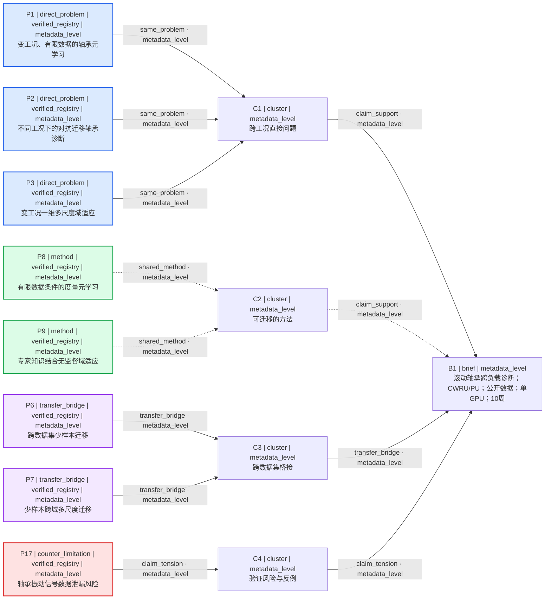

# M1 Fresh-Context Forward Test B

- Skill revision: `2291357`
- 开始时间（北京时间）: `2026-08-04 18:15:59 +08:00`
- 结束时间（北京时间）: `2026-08-04 18:16:36 +08:00`
- 当前状态: `WAITING_FOR_INTAKE_ANSWERS`

## 原始用户提示

> 请帮我找机械设备故障诊断论文。

## Intake 澄清问题

问题数量：3

1. 您希望聚焦哪一种机械设备或部件，以及哪类故障诊断任务（如故障检测、类型识别、严重度评估或剩余寿命预测）？
2. 您有哪些可用数据与资源约束（如信号类型、公开/自有数据、是否允许实验采集或仿真）？
3. 文献的时间范围、语言和类型（期刊、会议、综述或学位论文等）有无硬性要求？

## 提问理由

1. 设备或部件与故障任务会直接决定检索词、直接问题证据的匹配范围，以及论文能否作为推荐候选。
2. 数据与资源约束会改变可行方法的检索范围，并决定依赖特定信号、私有数据、实验采集或仿真的论文是否具备推荐资格。
3. 时间、语言与文献类型是检索边界；若存在硬性要求，不满足边界的论文不能进入推荐集合。

## 边界记录

- 未推测研究对象、数据、硬件、周期、泛化目标或排除项。
- 未开始文献检索或候选推荐。
- 未进入实验路线、模型下载、服务、RRC、M2 或 M3。

---

# 冻结 Intake 答复后的第一轮

- 阶段开始时间（北京时间）: `2026-08-04 18:18:36 +08:00`
- 阶段结束时间（北京时间）: `2026-08-04 18:29:37 +08:00`
- Skill revision: `2291357`
- 工作流: `multi-source-search` + `citation-verification`
- 状态: `ROUND_ONE_READY`
- 结果: `round_one_captured`

## 冻结的 Intake 答复（原样）

> 研究对象是滚动轴承。可用数据是 CWRU 和 Paderborn University（PU）的公开振动数据；没有试验台；计算资源为单张 GPU；周期为 10 周。重点关注跨负载泛化。排除私有数据和复杂硬件依赖。

## 完整 ResearchBrief

```yaml
research_brief:
  brief_version: 1
  branch_id: "branch-a"
  engineering_object: "滚动轴承"
  target_problem: "基于公开振动数据的滚动轴承故障诊断，重点关注跨负载泛化"
  target_metric: ""
  available_data:
    - "CWRU 公开振动数据"
    - "Paderborn University (PU) 公开振动数据"
  resources:
    - "单张 GPU"
    - "无试验台"
  time_budget: "10 周"
  preferred_routes:
    - "跨负载泛化"
  excluded_routes:
    - "私有数据"
    - "复杂硬件依赖"
  hard_constraints:
    - "仅使用公开数据"
    - "无试验台，不依赖新增实验采集"
    - "计算资源限于单张 GPU"
    - "研究周期为 10 周"
    - "排除复杂硬件依赖"
  soft_preferences:
    - "重点关注跨负载泛化"
  open_questions:
    - "未指定故障类别体系、诊断输出形式及目标指标或最低改进幅度"
    - "未说明目标负载是否允许少量有标签样本"
    - "未指定论文发表时间、语言或文献类型边界"
  evidence_needs:
    - "直接针对滚动轴承跨工况或跨负载诊断的证据"
    - "单 GPU、10 周内可评估的迁移、域适应或元学习方法证据"
    - "CWRU 与 PU 跨数据集迁移的桥接证据"
    - "随机切片或数据泄漏导致泛化高估的反例或限制证据"
```

## 第一轮静态 Paper Evidence Map

```yaml
paper_map:
  round: 1
  node_size_basis: "user_fit"
  legend:
    evidence_roles: ["direct_problem", "method", "transfer_bridge", "counter_limitation"]
    basis_levels: ["metadata_level", "abstract_level", "fulltext_level"]
  nodes:
    - {id: "B1", node_type: "brief", basis_level: "metadata_level", short_note: "滚动轴承跨负载故障诊断；CWRU/PU；公开数据；单 GPU；10 周"}
    - {id: "C1", node_type: "cluster", basis_level: "metadata_level", short_note: "跨工况直接问题"}
    - {id: "C2", node_type: "cluster", basis_level: "metadata_level", short_note: "可迁移的方法"}
    - {id: "C3", node_type: "cluster", basis_level: "metadata_level", short_note: "跨数据集桥接"}
    - {id: "C4", node_type: "cluster", basis_level: "metadata_level", short_note: "验证风险与反例"}
    - {id: "P1", node_type: "paper", fit_score: 0.95, evidence_role: "direct_problem", verification_status: "verified_registry", basis_level: "metadata_level", short_note: "变工况、有限数据的轴承元学习"}
    - {id: "P2", node_type: "paper", fit_score: 0.94, evidence_role: "direct_problem", verification_status: "verified_registry", basis_level: "metadata_level", short_note: "不同工况下的对抗迁移轴承诊断"}
    - {id: "P3", node_type: "paper", fit_score: 0.93, evidence_role: "direct_problem", verification_status: "verified_registry", basis_level: "metadata_level", short_note: "变工况一维多尺度域适应"}
    - {id: "P8", node_type: "paper", fit_score: 0.84, evidence_role: "method", verification_status: "verified_registry", basis_level: "metadata_level", short_note: "有限数据条件的度量元学习"}
    - {id: "P9", node_type: "paper", fit_score: 0.82, evidence_role: "method", verification_status: "verified_registry", basis_level: "metadata_level", short_note: "专家知识结合无监督域适应"}
    - {id: "P6", node_type: "paper", fit_score: 0.90, evidence_role: "transfer_bridge", verification_status: "verified_registry", basis_level: "metadata_level", short_note: "跨数据集少样本迁移"}
    - {id: "P7", node_type: "paper", fit_score: 0.88, evidence_role: "transfer_bridge", verification_status: "verified_registry", basis_level: "metadata_level", short_note: "少样本跨域多尺度迁移"}
    - {id: "P17", node_type: "paper", fit_score: 0.91, evidence_role: "counter_limitation", verification_status: "verified_registry", basis_level: "metadata_level", short_note: "轴承振动信号数据泄漏风险"}
  edges:
    - {source: "P1", target: "C1", relation: "same_problem", strength: "strong", confidence: "medium", basis_level: "metadata_level", note: "题名明确为变工况轴承诊断"}
    - {source: "P2", target: "C1", relation: "same_problem", strength: "strong", confidence: "medium", basis_level: "metadata_level", note: "题名明确为不同工况轴承诊断"}
    - {source: "P3", target: "C1", relation: "same_problem", strength: "strong", confidence: "medium", basis_level: "metadata_level", note: "题名明确为变工况轴承诊断"}
    - {source: "P8", target: "C2", relation: "shared_method", strength: "medium", confidence: "low", basis_level: "metadata_level", note: "有限数据元学习可作为方法候选，适配性待核"}
    - {source: "P9", target: "C2", relation: "shared_method", strength: "medium", confidence: "low", basis_level: "metadata_level", note: "无监督域适应可作为方法候选，轴承适配性待核"}
    - {source: "P6", target: "C3", relation: "transfer_bridge", strength: "strong", confidence: "medium", basis_level: "metadata_level", note: "题名明确跨不同数据集"}
    - {source: "P7", target: "C3", relation: "transfer_bridge", strength: "strong", confidence: "medium", basis_level: "metadata_level", note: "题名明确少样本跨域轴承诊断"}
    - {source: "P17", target: "C4", relation: "claim_tension", strength: "strong", confidence: "medium", basis_level: "metadata_level", note: "题名明确提示振动信号数据泄漏会威胁诊断评估"}
    - {source: "C1", target: "B1", relation: "claim_support", strength: "strong", confidence: "medium", basis_level: "metadata_level", note: "直接问题簇对齐跨工况需求"}
    - {source: "C2", target: "B1", relation: "claim_support", strength: "medium", confidence: "low", basis_level: "metadata_level", note: "方法簇对齐有限资源候选，但成本未核"}
    - {source: "C3", target: "B1", relation: "transfer_bridge", strength: "strong", confidence: "medium", basis_level: "metadata_level", note: "桥接簇对齐 CWRU/PU 跨数据集需求，具体数据集待核"}
    - {source: "C4", target: "B1", relation: "claim_tension", strength: "strong", confidence: "medium", basis_level: "metadata_level", note: "风险簇约束跨负载划分与泛化声明"}
```



### 语义等价文本 fallback

```yaml
text_fallback:
  - {entry_type: "node", id: "B1", node_type: "brief", basis_level: "metadata_level", text: "B1: 滚动轴承跨负载诊断；CWRU/PU；公开数据；单 GPU；10 周"}
  - {entry_type: "node", id: "C1", node_type: "cluster", basis_level: "metadata_level", text: "C1: 跨工况直接问题"}
  - {entry_type: "node", id: "C2", node_type: "cluster", basis_level: "metadata_level", text: "C2: 可迁移的方法"}
  - {entry_type: "node", id: "C3", node_type: "cluster", basis_level: "metadata_level", text: "C3: 跨数据集桥接"}
  - {entry_type: "node", id: "C4", node_type: "cluster", basis_level: "metadata_level", text: "C4: 验证风险与反例"}
  - {entry_type: "node", id: "P1", node_type: "paper", evidence_role: "direct_problem", verification_status: "verified_registry", basis_level: "metadata_level", text: "P1: 变工况、有限数据的轴承元学习"}
  - {entry_type: "node", id: "P2", node_type: "paper", evidence_role: "direct_problem", verification_status: "verified_registry", basis_level: "metadata_level", text: "P2: 不同工况下的对抗迁移轴承诊断"}
  - {entry_type: "node", id: "P3", node_type: "paper", evidence_role: "direct_problem", verification_status: "verified_registry", basis_level: "metadata_level", text: "P3: 变工况一维多尺度域适应"}
  - {entry_type: "node", id: "P8", node_type: "paper", evidence_role: "method", verification_status: "verified_registry", basis_level: "metadata_level", text: "P8: 有限数据条件的度量元学习"}
  - {entry_type: "node", id: "P9", node_type: "paper", evidence_role: "method", verification_status: "verified_registry", basis_level: "metadata_level", text: "P9: 专家知识结合无监督域适应"}
  - {entry_type: "node", id: "P6", node_type: "paper", evidence_role: "transfer_bridge", verification_status: "verified_registry", basis_level: "metadata_level", text: "P6: 跨数据集少样本迁移"}
  - {entry_type: "node", id: "P7", node_type: "paper", evidence_role: "transfer_bridge", verification_status: "verified_registry", basis_level: "metadata_level", text: "P7: 少样本跨域多尺度迁移"}
  - {entry_type: "node", id: "P17", node_type: "paper", evidence_role: "counter_limitation", verification_status: "verified_registry", basis_level: "metadata_level", text: "P17: 轴承振动信号数据泄漏风险"}
  - {entry_type: "edge", source: "P1", target: "C1", relation: "same_problem", basis_level: "metadata_level", text: "P1 --same_problem--> C1: 题名明确为变工况轴承诊断"}
  - {entry_type: "edge", source: "P2", target: "C1", relation: "same_problem", basis_level: "metadata_level", text: "P2 --same_problem--> C1: 题名明确为不同工况轴承诊断"}
  - {entry_type: "edge", source: "P3", target: "C1", relation: "same_problem", basis_level: "metadata_level", text: "P3 --same_problem--> C1: 题名明确为变工况轴承诊断"}
  - {entry_type: "edge", source: "P8", target: "C2", relation: "shared_method", basis_level: "metadata_level", text: "P8 --shared_method--> C2: 有限数据元学习可作为方法候选，适配性待核"}
  - {entry_type: "edge", source: "P9", target: "C2", relation: "shared_method", basis_level: "metadata_level", text: "P9 --shared_method--> C2: 无监督域适应可作为方法候选，轴承适配性待核"}
  - {entry_type: "edge", source: "P6", target: "C3", relation: "transfer_bridge", basis_level: "metadata_level", text: "P6 --transfer_bridge--> C3: 题名明确跨不同数据集"}
  - {entry_type: "edge", source: "P7", target: "C3", relation: "transfer_bridge", basis_level: "metadata_level", text: "P7 --transfer_bridge--> C3: 题名明确少样本跨域轴承诊断"}
  - {entry_type: "edge", source: "P17", target: "C4", relation: "claim_tension", basis_level: "metadata_level", text: "P17 --claim_tension--> C4: 题名明确提示振动信号数据泄漏会威胁诊断评估"}
  - {entry_type: "edge", source: "C1", target: "B1", relation: "claim_support", basis_level: "metadata_level", text: "C1 --claim_support--> B1: 直接问题簇对齐跨工况需求"}
  - {entry_type: "edge", source: "C2", target: "B1", relation: "claim_support", basis_level: "metadata_level", text: "C2 --claim_support--> B1: 方法簇对齐有限资源候选，但成本未核"}
  - {entry_type: "edge", source: "C3", target: "B1", relation: "transfer_bridge", basis_level: "metadata_level", text: "C3 --transfer_bridge--> B1: 桥接簇对齐 CWRU/PU 跨数据集需求，具体数据集待核"}
  - {entry_type: "edge", source: "C4", target: "B1", relation: "claim_tension", basis_level: "metadata_level", text: "C4 --claim_tension--> B1: 风险簇约束跨负载划分与泛化声明"}
```

## 精确 Citation Index（第一轮入选 8 篇）

| ID | 角色 | 精确引文元数据（Crossref 当前记录） | 核验 / basis |
|---|---|---|---|
| P1 | direct_problem | Jianjun Chen, Weihao Hu, Di Cao, Zhenyuan Zhang, Zhe Chen, Frede Blaabjerg. “A Meta-Learning Method for Electric Machine Bearing Fault Diagnosis Under Varying Working Conditions With Limited Data.” *IEEE Transactions on Industrial Informatics* (2023). DOI: [10.1109/tii.2022.3165027](https://doi.org/10.1109/tii.2022.3165027). | `verified_registry` / `metadata_level` |
| P2 | direct_problem | Ming Zhang, Duo Wang, Weining Lu, Jun Yang, Zhiheng Li, Bin Liang. “A Deep Transfer Model With Wasserstein Distance Guided Multi-Adversarial Networks for Bearing Fault Diagnosis Under Different Working Conditions.” *IEEE Access* (2019). DOI: [10.1109/access.2019.2916935](https://doi.org/10.1109/access.2019.2916935). | `verified_registry` / `metadata_level` |
| P3 | direct_problem | Kai Wang, Wei Zhao, Aidong Xu, Peng Zeng, Shunkun Yang. “One-Dimensional Multi-Scale Domain Adaptive Network for Bearing-Fault Diagnosis under Varying Working Conditions.” *Sensors* (2020). DOI: [10.3390/s20216039](https://doi.org/10.3390/s20216039). | `verified_registry` / `metadata_level` |
| P8 | method | Duo Wang, Ming Zhang, Yuchun Xu, Weining Lu, Jun Yang, Tao Zhang. “Metric-based meta-learning model for few-shot fault diagnosis under multiple limited data conditions.” *Mechanical Systems and Signal Processing* (2021). DOI: [10.1016/j.ymssp.2020.107510](https://doi.org/10.1016/j.ymssp.2020.107510). | `verified_registry` / `metadata_level` |
| P9 | method | Qin Wang, Cees Taal, Olga Fink. “Integrating Expert Knowledge With Domain Adaptation for Unsupervised Fault Diagnosis.” *IEEE Transactions on Instrumentation and Measurement* (2022). DOI: [10.1109/tim.2021.3127654](https://doi.org/10.1109/tim.2021.3127654). | `verified_registry` / `metadata_level` |
| P6 | transfer_bridge | Yizong Zhang, Shaobo Li, Ansi Zhang, Chuanjiang Li, Ling Qiu. “A Novel Bearing Fault Diagnosis Method Based on Few-Shot Transfer Learning across Different Datasets.” *Entropy* (2022). DOI: [10.3390/e24091295](https://doi.org/10.3390/e24091295). | `verified_registry` / `metadata_level` |
| P7 | transfer_bridge | Fan Li, Liping Wang, Decheng Wang, Jun Wu, Hongjun Zhao. “Transfer multiscale adaptive convolutional neural network for few-shot and cross-domain bearing fault diagnosis.” *Measurement Science and Technology* (2023). DOI: [10.1088/1361-6501/aced5b](https://doi.org/10.1088/1361-6501/aced5b). | `verified_registry` / `metadata_level` |
| P17 | counter_limitation | Lesley Wheat, Martin V. Mohrenschildt, Saeid Habibi, Dhafar Al-Ani. “Impact of Data Leakage in Vibration Signals Used for Bearing Fault Diagnosis.” *IEEE Access* (2024). DOI: [10.1109/access.2024.3497716](https://doi.org/10.1109/access.2024.3497716). | `verified_registry` / `metadata_level` |

## 第一轮结论与停止边界

- 固定配额已满足：`3 direct_problem + 2 method + 2 transfer_bridge + 1 counter_limitation`。
- 所有 8 个入选 ID 均唯一解析到一个 recommendation-eligible 候选；没有 blocked、partial、preprint 或重复记录进入图或引文索引。
- 本轮只支持“这些论文的已核验元数据与题名和当前 brief 相关”。不支持其具体数据集、实验结果、跨负载增益、计算成本或复现性结论。
- 未执行第二轮，也未推测用户反馈；等待自然语言反馈后才能应用 feedback delta。
- 未生成研究方向卡、实验/仿真路线，未下载模型、启动服务、接入 RRC，未执行 M2/M3。

---

# 第二轮：冻结反馈与检索变更

- 反馈接收时间（北京时间）: `2026-08-04 18:30:56 +08:00`
- 第二轮开始时间（北京时间）: `2026-08-04 18:30:56 +08:00`
- 第二轮结束时间（北京时间）: `2026-08-04 18:46:44 +08:00`
- 最终分类: `evidence_incomplete`

## 冻结的第二轮反馈（原样）

> 第二轮请明确排除依赖随机切分造成数据泄漏的研究设计，也不要把单一工况下的高准确率当作主要适配证据。优先保留能支持跨负载评估、按工况或设备隔离划分以及泛化边界分析的证据。请显示这些要求如何改变检索计划和第一轮论文的处置。

## FeedbackDelta

```yaml
feedback_delta:
  from_brief_version: 1
  to_brief_version: 2
  inherited:
    - "研究对象：滚动轴承"
    - "可用数据：CWRU 与 Paderborn University (PU) 公开振动数据"
    - "资源：无试验台、单张 GPU、10 周"
    - "排除私有数据和复杂硬件依赖"
    - "重点关注跨负载泛化"
  rejected:
    - object_id: "evaluation_design.random_segment_split"
      reason: "明确排除依赖随机切分造成数据泄漏的研究设计"
    - object_id: "evidence.single_condition_accuracy"
      reason: "单一工况下的高准确率不得作为主要适配证据"
  reset:
    - object_id: "round_one.fit_scores_and_priority"
      reason: "第一轮 metadata_level 适配分数未纳入新的防泄漏与隔离划分要求，第二轮重新评估"
  added:
    - object_id: "evidence.cross_load_evaluation"
      reason: "优先保留能支持跨负载评估的证据"
    - object_id: "evaluation.condition_or_device_isolation"
      reason: "优先保留按工况或设备隔离划分的证据"
    - object_id: "evidence.generalization_boundary"
      reason: "优先保留泛化边界分析证据"
  allocation:
    exploit: 30
    explore: 70
  query_changes:
    - query_id: "Q1-R2"
      reason: "把直接问题检索从宽泛跨负载主题收紧到明确的跨负载评价与工况隔离"
      cause_refs: ["feedback_delta.rejected[0]", "feedback_delta.added[0]", "feedback_delta.added[1]"]
      before: "rolling bearing fault diagnosis cross-load domain generalization CWRU Paderborn vibration"
      after: "rolling bearing fault diagnosis cross-load evaluation operating condition split CWRU Paderborn vibration"
    - query_id: "Q2-R2"
      reason: "重置旧优先级并寻找未见负载、按工况隔离的域泛化证据"
      cause_refs: ["feedback_delta.reset[0]", "feedback_delta.added[0]", "feedback_delta.added[1]", "feedback_delta.added[2]"]
      before: "bearing fault diagnosis domain adaptation varying working conditions CWRU"
      after: "bearing fault diagnosis domain generalization unseen load condition isolated split"
    - query_id: "Q3-R2"
      reason: "跨数据集桥接必须同时暴露设备隔离与泛化边界，不能以单工况准确率替代"
      cause_refs: ["feedback_delta.rejected[1]", "feedback_delta.added[1]", "feedback_delta.added[2]"]
      before: "bearing fault diagnosis cross-domain transfer learning Paderborn CWRU"
      after: "bearing fault diagnosis cross-dataset transfer CWRU Paderborn device isolation generalization boundary"
    - query_id: "Q4-R2"
      reason: "限制检索明确对照随机片段切分与按工况划分，并追踪泄漏对泛化结论的影响"
      cause_refs: ["feedback_delta.rejected[0]", "feedback_delta.rejected[1]", "feedback_delta.added[0]", "feedback_delta.added[1]"]
      before: "rolling bearing fault diagnosis benchmark data leakage random split generalization"
      after: "bearing fault diagnosis data leakage random segment split condition-wise split generalization evaluation"
```

变更日志：

- Inherited：滚动轴承、CWRU/PU 公开振动数据、无试验台、单 GPU、10 周、排除私有数据和复杂硬件依赖、跨负载重点。
- Rejected：依赖随机片段切分的数据泄漏设计；把单一工况高准确率作为主要适配证据。
- Reset：第一轮仅基于 metadata_level 的 fit score 与优先级。
- Added：跨负载评价、按工况或设备隔离划分、泛化边界分析。
- Search allocation：30% exploit / 70% explore，作为查询与候选预算而非概率或置信度。

## ResearchBrief v2

```yaml
research_brief:
  brief_version: 2
  branch_id: "branch-a"
  engineering_object: "滚动轴承"
  target_problem: "基于 CWRU 与 PU 公开振动数据的跨负载滚动轴承故障诊断，评价必须抵抗随机切分泄漏"
  target_metric: ""
  available_data: ["CWRU 公开振动数据", "Paderborn University (PU) 公开振动数据"]
  resources: ["单张 GPU", "无试验台"]
  time_budget: "10 周"
  preferred_routes: ["跨负载评估", "按工况或设备隔离划分", "泛化边界分析"]
  excluded_routes: ["私有数据", "复杂硬件依赖", "依赖随机切分造成数据泄漏的研究设计", "以单一工况高准确率作为主要适配证据"]
  hard_constraints:
    - "仅使用公开数据"
    - "无试验台，不依赖新增实验采集"
    - "计算资源限于单张 GPU"
    - "研究周期为 10 周"
    - "排除复杂硬件依赖"
    - "排除依赖随机切分造成数据泄漏的研究设计"
    - "单一工况高准确率不得作为主要适配证据"
  soft_preferences:
    - "优先跨负载评估"
    - "优先按工况或设备隔离划分"
    - "优先泛化边界分析"
  open_questions:
    - "未指定故障类别体系、目标指标或最低改进幅度"
    - "未说明目标负载是否允许少量有标签样本"
    - "未指定论文发表时间、语言或文献类型边界"
  evidence_needs:
    - "能够从题名或更强证据确认跨负载、未见工况或工况隔离评价"
    - "能够确认按工况、设备、采集批次或源-目标域隔离的评估设计"
    - "直接揭示随机切分泄漏风险或泛化边界的证据"
```

## 第二轮 SearchPlan

```yaml
search_plan:
  round: 2
  brief_version: 2
  branch_id: "branch-a"
  time_boundary: "用户未指定发表年份；本轮未设置年份过滤"
  language_boundary: ["英文检索式", "当前权威注册记录可返回的英文元数据", "未检索中文数据库"]
  source_boundary: ["发现：OpenAlex 公共 API 降级路径", "核验：Crossref DOI 注册记录", "交叉核验：DOI 出版社落地页"]
  queries:
    - {query_id: "Q1-R2", purpose: "direct_problem", query_text: "rolling bearing fault diagnosis cross-load evaluation operating condition split CWRU Paderborn vibration", expected_evidence_role: "direct_problem", inclusion_terms: ["cross-load evaluation", "operating condition split", "bearing"], exclusion_terms: ["random segment split", "single-condition accuracy as main evidence", "private data", "complex hardware"]}
    - {query_id: "Q2-R2", purpose: "direct_problem", query_text: "bearing fault diagnosis domain generalization unseen load condition isolated split", expected_evidence_role: "direct_problem", inclusion_terms: ["domain generalization", "unseen load", "condition isolated split"], exclusion_terms: ["random segment split", "single-condition accuracy as main evidence"]}
    - {query_id: "Q3-R2", purpose: "transfer_bridge", query_text: "bearing fault diagnosis cross-dataset transfer CWRU Paderborn device isolation generalization boundary", expected_evidence_role: "transfer_bridge", inclusion_terms: ["cross-dataset", "device isolation", "generalization boundary"], exclusion_terms: ["random segment split", "single-condition accuracy as main evidence"]}
    - {query_id: "Q4-R2", purpose: "counter_limitation", query_text: "bearing fault diagnosis data leakage random segment split condition-wise split generalization evaluation", expected_evidence_role: "counter_limitation", inclusion_terms: ["data leakage", "random segment split", "condition-wise split", "generalization"], exclusion_terms: ["claims supported only by single-condition accuracy"]}
  limitations: []
```

## 第二轮结果附录（基于已完成核验收束）

### 20 条已核验去重池

18 条 carried 记录沿用上方第一轮当前 Crossref 核验对象与稳定 ID；P19、P20 为第二轮新发现。20 个规范化 DOI 均唯一。`eligible` 表示引文元数据推荐资格，不表示防泄漏评价设计已经证明。

| ID | carried/new | DOI | 题名 | role | verification | basis | selected |
|---|---|---|---|---|---|---|---|
| P1 | carried | `10.1109/tii.2022.3165027` | A Meta-Learning Method for Electric Machine Bearing Fault Diagnosis Under Varying Working Conditions With Limited Data | direct_problem | verified_registry, eligible | metadata_level | yes |
| P2 | carried | `10.1109/access.2019.2916935` | A Deep Transfer Model With Wasserstein Distance Guided Multi-Adversarial Networks for Bearing Fault Diagnosis Under Different Working Conditions | direct_problem | verified_registry, eligible | metadata_level | yes |
| P3 | carried | `10.3390/s20216039` | One-Dimensional Multi-Scale Domain Adaptive Network for Bearing-Fault Diagnosis under Varying Working Conditions | direct_problem | verified_registry, eligible | abstract_level | yes |
| P4 | carried | `10.1109/access.2020.3028465` | Input Feature Mappings-Based Deep Residual Networks for Fault Diagnosis of Rolling Element Bearing With Complicated Dataset | direct_problem | verified_registry, eligible | metadata_level | no |
| P5 | carried | `10.3390/s21154970` | Pre-Processing Method to Improve Cross-Domain Fault Diagnosis for Bearing | method | verified_registry, eligible | metadata_level | no |
| P6 | carried | `10.3390/e24091295` | A Novel Bearing Fault Diagnosis Method Based on Few-Shot Transfer Learning across Different Datasets | transfer_bridge | verified_registry, eligible | abstract_level | yes |
| P7 | carried | `10.1088/1361-6501/aced5b` | Transfer multiscale adaptive convolutional neural network for few-shot and cross-domain bearing fault diagnosis | transfer_bridge | verified_registry, eligible | abstract_level | yes |
| P8 | carried | `10.1016/j.ymssp.2020.107510` | Metric-based meta-learning model for few-shot fault diagnosis under multiple limited data conditions | method | verified_registry, eligible | metadata_level | no |
| P9 | carried | `10.1109/tim.2021.3127654` | Integrating Expert Knowledge With Domain Adaptation for Unsupervised Fault Diagnosis | method | verified_registry, eligible | metadata_level | no |
| P10 | carried | `10.1016/j.ress.2020.107050` | Multi-scale deep intra-class transfer learning for bearing fault diagnosis | direct_problem | verified_registry, eligible | metadata_level | no |
| P11 | carried | `10.1016/j.measurement.2022.111597` | A wavelet packet transform-based deep feature transfer learning method for bearing fault diagnosis under different working conditions | direct_problem | verified_registry, eligible | metadata_level | no |
| P12 | carried | `10.1109/access.2020.3022840` | A Generic Intelligent Bearing Fault Diagnosis System Using Convolutional Neural Networks With Transfer Learning | method | verified_registry, eligible | metadata_level | no |
| P13 | carried | `10.36001/phme.2016.v3i1.1577` | Condition Monitoring of Bearing Damage in Electromechanical Drive Systems by Using Motor Current Signals of Electric Motors: A Benchmark Data Set for Data-Driven Classification | transfer_bridge | verified_primary, eligible | metadata_level | no |
| P14 | carried | `10.1109/access.2020.2990528` | Bearing Fault Detection and Diagnosis Using Case Western Reserve University Dataset With Deep Learning Approaches: A Review | direct_problem | verified_registry, eligible | metadata_level | no |
| P15 | carried | `10.1109/tim.2023.3244237` | Deep Transfer Learning for Bearing Fault Diagnosis: A Systematic Review Since 2016 | method | verified_registry, eligible | metadata_level | no |
| P16 | carried | `10.1016/j.cja.2021.10.006` | Rotating machinery fault detection and diagnosis based on deep domain adaptation: A survey | method | verified_registry, eligible | metadata_level | no |
| P17 | carried | `10.1109/access.2024.3497716` | Impact of Data Leakage in Vibration Signals Used for Bearing Fault Diagnosis | counter_limitation | verified_registry, eligible | metadata_level | yes |
| P18 | carried | `10.1016/j.ymssp.2019.106587` | Applications of machine learning to machine fault diagnosis: A review and roadmap | counter_limitation | verified_registry, eligible | metadata_level | no |
| P19 | new | `10.1038/s41598-024-81489-6` | Feature decoupling integrated domain generalization network for bearing fault diagnosis under unknown operating conditions | direct_problem | verified_registry, eligible | metadata_level | yes |
| P20 | new | `10.3390/math12182865` | A Domain Generation Diagnosis Framework for Unseen Conditions Based on Adaptive Feature Fusion and Augmentation | direct_problem | verified_registry, eligible | abstract_level | yes |

P19 exact Crossref record: Qiyang Xiao, Maolin Yang, Jiayuan Yan, Wentao Shi; *Scientific Reports*; online 2024-12-28; DOI [10.1038/s41598-024-81489-6](https://doi.org/10.1038/s41598-024-81489-6). Crossref checked `2026-08-04T18:40:36.1174211+08:00`; the official publisher page was found in the second-round web discovery, but its excerpt was not promoted to systematic full-text evidence.

P20 exact Crossref record: Tong Zhang, Haowen Chen, Xianqun Mao, Xin Zhu, Lefei Xu; *Mathematics*; online 2024-09-14; DOI [10.3390/math12182865](https://doi.org/10.3390/math12182865). Crossref checked `2026-08-04T18:40:36.7455080+08:00`; the Crossref-deposited abstract explicitly states unseen working loads and machines and validation on SDUST and PU, but does not expose segment-level split construction.

### 第二轮选择（8）

```yaml
round_two_request:
  explicit_user_request: true
  requested_count: 8
selected_ids: ["P1", "P2", "P3", "P6", "P7", "P17", "P19", "P20"]
```

选择解释：P1/P2 的题名明确为变/不同工况，P3 的 Crossref 摘要明确 12 个跨工况迁移任务，P6/P7 的 Crossref 摘要明确跨 CWRU/PU 或跨数据集/跨域，P19/P20 明确未知工况域泛化，P17 专门约束数据泄漏。由于大部分记录没有足以核验片段级划分的摘要或全文证据，这 8 条仅是第二轮的受限候选集，不能据此宣称其评价设计均已防泄漏。

### 第一轮 8 条选择的处置

同时给出 case 请求的 `kept/replaced/dropped` 标签和 Skill 的规范 disposition。

```yaml
round_one_dispositions:
  - round_one_id: "P1"
    case_disposition: "kept"
    disposition: "retained"
    round_two_id: "P1"
    reason: "题名明确针对变工况轴承诊断，继续作为 metadata_level 直接问题入口；隔离划分仍是 evidence gap。"
    cause_type: "feedback_delta"
    cause_ref: "feedback_delta.added[0]"
  - round_one_id: "P2"
    case_disposition: "kept"
    disposition: "retained"
    round_two_id: "P2"
    reason: "题名明确针对不同工况，不以单一工况准确率作为本轮保留理由；防泄漏划分未证明。"
    cause_type: "feedback_delta"
    cause_ref: "feedback_delta.rejected[1]"
  - round_one_id: "P3"
    case_disposition: "kept"
    disposition: "retained"
    round_two_id: "P3"
    reason: "当前 Crossref 摘要明确 CWRU 上 12 个变工况迁移任务，直接响应跨负载/工况评估偏好。"
    cause_type: "new_evidence"
    cause_ref: "https://api.crossref.org/works/10.3390%2Fs20216039"
  - round_one_id: "P8"
    case_disposition: "replaced"
    disposition: "replaced"
    round_two_id: "P19"
    reason: "P8 仅由题名支持有限数据元学习，未显示未见工况评价；由题名明确未知工况域泛化的 P19 替代。"
    cause_type: "new_evidence"
    cause_ref: "https://api.crossref.org/works/10.1038%2Fs41598-024-81489-6"
  - round_one_id: "P9"
    case_disposition: "replaced"
    disposition: "replaced"
    round_two_id: "P20"
    reason: "P9 的 metadata_level 记录未显示工况/设备隔离；P20 摘要明确未见负载和机器及 PU 验证，证据更贴近反馈。"
    cause_type: "new_evidence"
    cause_ref: "https://api.crossref.org/works/10.3390%2Fmath12182865"
  - round_one_id: "P6"
    case_disposition: "kept"
    disposition: "retained"
    round_two_id: "P6"
    reason: "Crossref 摘要明确跨 CWRU/PU、跨机器与人工/自然故障数据，保留为跨数据集桥接；具体切分待核。"
    cause_type: "new_evidence"
    cause_ref: "https://api.crossref.org/works/10.3390%2Fe24091295"
  - round_one_id: "P7"
    case_disposition: "kept"
    disposition: "retained"
    round_two_id: "P7"
    reason: "Crossref 摘要明确在 CWRU 与 Paderborn 数据集进行少样本跨域实验；具体隔离层级待核。"
    cause_type: "new_evidence"
    cause_ref: "https://api.crossref.org/works/10.1088%2F1361-6501%2Faced5b"
  - round_one_id: "P17"
    case_disposition: "kept"
    disposition: "retained"
    round_two_id: "P17"
    reason: "题名直接针对轴承振动数据泄漏，作为本轮不可替代的 counter/limitation 入口。"
    cause_type: "feedback_delta"
    cause_ref: "feedback_delta.rejected[0]"
```

处置计数：`kept/retained=6`，`replaced=2`，`dropped/removed=0`。替代目标 P19、P20 唯一且均在第二轮 `selected_ids` 中；8 个第一轮 ID 各出现一次。

### 第二轮来源、计数与 basis

| 项目 | 记录 |
|---|---|
| 发现 | OpenAlex 降级检索执行 Q1-R2 至 Q4-R2；完成于反馈接收后、`2026-08-04T18:39:00+08:00` 前；随后一次窄化网页发现仅用于找到未知工况/隔离评价候选，不以搜索摘要核验引文元数据。 |
| carried 权威核验 | P1–P18 的 Crossref 当前查询完成于 `2026-08-04 18:21:39–18:21:47 +08:00`；第二轮入选 carried DOI 于 `18:39:00–18:39:17 +08:00` 再查。 |
| new 权威核验 | P19、P20 Crossref 查询分别为 `2026-08-04T18:40:36.1174211+08:00` 与 `2026-08-04T18:40:36.7455080+08:00`。 |
| 计数 | merged observations 多于 20；强相关 DOI 入池 20；规范化 DOI 去重后 20；引文元数据 blocked 0；入选 8。 |
| basis | `metadata_level=16`，`abstract_level=4`（P3、P6、P7、P20），`fulltext_level=0`。 |

### 阻塞、缺口与最终判定

- 没有 DOI、题名或作者冲突；没有 partial、conflicted、not_found、manual_needed 或 preprint 进入第二轮选择。
- `evidence_gap`: P1、P2、P17、P19 及多数非入选项只有 metadata_level，无法证明训练/测试是否按原始记录、轴承、工况或设备隔离。
- `evidence_gap`: P3、P6、P7、P20 的摘要支持跨工况、跨数据集、跨机器或未见负载，但摘要未给出片段生成、窗口重叠、同一物理轴承跨集合情况，不能证明完全无泄漏。
- `evidence_gap`: 反馈要求的“按工况或设备隔离”中，P20 摘要最接近该要求，但仍未提供可审计的样本索引或 split manifest。
- `evidence_gap`: P17 的权威元数据核验成功，但 Crossref 未返回摘要；本轮只能确认论文主题是数据泄漏，不能从当前 basis 提取其具体结论。
- `search_limitation`: 学术检索 MCP 未挂载；OpenAlex 仅用于发现。未覆盖无 DOI 论文、中文数据库、Scopus、Web of Science；未进行新的全文检查。
- `blocking_decision`: 在现有 metadata/abstract basis 下，无法证明 8 个选择全部满足 leakage-resistant、condition/device-isolated 设计门槛，因此不得标 `ROUND_TWO_READY` 或 `M1_COMPLETE`。
- 最终 case 分类：`evidence_incomplete`。
- 结束状态：`WAITING_FOR_EVIDENCE_DECISION`。需要用户提供/授权检查候选的实验划分全文或可审计 split 描述，才能判断哪些研究真正满足防泄漏硬约束。
- 后续阶段：`not_run`。未生成方向卡、实验/仿真路线；未下载模型、启动服务、接入 RRC 或执行 M2/M3。

硬约束、软偏好与排除项均来自冻结答复；未把未回答的问题补猜为约束。

## 第一轮 SearchPlan

```yaml
search_plan:
  round: 1
  brief_version: 1
  branch_id: "branch-a"
  time_boundary: "用户未指定发表年份；本轮未设置年份过滤"
  language_boundary:
    - "使用英文检索式"
    - "仅纳入当前权威注册记录可返回的英文元数据；未检索中文数据库"
  source_boundary:
    - "发现：OpenAlex 公共 API（academic_search.py 无 MCP 降级路径）"
    - "权威元数据核验：Crossref REST API DOI 注册记录"
    - "交叉核验：DOI 解析后的出版社落地页，自动提取 citation_title；不可提取时记 unavailable"
  queries:
    - query_id: "Q1"
      purpose: "direct_problem"
      query_text: "rolling bearing fault diagnosis cross-load domain generalization CWRU Paderborn vibration"
      expected_evidence_role: "direct_problem"
      inclusion_terms: ["rolling bearing", "fault diagnosis", "cross-load", "CWRU", "Paderborn", "vibration"]
      exclusion_terms: ["private data", "complex hardware dependency"]
    - query_id: "Q2"
      purpose: "method"
      query_text: "bearing fault diagnosis domain adaptation varying working conditions CWRU"
      expected_evidence_role: "method"
      inclusion_terms: ["bearing fault diagnosis", "domain adaptation", "varying working conditions"]
      exclusion_terms: ["private data", "complex hardware dependency"]
    - query_id: "Q3"
      purpose: "transfer_bridge"
      query_text: "bearing fault diagnosis cross-domain transfer learning Paderborn CWRU"
      expected_evidence_role: "transfer_bridge"
      inclusion_terms: ["bearing fault diagnosis", "cross-domain", "transfer learning", "Paderborn", "CWRU"]
      exclusion_terms: ["private data", "complex hardware dependency"]
    - query_id: "Q4"
      purpose: "counter_limitation"
      query_text: "rolling bearing fault diagnosis benchmark data leakage random split generalization"
      expected_evidence_role: "counter_limitation"
      inclusion_terms: ["bearing fault diagnosis", "data leakage", "random split", "generalization"]
      exclusion_terms: ["private data", "complex hardware dependency"]
  limitations:
    - "学术检索 MCP 未挂载，依 Skill 使用 OpenAlex 无 MCP 发现路径"
    - "首次 OpenAlex 紧凑输出因本地 GBK 无法编码一位作者姓名而中断；设置 PYTHONUTF8 后一次重跑成功，未改变查询"
    - "OpenAlex 仅用于发现，未作为权威元数据来源"
    - "未检索 CNKI、万方、Web of Science 或 Scopus"
    - "本轮未做全文检索；所有相关性判断均限于 metadata_level"
```

## 工具、来源与时间记录

| 步骤 | 工具/来源 | 北京时间 | 结果 |
|---|---|---:|---|
| 工作流加载 | Nature Academic Search Skill 2.0.0；Engineering Research Copilot revision `2291357` | 2026-08-04 18:18:36 +08:00 | 完成 |
| 发现检索 | `academic_search.py` → OpenAlex API | 2026-08-04 18:19–18:20 +08:00 | 4 个主查询及 3 个限制查询完成；保留强相关 DOI 候选 |
| DOI 注册核验 | Crossref REST API `api.crossref.org/works/{doi}` | 2026-08-04 18:21:39–18:21:47 +08:00 | 18/18 DOI 返回注册记录，题名与发现记录一致 |
| 出版社落地页交叉核验 | `https://doi.org/{doi}` 解析 | 2026-08-04 18:22:18–18:22:34 +08:00 | 1 条取得并匹配 `citation_title`；17 条因 HTTP 202/403 或页面无可提取 citation metadata 记为 unavailable |

## 去重与准入

- 发现候选先保持 `unverified_candidate`；只有完成当前 Crossref 查询后才进入候选池。
- 按规范化 DOI 主键去重；18 条 DOI 互不相同，因此没有调用较弱的题名+首作者键合并记录。
- Crossref DOI、题名与发现观察一致；作者列表以 Crossref 当前注册记录为准。发现输出截断作者时记 `compatible`，不补猜。
- P13 的出版社页 `citation_title` 与 Crossref 题名一致，记 `verified_primary`；其余 17 条的出版社元数据自动交叉核验不可用，披露后记 `verified_registry`。
- 候选池计数：发现并核验 `18`，去重后 `18`，阻塞候选 `0`。

## CandidatePool

```yaml
candidate_pool:
  - candidate_id: "P1"
    verification_status: "verified_registry"
    recommendation_eligible: true
    evidence_roles: ["direct_problem", "method"]
    selection_role: "direct_problem"
    basis_level: "metadata_level"
    verified_record:
      paper_id: "P1"
      title: "A Meta-Learning Method for Electric Machine Bearing Fault Diagnosis Under Varying Working Conditions With Limited Data"
      authors: ["Jianjun Chen", "Weihao Hu", "Di Cao", "Zhenyuan Zhang", "Zhe Chen", "Frede Blaabjerg"]
      year_online: null
      year_issue: 2023
      venue: "IEEE Transactions on Industrial Informatics"
      publication_type: "journal-article"
      doi: "10.1109/tii.2022.3165027"
      canonical_url: "https://doi.org/10.1109/tii.2022.3165027"
      alternate_id: null
      verification:
        status: "verified_registry"
        checked_sources:
          - {source_type: "doi_registry", canonical_record: "https://api.crossref.org/works/10.1109%2FTII.2022.3165027", checked_at: "2026-08-04T18:21:39.6345997+08:00", result: "match"}
          - {source_type: "publisher_landing", canonical_record: "https://doi.org/10.1109/tii.2022.3165027", checked_at: "2026-08-04T18:22:18.8703254+08:00", result: "unavailable"}
        title_match: "exact"
        author_match: "compatible"
        version_relation: "same_work"
        recommendation_eligible: true
        blocking_reasons: []
      evidence_role: "direct_problem"
      supports: "题名直接指向有限数据、变工况下的轴承故障诊断。"
      does_not_support: "metadata_level 不能证明使用 CWRU/PU、具体跨负载协议或性能。"
      basis_level: "metadata_level"
  - candidate_id: "P2"
    verification_status: "verified_registry"
    recommendation_eligible: true
    evidence_roles: ["direct_problem", "method"]
    selection_role: "direct_problem"
    basis_level: "metadata_level"
    verified_record:
      paper_id: "P2"
      title: "A Deep Transfer Model With Wasserstein Distance Guided Multi-Adversarial Networks for Bearing Fault Diagnosis Under Different Working Conditions"
      authors: ["Ming Zhang", "Duo Wang", "Weining Lu", "Jun Yang", "Zhiheng Li", "Bin Liang"]
      year_online: null
      year_issue: 2019
      venue: "IEEE Access"
      publication_type: "journal-article"
      doi: "10.1109/access.2019.2916935"
      canonical_url: "https://doi.org/10.1109/access.2019.2916935"
      alternate_id: null
      verification:
        status: "verified_registry"
        checked_sources:
          - {source_type: "doi_registry", canonical_record: "https://api.crossref.org/works/10.1109%2FACCESS.2019.2916935", checked_at: "2026-08-04T18:21:41.8680421+08:00", result: "match"}
          - {source_type: "publisher_landing", canonical_record: "https://doi.org/10.1109/access.2019.2916935", checked_at: "2026-08-04T18:22:20.3908079+08:00", result: "unavailable"}
        title_match: "exact"
        author_match: "compatible"
        version_relation: "same_work"
        recommendation_eligible: true
        blocking_reasons: []
      evidence_role: "direct_problem"
      supports: "题名直接覆盖不同工况下的轴承迁移诊断。"
      does_not_support: "metadata_level 不能证明跨负载拆分、公平比较或资源开销。"
      basis_level: "metadata_level"
  - candidate_id: "P3"
    verification_status: "verified_registry"
    recommendation_eligible: true
    evidence_roles: ["direct_problem", "method"]
    selection_role: "direct_problem"
    basis_level: "metadata_level"
    verified_record:
      paper_id: "P3"
      title: "One-Dimensional Multi-Scale Domain Adaptive Network for Bearing-Fault Diagnosis under Varying Working Conditions"
      authors: ["Kai Wang", "Wei Zhao", "Aidong Xu", "Peng Zeng", "Shunkun Yang"]
      year_online: 2020
      year_issue: null
      venue: "Sensors"
      publication_type: "journal-article"
      doi: "10.3390/s20216039"
      canonical_url: "https://doi.org/10.3390/s20216039"
      alternate_id: null
      verification:
        status: "verified_registry"
        checked_sources:
          - {source_type: "doi_registry", canonical_record: "https://api.crossref.org/works/10.3390%2FS20216039", checked_at: "2026-08-04T18:21:42.1836265+08:00", result: "match"}
          - {source_type: "publisher_landing", canonical_record: "https://doi.org/10.3390/s20216039", checked_at: "2026-08-04T18:22:20.7681482+08:00", result: "unavailable"}
        title_match: "exact"
        author_match: "exact"
        version_relation: "same_work"
        recommendation_eligible: true
        blocking_reasons: []
      evidence_role: "direct_problem"
      supports: "题名直接覆盖变工况轴承故障诊断与域适应。"
      does_not_support: "metadata_level 不能确认数据集、域定义或实验结论。"
      basis_level: "metadata_level"
  - candidate_id: "P4"
    verification_status: "verified_registry"
    recommendation_eligible: true
    evidence_roles: ["direct_problem"]
    selection_role: "direct_problem"
    basis_level: "metadata_level"
    verified_record:
      paper_id: "P4"
      title: "Input Feature Mappings-Based Deep Residual Networks for Fault Diagnosis of Rolling Element Bearing With Complicated Dataset"
      authors: ["Liangsheng Hou", "Ruizheng Jiang", "Yanghui Tan", "Jundong Zhang"]
      year_online: null
      year_issue: 2020
      venue: "IEEE Access"
      publication_type: "journal-article"
      doi: "10.1109/access.2020.3028465"
      canonical_url: "https://doi.org/10.1109/access.2020.3028465"
      alternate_id: null
      verification:
        status: "verified_registry"
        checked_sources:
          - {source_type: "doi_registry", canonical_record: "https://api.crossref.org/works/10.1109%2FACCESS.2020.3028465", checked_at: "2026-08-04T18:21:42.5112145+08:00", result: "match"}
          - {source_type: "publisher_landing", canonical_record: "https://doi.org/10.1109/access.2020.3028465", checked_at: "2026-08-04T18:22:22.0888872+08:00", result: "unavailable"}
        title_match: "exact"
        author_match: "exact"
        version_relation: "same_work"
        recommendation_eligible: true
        blocking_reasons: []
      evidence_role: "direct_problem"
      supports: "题名表明面向复杂数据集的滚动轴承诊断。"
      does_not_support: "metadata_level 不证明复杂数据集包含跨负载域。"
      basis_level: "metadata_level"
  - candidate_id: "P5"
    verification_status: "verified_registry"
    recommendation_eligible: true
    evidence_roles: ["method", "transfer_bridge"]
    selection_role: "method"
    basis_level: "metadata_level"
    verified_record:
      paper_id: "P5"
      title: "Pre-Processing Method to Improve Cross-Domain Fault Diagnosis for Bearing"
      authors: ["Taeyun Kim", "Jangbom Chai"]
      year_online: 2021
      year_issue: null
      venue: "Sensors"
      publication_type: "journal-article"
      doi: "10.3390/s21154970"
      canonical_url: "https://doi.org/10.3390/s21154970"
      alternate_id: null
      verification:
        status: "verified_registry"
        checked_sources:
          - {source_type: "doi_registry", canonical_record: "https://api.crossref.org/works/10.3390%2FS21154970", checked_at: "2026-08-04T18:21:42.7898600+08:00", result: "match"}
          - {source_type: "publisher_landing", canonical_record: "https://doi.org/10.3390/s21154970", checked_at: "2026-08-04T18:22:22.4675029+08:00", result: "unavailable"}
        title_match: "exact"
        author_match: "exact"
        version_relation: "same_work"
        recommendation_eligible: true
        blocking_reasons: []
      evidence_role: "method"
      supports: "题名提供跨域诊断的预处理方法候选。"
      does_not_support: "metadata_level 不证明适配 CWRU/PU 或单 GPU 成本。"
      basis_level: "metadata_level"
  - candidate_id: "P6"
    verification_status: "verified_registry"
    recommendation_eligible: true
    evidence_roles: ["transfer_bridge", "method"]
    selection_role: "transfer_bridge"
    basis_level: "metadata_level"
    verified_record:
      paper_id: "P6"
      title: "A Novel Bearing Fault Diagnosis Method Based on Few-Shot Transfer Learning across Different Datasets"
      authors: ["Yizong Zhang", "Shaobo Li", "Ansi Zhang", "Chuanjiang Li", "Ling Qiu"]
      year_online: 2022
      year_issue: null
      venue: "Entropy"
      publication_type: "journal-article"
      doi: "10.3390/e24091295"
      canonical_url: "https://doi.org/10.3390/e24091295"
      alternate_id: null
      verification:
        status: "verified_registry"
        checked_sources:
          - {source_type: "doi_registry", canonical_record: "https://api.crossref.org/works/10.3390%2FE24091295", checked_at: "2026-08-04T18:21:43.1330217+08:00", result: "match"}
          - {source_type: "publisher_landing", canonical_record: "https://doi.org/10.3390/e24091295", checked_at: "2026-08-04T18:22:23.8296214+08:00", result: "unavailable"}
        title_match: "exact"
        author_match: "exact"
        version_relation: "same_work"
        recommendation_eligible: true
        blocking_reasons: []
      evidence_role: "transfer_bridge"
      supports: "题名直接提供跨不同数据集的少样本迁移桥接。"
      does_not_support: "metadata_level 不确认数据集是否为 CWRU 与 PU。"
      basis_level: "metadata_level"
  - candidate_id: "P7"
    verification_status: "verified_registry"
    recommendation_eligible: true
    evidence_roles: ["transfer_bridge", "method"]
    selection_role: "transfer_bridge"
    basis_level: "metadata_level"
    verified_record:
      paper_id: "P7"
      title: "Transfer multiscale adaptive convolutional neural network for few-shot and cross-domain bearing fault diagnosis"
      authors: ["Fan Li", "Liping Wang", "Decheng Wang", "Jun Wu", "Hongjun Zhao"]
      year_online: 2023
      year_issue: 2023
      venue: "Measurement Science and Technology"
      publication_type: "journal-article"
      doi: "10.1088/1361-6501/aced5b"
      canonical_url: "https://doi.org/10.1088/1361-6501/aced5b"
      alternate_id: null
      verification:
        status: "verified_registry"
        checked_sources:
          - {source_type: "doi_registry", canonical_record: "https://api.crossref.org/works/10.1088%2F1361-6501%2Faced5b", checked_at: "2026-08-04T18:21:43.4647685+08:00", result: "match"}
          - {source_type: "publisher_landing", canonical_record: "https://doi.org/10.1088/1361-6501/aced5b", checked_at: "2026-08-04T18:22:25.1416348+08:00", result: "unavailable"}
        title_match: "exact"
        author_match: "exact"
        version_relation: "same_work"
        recommendation_eligible: true
        blocking_reasons: []
      evidence_role: "transfer_bridge"
      supports: "题名直接提供少样本、跨域轴承诊断桥接。"
      does_not_support: "metadata_level 不证明跨域等同于跨负载或跨 CWRU/PU。"
      basis_level: "metadata_level"
  - candidate_id: "P8"
    verification_status: "verified_registry"
    recommendation_eligible: true
    evidence_roles: ["method"]
    selection_role: "method"
    basis_level: "metadata_level"
    verified_record:
      paper_id: "P8"
      title: "Metric-based meta-learning model for few-shot fault diagnosis under multiple limited data conditions"
      authors: ["Duo Wang", "Ming Zhang", "Yuchun Xu", "Weining Lu", "Jun Yang", "Tao Zhang"]
      year_online: null
      year_issue: 2021
      venue: "Mechanical Systems and Signal Processing"
      publication_type: "journal-article"
      doi: "10.1016/j.ymssp.2020.107510"
      canonical_url: "https://doi.org/10.1016/j.ymssp.2020.107510"
      alternate_id: null
      verification:
        status: "verified_registry"
        checked_sources:
          - {source_type: "doi_registry", canonical_record: "https://api.crossref.org/works/10.1016%2Fj.ymssp.2020.107510", checked_at: "2026-08-04T18:21:43.7848491+08:00", result: "match"}
          - {source_type: "publisher_landing", canonical_record: "https://doi.org/10.1016/j.ymssp.2020.107510", checked_at: "2026-08-04T18:22:27.1499530+08:00", result: "unavailable"}
        title_match: "exact"
        author_match: "compatible"
        version_relation: "same_work"
        recommendation_eligible: true
        blocking_reasons: []
      evidence_role: "method"
      supports: "题名提供面向有限数据条件的度量元学习方法。"
      does_not_support: "metadata_level 不确认轴承数据、跨负载设定或计算预算。"
      basis_level: "metadata_level"
  - candidate_id: "P9"
    verification_status: "verified_registry"
    recommendation_eligible: true
    evidence_roles: ["method", "transfer_bridge"]
    selection_role: "method"
    basis_level: "metadata_level"
    verified_record:
      paper_id: "P9"
      title: "Integrating Expert Knowledge With Domain Adaptation for Unsupervised Fault Diagnosis"
      authors: ["Qin Wang", "Cees Taal", "Olga Fink"]
      year_online: null
      year_issue: 2022
      venue: "IEEE Transactions on Instrumentation and Measurement"
      publication_type: "journal-article"
      doi: "10.1109/tim.2021.3127654"
      canonical_url: "https://doi.org/10.1109/tim.2021.3127654"
      alternate_id: null
      verification:
        status: "verified_registry"
        checked_sources:
          - {source_type: "doi_registry", canonical_record: "https://api.crossref.org/works/10.1109%2FTIM.2021.3127654", checked_at: "2026-08-04T18:21:44.1083723+08:00", result: "match"}
          - {source_type: "publisher_landing", canonical_record: "https://doi.org/10.1109/tim.2021.3127654", checked_at: "2026-08-04T18:22:28.4864716+08:00", result: "unavailable"}
        title_match: "exact"
        author_match: "exact"
        version_relation: "same_work"
        recommendation_eligible: true
        blocking_reasons: []
      evidence_role: "method"
      supports: "题名提供专家知识与无监督域适应结合的方法候选。"
      does_not_support: "metadata_level 不确认目标域无标签协议与轴承适用性。"
      basis_level: "metadata_level"
  - candidate_id: "P10"
    verification_status: "verified_registry"
    recommendation_eligible: true
    evidence_roles: ["direct_problem", "method"]
    selection_role: "direct_problem"
    basis_level: "metadata_level"
    verified_record:
      paper_id: "P10"
      title: "Multi-scale deep intra-class transfer learning for bearing fault diagnosis"
      authors: ["Xu Wang", "Changqing Shen", "Min Xia", "Dong Wang", "Jun Zhu", "Zhongkui Zhu"]
      year_online: null
      year_issue: 2020
      venue: "Reliability Engineering & System Safety"
      publication_type: "journal-article"
      doi: "10.1016/j.ress.2020.107050"
      canonical_url: "https://doi.org/10.1016/j.ress.2020.107050"
      alternate_id: null
      verification:
        status: "verified_registry"
        checked_sources:
          - {source_type: "doi_registry", canonical_record: "https://api.crossref.org/works/10.1016%2Fj.ress.2020.107050", checked_at: "2026-08-04T18:21:44.3947559+08:00", result: "match"}
          - {source_type: "publisher_landing", canonical_record: "https://doi.org/10.1016/j.ress.2020.107050", checked_at: "2026-08-04T18:22:28.8612824+08:00", result: "unavailable"}
        title_match: "exact"
        author_match: "compatible"
        version_relation: "same_work"
        recommendation_eligible: true
        blocking_reasons: []
      evidence_role: "direct_problem"
      supports: "题名提供轴承故障诊断中的深度类内迁移候选。"
      does_not_support: "metadata_level 不说明跨负载协议或公开数据依赖。"
      basis_level: "metadata_level"
  - candidate_id: "P11"
    verification_status: "verified_registry"
    recommendation_eligible: true
    evidence_roles: ["direct_problem", "method"]
    selection_role: "direct_problem"
    basis_level: "metadata_level"
    verified_record:
      paper_id: "P11"
      title: "A wavelet packet transform-based deep feature transfer learning method for bearing fault diagnosis under different working conditions"
      authors: ["Xiao Yu", "Zhongting Liang", "Youjie Wang", "Hongshen Yin", "Xiaowen Liu", "Wanli Yu", "Yanqiu Huang"]
      year_online: null
      year_issue: 2022
      venue: "Measurement"
      publication_type: "journal-article"
      doi: "10.1016/j.measurement.2022.111597"
      canonical_url: "https://doi.org/10.1016/j.measurement.2022.111597"
      alternate_id: null
      verification:
        status: "verified_registry"
        checked_sources:
          - {source_type: "doi_registry", canonical_record: "https://api.crossref.org/works/10.1016%2Fj.measurement.2022.111597", checked_at: "2026-08-04T18:21:44.7172788+08:00", result: "match"}
          - {source_type: "publisher_landing", canonical_record: "https://doi.org/10.1016/j.measurement.2022.111597", checked_at: "2026-08-04T18:22:29.4391579+08:00", result: "unavailable"}
        title_match: "exact"
        author_match: "compatible"
        version_relation: "same_work"
        recommendation_eligible: true
        blocking_reasons: []
      evidence_role: "direct_problem"
      supports: "题名直接覆盖不同工况下的轴承深度特征迁移。"
      does_not_support: "metadata_level 不确认跨负载拆分、CWRU/PU 或性能。"
      basis_level: "metadata_level"
  - candidate_id: "P12"
    verification_status: "verified_registry"
    recommendation_eligible: true
    evidence_roles: ["method"]
    selection_role: "method"
    basis_level: "metadata_level"
    verified_record:
      paper_id: "P12"
      title: "A Generic Intelligent Bearing Fault Diagnosis System Using Convolutional Neural Networks With Transfer Learning"
      authors: ["Tao Lu", "Fanqianhui Yu", "Baokun Han", "Jinrui Wang"]
      year_online: null
      year_issue: 2020
      venue: "IEEE Access"
      publication_type: "journal-article"
      doi: "10.1109/access.2020.3022840"
      canonical_url: "https://doi.org/10.1109/access.2020.3022840"
      alternate_id: null
      verification:
        status: "verified_registry"
        checked_sources:
          - {source_type: "doi_registry", canonical_record: "https://api.crossref.org/works/10.1109%2FACCESS.2020.3022840", checked_at: "2026-08-04T18:21:45.0644779+08:00", result: "match"}
          - {source_type: "publisher_landing", canonical_record: "https://doi.org/10.1109/access.2020.3022840", checked_at: "2026-08-04T18:22:30.0756836+08:00", result: "unavailable"}
        title_match: "exact"
        author_match: "exact"
        version_relation: "same_work"
        recommendation_eligible: true
        blocking_reasons: []
      evidence_role: "method"
      supports: "题名提供 CNN 与迁移学习结合的通用轴承诊断候选。"
      does_not_support: "metadata_level 不证明通用性、数据边界或计算成本。"
      basis_level: "metadata_level"
  - candidate_id: "P13"
    verification_status: "verified_primary"
    recommendation_eligible: true
    evidence_roles: ["transfer_bridge"]
    selection_role: "transfer_bridge"
    basis_level: "metadata_level"
    verified_record:
      paper_id: "P13"
      title: "Condition Monitoring of Bearing Damage in Electromechanical Drive Systems by Using Motor Current Signals of Electric Motors: A Benchmark Data Set for Data-Driven Classification"
      authors: ["Christian Lessmeier", "James Kuria Kimotho", "Detmar Zimmer", "Walter Sextro"]
      year_online: 2016
      year_issue: null
      venue: "PHM Society European Conference"
      publication_type: "journal-article"
      doi: "10.36001/phme.2016.v3i1.1577"
      canonical_url: "https://doi.org/10.36001/phme.2016.v3i1.1577"
      alternate_id: null
      verification:
        status: "verified_primary"
        checked_sources:
          - {source_type: "doi_registry", canonical_record: "https://api.crossref.org/works/10.36001%2Fphme.2016.v3i1.1577", checked_at: "2026-08-04T18:21:45.3471806+08:00", result: "match"}
          - {source_type: "publisher_landing", canonical_record: "https://doi.org/10.36001/phme.2016.v3i1.1577", checked_at: "2026-08-04T18:22:30.4521014+08:00", result: "match"}
        title_match: "exact"
        author_match: "exact"
        version_relation: "same_work"
        recommendation_eligible: true
        blocking_reasons: []
      evidence_role: "transfer_bridge"
      supports: "题名核验了电机驱动系统轴承损伤的公开基准数据论文入口。"
      does_not_support: "题名强调电机电流；metadata_level 不能证明其振动通道与当前跨负载任务的具体适配性。"
      basis_level: "metadata_level"
  - candidate_id: "P14"
    verification_status: "verified_registry"
    recommendation_eligible: true
    evidence_roles: ["direct_problem", "counter_limitation"]
    selection_role: "direct_problem"
    basis_level: "metadata_level"
    verified_record:
      paper_id: "P14"
      title: "Bearing Fault Detection and Diagnosis Using Case Western Reserve University Dataset With Deep Learning Approaches: A Review"
      authors: ["Dhiraj Neupane", "Jongwon Seok"]
      year_online: null
      year_issue: 2020
      venue: "IEEE Access"
      publication_type: "journal-article"
      doi: "10.1109/access.2020.2990528"
      canonical_url: "https://doi.org/10.1109/access.2020.2990528"
      alternate_id: null
      verification:
        status: "verified_registry"
        checked_sources:
          - {source_type: "doi_registry", canonical_record: "https://api.crossref.org/works/10.1109%2FACCESS.2020.2990528", checked_at: "2026-08-04T18:21:45.6164284+08:00", result: "match"}
          - {source_type: "publisher_landing", canonical_record: "https://doi.org/10.1109/access.2020.2990528", checked_at: "2026-08-04T18:22:32.5612113+08:00", result: "unavailable"}
        title_match: "exact"
        author_match: "exact"
        version_relation: "same_work"
        recommendation_eligible: true
        blocking_reasons: []
      evidence_role: "direct_problem"
      supports: "题名明确覆盖 CWRU 轴承故障诊断与深度学习综述。"
      does_not_support: "metadata_level 不证明综述如何评价跨负载泛化。"
      basis_level: "metadata_level"
  - candidate_id: "P15"
    verification_status: "verified_registry"
    recommendation_eligible: true
    evidence_roles: ["method", "counter_limitation"]
    selection_role: "method"
    basis_level: "metadata_level"
    verified_record:
      paper_id: "P15"
      title: "Deep Transfer Learning for Bearing Fault Diagnosis: A Systematic Review Since 2016"
      authors: ["Xiaohan Chen", "Rui Yang", "Yihao Xue", "Mengjie Huang", "Roberto Ferrero", "Zidong Wang"]
      year_online: null
      year_issue: 2023
      venue: "IEEE Transactions on Instrumentation and Measurement"
      publication_type: "journal-article"
      doi: "10.1109/tim.2023.3244237"
      canonical_url: "https://doi.org/10.1109/tim.2023.3244237"
      alternate_id: null
      verification:
        status: "verified_registry"
        checked_sources:
          - {source_type: "doi_registry", canonical_record: "https://api.crossref.org/works/10.1109%2FTIM.2023.3244237", checked_at: "2026-08-04T18:21:45.9611181+08:00", result: "match"}
          - {source_type: "publisher_landing", canonical_record: "https://doi.org/10.1109/tim.2023.3244237", checked_at: "2026-08-04T18:22:32.9918232+08:00", result: "unavailable"}
        title_match: "exact"
        author_match: "compatible"
        version_relation: "same_work"
        recommendation_eligible: true
        blocking_reasons: []
      evidence_role: "method"
      supports: "题名提供轴承深度迁移学习方法谱系的系统综述入口。"
      does_not_support: "metadata_level 不提供具体方法优劣或跨负载证据。"
      basis_level: "metadata_level"
  - candidate_id: "P16"
    verification_status: "verified_registry"
    recommendation_eligible: true
    evidence_roles: ["method", "transfer_bridge"]
    selection_role: "method"
    basis_level: "metadata_level"
    verified_record:
      paper_id: "P16"
      title: "Rotating machinery fault detection and diagnosis based on deep domain adaptation: A survey"
      authors: ["Siyu ZHANG", "Lei SU", "Jiefei GU", "Ke LI", "Lang ZHOU", "Michael PECHT"]
      year_online: null
      year_issue: 2023
      venue: "Chinese Journal of Aeronautics"
      publication_type: "journal-article"
      doi: "10.1016/j.cja.2021.10.006"
      canonical_url: "https://doi.org/10.1016/j.cja.2021.10.006"
      alternate_id: null
      verification:
        status: "verified_registry"
        checked_sources:
          - {source_type: "doi_registry", canonical_record: "https://api.crossref.org/works/10.1016%2Fj.cja.2021.10.006", checked_at: "2026-08-04T18:21:46.3000251+08:00", result: "match"}
          - {source_type: "publisher_landing", canonical_record: "https://doi.org/10.1016/j.cja.2021.10.006", checked_at: "2026-08-04T18:22:33.3649518+08:00", result: "unavailable"}
        title_match: "exact"
        author_match: "compatible"
        version_relation: "same_work"
        recommendation_eligible: true
        blocking_reasons: []
      evidence_role: "method"
      supports: "题名提供旋转机械深度域适应方法综述入口。"
      does_not_support: "metadata_level 不证明其中结论对滚动轴承跨负载任务成立。"
      basis_level: "metadata_level"
  - candidate_id: "P17"
    verification_status: "verified_registry"
    recommendation_eligible: true
    evidence_roles: ["counter_limitation"]
    selection_role: "counter_limitation"
    basis_level: "metadata_level"
    verified_record:
      paper_id: "P17"
      title: "Impact of Data Leakage in Vibration Signals Used for Bearing Fault Diagnosis"
      authors: ["Lesley Wheat", "Martin V. Mohrenschildt", "Saeid Habibi", "Dhafar Al-Ani"]
      year_online: null
      year_issue: 2024
      venue: "IEEE Access"
      publication_type: "journal-article"
      doi: "10.1109/access.2024.3497716"
      canonical_url: "https://doi.org/10.1109/access.2024.3497716"
      alternate_id: null
      verification:
        status: "verified_registry"
        checked_sources:
          - {source_type: "doi_registry", canonical_record: "https://api.crossref.org/works/10.1109%2FACCESS.2024.3497716", checked_at: "2026-08-04T18:21:46.7473823+08:00", result: "match"}
          - {source_type: "publisher_landing", canonical_record: "https://doi.org/10.1109/access.2024.3497716", checked_at: "2026-08-04T18:22:33.9342846+08:00", result: "unavailable"}
        title_match: "exact"
        author_match: "exact"
        version_relation: "same_work"
        recommendation_eligible: true
        blocking_reasons: []
      evidence_role: "counter_limitation"
      supports: "题名直接指出轴承故障诊断振动信号中的数据泄漏风险。"
      does_not_support: "metadata_level 不提供泄漏机制、影响量级或推荐拆分方案。"
      basis_level: "metadata_level"
  - candidate_id: "P18"
    verification_status: "verified_registry"
    recommendation_eligible: true
    evidence_roles: ["counter_limitation", "method"]
    selection_role: "counter_limitation"
    basis_level: "metadata_level"
    verified_record:
      paper_id: "P18"
      title: "Applications of machine learning to machine fault diagnosis: A review and roadmap"
      authors: ["Yaguo Lei", "Bin Yang", "Xinwei Jiang", "Feng Jia", "Naipeng Li", "Asoke K. Nandi"]
      year_online: null
      year_issue: 2020
      venue: "Mechanical Systems and Signal Processing"
      publication_type: "journal-article"
      doi: "10.1016/j.ymssp.2019.106587"
      canonical_url: "https://doi.org/10.1016/j.ymssp.2019.106587"
      alternate_id: null
      verification:
        status: "verified_registry"
        checked_sources:
          - {source_type: "doi_registry", canonical_record: "https://api.crossref.org/works/10.1016%2Fj.ymssp.2019.106587", checked_at: "2026-08-04T18:21:47.0554479+08:00", result: "match"}
          - {source_type: "publisher_landing", canonical_record: "https://doi.org/10.1016/j.ymssp.2019.106587", checked_at: "2026-08-04T18:22:34.3081381+08:00", result: "unavailable"}
        title_match: "exact"
        author_match: "compatible"
        version_relation: "same_work"
        recommendation_eligible: true
        blocking_reasons: []
      evidence_role: "counter_limitation"
      supports: "题名提供机器故障诊断的综述与路线图入口，可用于识别方法边界。"
      does_not_support: "metadata_level 不提供针对 CWRU/PU 跨负载的具体限制结论。"
      basis_level: "metadata_level"
```

## RoundBundle 摘要

```yaml
round_bundle:
  schema_version: "m1.1"
  round: 1
  research_brief: "见上方完整 ResearchBrief"
  search_plan: "见上方完整 SearchPlan"
  candidate_pool: "见上方 18 条完整 CandidatePool"
  selected_ids: ["P1", "P2", "P3", "P8", "P9", "P6", "P7", "P17"]
  selection_role_counts:
    direct_problem: 3
    method: 2
    transfer_bridge: 2
    counter_limitation: 1
  paper_map: "见下方完整结构、Mermaid 与语义等价 fallback"
  evidence_gaps:
    - "用户尚未给出目标指标、最低改进幅度和目标域标签可用性；这些不阻塞本轮 metadata_level 论文校准，但会影响后续方法比较。"
    - "未完成摘要或全文级核验；本轮不声称任何实验结果、数据集组合、泛化幅度或计算开销。"
    - "除题名明确写出 CWRU 的 P14 外，未在 metadata_level 确认候选实际使用 CWRU 或 PU；跨数据集适配仍待摘要/全文核验。"
  search_limitations:
    - "学术检索 MCP 不可用；发现阶段使用 OpenAlex 降级路径。"
    - "17/18 出版社落地页无法自动提取 citation metadata，因此这些记录为 verified_registry，不是 verified_primary。"
    - "未设置年份过滤；未覆盖中文数据库、Scopus、Web of Science 或未注册 DOI 的论文。"
    - "本轮只完成第一轮，不推测或执行第二轮反馈。"
```
