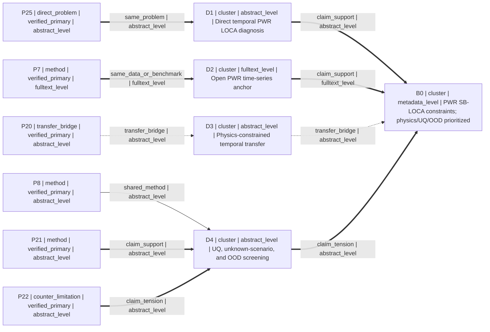

# M1 clean second-round rerun — PWR SB-LOCA

## Capture metadata and isolation

- `baseline_commit`: `3d18cdc74deddacf7fd5859f201c9da5bdc4942f`
- `executed_at_beijing`: `2026-08-04T19:03:26.8369897+08:00`
- `branch_id`: `branch-a`
- `from_brief_version`: `1`
- `to_brief_version`: `2`
- `case_input_scope`: clean second-round feedback only
- `round_one_prior_state_read`: `evals/m1/results/2026-08-04-pwr-sb-loca.md` lines `1–436` only
- `round_one_prior_state_treatment`: frozen; no content at line 437 or later was read
- `prohibited_case_material_read`: false
- `write_scope`: this file only; no commit
- `terminal_state`: `M1_COMPLETE`
- `stage_result`: `ROUND_TWO_READY`
- `validator_result`: `not_run`
- `validator_reason`: The deliverable is Markdown containing a YAML-shaped RoundBundle, not a standalone compatible JSON RoundBundle accepted by the repository validator; no validator success is claimed.

The worktree began at the requested baseline. One unrelated untracked file, `evals/m1/results/2026-08-04-citation-audit-supplement.md`, was present and was not read, edited, staged, or removed.

## Exact new user input

> 第一轮之后，我希望第二轮更偏向物理约束的时序建模，并把不确定性量化（UQ）与分布外（OOD）检测作为重要筛选维度。继续排除依赖私有电厂数据、实验设备或超出单张 24 GB GPU 与 12 周预算的路线。请先显示约束如何继承、拒绝、重置或新增，以及检索式如何因此改变，再给第二轮结果。

## Visible change log shown before the search

- **Inherited:** PWR SB-LOCA relevance; public/open simulated data only; no proprietary plant data; no experimental equipment; one 24 GB GPU; 12 weeks; paper calibration only until a direction is confirmed; unresolved early-warning horizon and primary metric.
- **Rejected:** no individual paper was explicitly rejected. Candidates or routes that require proprietary plant data, experimental hardware, or resources beyond the fixed compute/time budget remain excluded by inherited hard constraints.
- **Reset:** round-one query emphasis and ranking were reset; generic data-driven diagnosis, unconstrained transfer learning, and accuracy-first screening no longer control round-two selection.
- **Added:** prefer physics-constrained temporal modeling; treat UQ as an important screening dimension; treat OOD/unknown-fault detection as an important screening dimension.
- **Search allocation:** 50% exploitation of verified PWR/LOCA/open-data anchors and 50% exploration of physics-informed, uncertainty-aware, and open-set/OOD methods.

## Feedback delta

```yaml
feedback_delta:
  from_brief_version: 1
  to_brief_version: 2
  inherited:
    - "PWR and SB-LOCA relevance must remain visible"
    - "use only public or open simulated data for any later executable work"
    - "exclude dependence on private nuclear power plant data"
    - "exclude routes requiring experimental equipment"
    - "method must be plausible on one 24 GB GPU within 12 weeks"
    - "do not generate a full experiment or simulation route before direction confirmation"
  rejected: []
  reset:
    - object_id: "round_one_search_emphasis"
      reason: "Generic data-driven diagnosis and accuracy-first ranking no longer reflect the requested physics/UQ/OOD emphasis."
  added:
    - object_id: "preference_physics_constrained_temporal"
      reason: "Prefer physics-constrained time-series modeling in round two."
    - object_id: "screen_uq"
      reason: "Treat uncertainty quantification as an important candidate-screening dimension."
    - object_id: "screen_ood"
      reason: "Treat out-of-distribution or unknown-fault detection as an important candidate-screening dimension."
  allocation:
    exploit: 50
    explore: 50
  query_changes:
    - query_id: "Q1-R2"
      reason: "Replace the generic direct-problem query with a temporal and physics-constrained PWR/LOCA query."
      cause_refs: ["feedback_delta.reset[0]", "feedback_delta.added[0]"]
      before: "small break LOCA PWR machine learning diagnosis"
      after: 'PWR AND ("small break LOCA" OR "pipe break extent") AND ("time series" OR temporal) AND ("physics-informed" OR "physics-constrained" OR "forecast-assisted")'
    - query_id: "Q2-R2"
      reason: "Make UQ and OOD/unknown-fault behavior explicit rather than leaving uncertainty as a broad limitation term."
      cause_refs: ["feedback_delta.reset[0]", "feedback_delta.added[1]", "feedback_delta.added[2]"]
      before: "nuclear reactor accident diagnosis explainability uncertainty machine learning"
      after: '("nuclear power plant" OR PWR) AND (fault OR accident) AND ("uncertainty quantification" OR Bayesian OR "predictive uncertainty") AND ("out-of-distribution" OR "unknown fault" OR "open set")'
    - query_id: "Q3-R2"
      reason: "Add a dedicated bridge search for explicit physics integration in nuclear transient or fault models."
      cause_refs: ["feedback_delta.added[0]"]
      before: ""
      after: '("physics-informed neural network" OR "physics-based feature") AND ("nuclear power plant" OR reactor) AND (accident OR fault OR transient)'
    - query_id: "Q4-R2"
      reason: "Tie method exploration to public simulation data and lightweight temporal/Bayesian families compatible with the inherited budget."
      cause_refs: ["feedback_delta.reset[0]", "feedback_delta.added[1]", "feedback_delta.added[2]"]
      before: "nuclear power plant accident diagnosis machine learning simulator dataset"
      after: '("public nuclear accident simulation" OR NPPAD OR PCTRAN) AND ("time series" OR transient) AND (lightweight OR LSTM OR Bayesian OR OOD)'
```

All material `reset` and `added` entries are covered by at least one exact `cause_refs` path. No query change cites `feedback_delta.inherited`.

## Round-two search and verification execution

The detected `nature-academic-search` workflow was `multi-source-search`. Discovery used the Skill's OpenAlex fallback because the named academic-search MCP was not callable in this environment. Four changed queries were run, then candidate identities were checked against the Crossref DOI registry. Selected records were also checked against official publisher pages. Discovery metadata and snippets never established verification status.

### Tool/source log (Beijing time)

| Tool/source | Purpose | Beijing timestamp | Result |
|---|---|---|---|
| `academic_search.py` → OpenAlex | Four materially changed discovery queries | completed before `2026-08-04T19:01:35+08:00` | 4/4 succeeded; overlapping and weak-fit hits remained discovery-only. |
| Crossref REST `api.crossref.org/works/{doi}` | Current DOI/title/author/type verification | per-record timestamps below, `2026-08-04T19:01:35+08:00`–`19:02:40+08:00` | 18/18 matched after the two preserved transient failures were retried once. |
| Official publisher pages: Springer Nature and Elsevier/ScienceDirect | Selected-record and relevant new-record cross-check; abstract/full-text basis | search/open capture completed at `2026-08-04T19:03:26.8369897+08:00` | Selected 6/6 matched. P7 exposed anchored full text; the other selected records are limited to abstract-level reasoning. |
| Direct page opener for several ScienceDirect URLs | Page retrieval | before `2026-08-04T19:03:26.8369897+08:00` | Returned internal errors for some direct opens; exact official-domain search results supplied the publisher landing metadata and abstract instead. |

The first Crossref calls for `10.1016/j.anucene.2022.109201` and `10.1016/j.net.2023.06.027` returned `unavailable` at `2026-08-04T19:01:39.0295797+08:00` and `2026-08-04T19:01:40.0914565+08:00`. One bounded retry returned authoritative matches at `2026-08-04T19:02:38.9337014+08:00` and `2026-08-04T19:02:40.3417467+08:00`. The failed attempts are not counted as matches.

### Counts and deterministic deduplication

```yaml
counts:
  discovery_queries_planned: 4
  discovery_queries_successful: 4
  current_authoritative_candidates_required: "15-20"
  current_crossref_matches: 18
  verified_deduplicated_candidates: 18
  verified_primary_candidates: 9
  verified_registry_candidates: 9
  blocked_or_partial_in_candidate_pool: 0
  selected_default_count: 6
  round_two_request_created: false
  normalized_doi_duplicates: 0
```

All 18 candidate records have a distinct normalized DOI. DOI was the decisive deduplication key; no weaker title/first-author key was used. No preprint/journal merge or inferred identifier was needed.

## Human-readable round-two state snapshot

This YAML-shaped state is included for auditability. It is not a standalone JSON artifact and is not claimed to be validator-compatible.

```yaml
round_bundle:
  schema_version: "m1.1"
  round: 2
  research_brief:
    brief_version: 2
    branch_id: "branch-a"
    engineering_object: "pressurized water reactor (PWR) accident monitoring"
    target_problem: "early diagnosis of small-break loss-of-coolant accidents (SB-LOCA)"
    target_metric: ""
    available_data:
      - "public or open simulated data only"
    resources:
      - "one GPU with 24 GB VRAM"
      - "no experimental equipment"
    time_budget: "12 weeks"
    preferred_routes:
      - "physics-constrained temporal modeling"
      - "uncertainty-aware diagnosis with explicit UQ"
      - "OOD or unknown-fault detection"
      - "reproducible simulation evidence"
    excluded_routes:
      - "private nuclear power plant data"
      - "new physical experiments"
      - "routes exceeding one 24 GB GPU or 12 weeks"
      - "full experimental or simulation route before direction confirmation"
    hard_constraints:
      - "PWR and SB-LOCA relevance must remain visible"
      - "use only public or open simulated data for any later executable work"
      - "do not assume access to proprietary plant data or experimental equipment"
      - "method must be plausible on one 24 GB GPU within 12 weeks"
      - "complete paper calibration before route planning"
    soft_preferences:
      - "prefer physics-constrained time-series modeling"
      - "treat UQ as an important screening dimension"
      - "treat OOD detection as an important screening dimension"
    open_questions:
      - "What operational definition of early diagnosis is required?"
      - "Which primary metric matters most: delay, event class, break-size error, false-alarm rate, calibration, or OOD AUROC/FPR?"
      - "Should NPPAD/PCTRAN-PWR3LP define the target system, or only provide a public feasibility benchmark?"
    evidence_needs:
      - "a public SB-LOCA subset and defensible split protocol"
      - "physics residuals or conservation features computable from available NPPAD variables"
      - "UQ calibration and selective-risk evidence under temporal shift"
      - "OOD construction that does not leak held-out accident identities"
      - "measured training memory and wall-clock feasibility on one 24 GB GPU"
  search_plan:
    round: 2
    brief_version: 2
    branch_id: "branch-a"
    time_boundary: "No publication-year cutoff; metadata checked on 2026-08-04 Asia/Shanghai. Bounded search, not exhaustive or novelty-complete."
    language_boundary: ["English"]
    source_boundary:
      - "Discovery: OpenAlex public API fallback plus official-domain web search"
      - "Verification: Crossref DOI registry for every candidate"
      - "Selected cross-check: official Springer Nature or Elsevier/ScienceDirect landing pages"
      - "Excluded as final truth: OpenAlex fields, snippets, citation counts, and model memory"
    queries:
      - query_id: "Q1-R2"
        purpose: "direct_problem"
        query_text: 'PWR AND ("small break LOCA" OR "pipe break extent") AND ("time series" OR temporal) AND ("physics-informed" OR "physics-constrained" OR "forecast-assisted")'
        expected_evidence_role: "direct_problem"
        inclusion_terms: ["PWR", "LOCA", "time series", "early or real-time", "physics or forecast constraint"]
        exclusion_terms: ["private plant data required", "large-break-only without transfer warning"]
      - query_id: "Q2-R2"
        purpose: "uq_and_ood"
        query_text: '("nuclear power plant" OR PWR) AND (fault OR accident) AND ("uncertainty quantification" OR Bayesian OR "predictive uncertainty") AND ("out-of-distribution" OR "unknown fault" OR "open set")'
        expected_evidence_role: "counter_limitation"
        inclusion_terms: ["predictive uncertainty", "unknown scenario", "domain shift", "open-set recognition"]
        exclusion_terms: ["confidence score without calibration or unknown-case evaluation", "private data required"]
      - query_id: "Q3-R2"
        purpose: "physics_transfer"
        query_text: '("physics-informed neural network" OR "physics-based feature") AND ("nuclear power plant" OR reactor) AND (accident OR fault OR transient)'
        expected_evidence_role: "transfer_bridge"
        inclusion_terms: ["explicit physical law, residual, mechanistic feature, or conservation constraint", "transient modeling"]
        exclusion_terms: ["physics-informed used only as a label", "experimental-equipment prerequisite"]
      - query_id: "Q4-R2"
        purpose: "open_data_and_budget"
        query_text: '("public nuclear accident simulation" OR NPPAD OR PCTRAN) AND ("time series" OR transient) AND (lightweight OR LSTM OR Bayesian OR OOD)'
        expected_evidence_role: "method"
        inclusion_terms: ["public simulator data", "multivariate time series", "bounded model family"]
        exclusion_terms: ["private plant data", "new experiments", "unbounded foundation-model training"]
    limitations:
      - "The academic-search MCP named by the search Skill was unavailable."
      - "OpenAlex was discovery-only; authoritative verification used Crossref and publisher pages."
      - "Only one selected paper exposed a stable inspected full-text anchor."
      - "No paper proves the exact one-24-GB-GPU/12-week end-to-end budget."
  candidate_pool:
    - candidate_id: P1
      verification_status: verified_registry
      recommendation_eligible: true
      evidence_roles: [direct_problem]
      selection_role: direct_problem
      basis_level: metadata_level
      verified_record:
        paper_id: P1
        title: "Real-time estimation of break sizes during LOCA in nuclear power plants using NARX neural network"
        authors: ["Mahdi Saghafi", "Mohammad B. Ghofrani"]
        year_online: null
        year_issue: 2019
        venue: "Nuclear Engineering and Technology"
        publication_type: "journal-article"
        doi: "10.1016/j.net.2018.11.017"
        canonical_url: "https://doi.org/10.1016/j.net.2018.11.017"
        alternate_id: null
        verification: {status: verified_registry, checked_sources: [{source_type: doi_registry, canonical_record: "https://api.crossref.org/works/10.1016%2Fj.net.2018.11.017", checked_at: "2026-08-04T19:01:35.9220294+08:00", result: match}], title_match: exact, author_match: exact, version_relation: same_work, recommendation_eligible: true, blocking_reasons: []}
        evidence_role: "direct_problem"
        supports: "Current registry identity for a real-time LOCA break-size paper."
        does_not_support: "Current abstract/full-text claims, public data, physics constraints, UQ, or OOD were not re-established in this rerun."
        basis_level: metadata_level
    - candidate_id: P3
      verification_status: verified_registry
      recommendation_eligible: true
      evidence_roles: [direct_problem]
      selection_role: direct_problem
      basis_level: metadata_level
      verified_record:
        paper_id: P3
        title: "Diagnosis and Prediction for Loss of Coolant Accidents in Nuclear Power Plants Using Deep Learning Methods"
        authors: ["Jingke She", "Tianzi Shi", "Shiyu Xue", "Yan Zhu", "Shaofei Lu", "Peiwei Sun", "Huasong Cao"]
        year_online: 2021
        year_issue: null
        venue: "Frontiers in Energy Research"
        publication_type: "journal-article"
        doi: "10.3389/fenrg.2021.665262"
        canonical_url: "https://doi.org/10.3389/fenrg.2021.665262"
        alternate_id: null
        verification: {status: verified_registry, checked_sources: [{source_type: doi_registry, canonical_record: "https://api.crossref.org/works/10.3389%2Ffenrg.2021.665262", checked_at: "2026-08-04T19:01:37.1977718+08:00", result: match}], title_match: exact, author_match: exact, version_relation: same_work, recommendation_eligible: true, blocking_reasons: []}
        evidence_role: "direct_problem"
        supports: "Current registry identity for direct LOCA diagnosis/prediction."
        does_not_support: "The current rerun did not establish explicit physics, UQ, OOD, or budget evidence."
        basis_level: metadata_level
    - candidate_id: P6
      verification_status: verified_registry
      recommendation_eligible: true
      evidence_roles: [direct_problem, method]
      selection_role: direct_problem
      basis_level: metadata_level
      verified_record:
        paper_id: P6
        title: "Enhancing LOCA Breach Size Diagnosis with Fundamental Deep Learning Models and Optimized Dataset Construction"
        authors: ["Xingyu Xiao", "Ben Qi", "Jingang Liang", "Jiejuan Tong", "Qing Deng", "Peng Chen"]
        year_online: 2023
        year_issue: 2024
        venue: "Energies"
        publication_type: "journal-article"
        doi: "10.3390/en17010159"
        canonical_url: "https://doi.org/10.3390/en17010159"
        alternate_id: null
        verification: {status: verified_registry, checked_sources: [{source_type: doi_registry, canonical_record: "https://api.crossref.org/works/10.3390%2Fen17010159", checked_at: "2026-08-04T19:01:37.9625853+08:00", result: match}], title_match: exact, author_match: exact, version_relation: same_work, recommendation_eligible: true, blocking_reasons: []}
        evidence_role: "direct_problem"
        supports: "Current registry identity for LOCA breach-size diagnosis and dataset construction."
        does_not_support: "Current-round physics-constrained, calibrated-UQ, or OOD evidence."
        basis_level: metadata_level
    - candidate_id: P7
      verification_status: verified_primary
      recommendation_eligible: true
      evidence_roles: [method, direct_problem]
      selection_role: method
      basis_level: fulltext_level
      verified_record:
        paper_id: P7
        title: "An open time-series simulated dataset covering various accidents for nuclear power plants"
        authors: ["Ben Qi", "Xingyu Xiao", "Jingang Liang", "Li-chi Cliff Po", "Liguo Zhang", "Jiejuan Tong"]
        year_online: 2022
        year_issue: 2022
        venue: "Scientific Data"
        publication_type: "journal-article"
        doi: "10.1038/s41597-022-01879-1"
        canonical_url: "https://doi.org/10.1038/s41597-022-01879-1"
        alternate_id: null
        verification:
          status: verified_primary
          checked_sources:
            - {source_type: doi_registry, canonical_record: "https://api.crossref.org/works/10.1038%2Fs41597-022-01879-1", checked_at: "2026-08-04T19:01:38.3231443+08:00", result: match}
            - {source_type: publisher_landing, canonical_record: "https://www.nature.com/articles/s41597-022-01879-1", checked_at: "2026-08-04T19:03:26.8369897+08:00", result: match}
          title_match: exact
          author_match: exact
          version_relation: same_work
          recommendation_eligible: true
          blocking_reasons: []
        evidence_role: "method"
        supports: "Open PCTRAN PWR accident time series; full-text anchors: Abstract, Methods, Theoretical models of PCTRAN, equations (1)–(11), and Data/Code availability sections."
        does_not_support: "A community-standard SB-LOCA split, early-warning horizon, OOD protocol, or safety validation."
        basis_level: fulltext_level
    - candidate_id: P8
      verification_status: verified_primary
      recommendation_eligible: true
      evidence_roles: [method, direct_problem]
      selection_role: method
      basis_level: abstract_level
      verified_record:
        paper_id: P8
        title: "Robust on-line diagnosis tool for the early accident detection in nuclear power plants"
        authors: ["Silvia Tolo", "Xiange Tian", "Nils Bausch", "Victor Becerra", "T.V. Santhosh", "G. Vinod", "Edoardo Patelli"]
        year_online: null
        year_issue: 2019
        venue: "Reliability Engineering & System Safety"
        publication_type: "journal-article"
        doi: "10.1016/j.ress.2019.02.015"
        canonical_url: "https://doi.org/10.1016/j.ress.2019.02.015"
        alternate_id: null
        verification:
          status: verified_primary
          checked_sources:
            - {source_type: doi_registry, canonical_record: "https://api.crossref.org/works/10.1016%2Fj.ress.2019.02.015", checked_at: "2026-08-04T19:01:38.6845821+08:00", result: match}
            - {source_type: publisher_landing, canonical_record: "https://www.sciencedirect.com/science/article/pii/S0951832018304253", checked_at: "2026-08-04T19:03:26.8369897+08:00", result: match}
          title_match: exact
          author_match: exact
          version_relation: same_work
          recommendation_eligible: true
          blocking_reasons: []
        evidence_role: "method"
        supports: "Bayesian ensemble-style uncertainty absorption and output confidence bounds for low-latency online LOCA diagnosis."
        does_not_support: "PWR validation, explicit OOD detection, public data, or a full compute audit; the case is a 220 MWe pressurized heavy-water reactor."
        basis_level: abstract_level
    - candidate_id: P13
      verification_status: verified_registry
      recommendation_eligible: true
      evidence_roles: [transfer_bridge, method]
      selection_role: transfer_bridge
      basis_level: metadata_level
      verified_record:
        paper_id: P13
        title: "Pre-trained network-based transfer learning: A small-sample machine learning approach to nuclear power plant classification problem"
        authors: ["Xianping Zhong", "Heng Ban"]
        year_online: null
        year_issue: 2022
        venue: "Annals of Nuclear Energy"
        publication_type: "journal-article"
        doi: "10.1016/j.anucene.2022.109201"
        canonical_url: "https://doi.org/10.1016/j.anucene.2022.109201"
        alternate_id: null
        verification: {status: verified_registry, checked_sources: [{source_type: doi_registry, canonical_record: "https://api.crossref.org/works/10.1016%2Fj.anucene.2022.109201", checked_at: "2026-08-04T19:01:39.0295797+08:00", result: unavailable}, {source_type: doi_registry, canonical_record: "https://api.crossref.org/works/10.1016%2Fj.anucene.2022.109201", checked_at: "2026-08-04T19:02:38.9337014+08:00", result: match}], title_match: exact, author_match: exact, version_relation: same_work, recommendation_eligible: true, blocking_reasons: []}
        evidence_role: "transfer_bridge"
        supports: "Current identity of a small-sample transfer-learning paper."
        does_not_support: "Target-domain PWR SB-LOCA physics, UQ, or OOD evidence."
        basis_level: metadata_level
    - candidate_id: P14
      verification_status: verified_registry
      recommendation_eligible: true
      evidence_roles: [transfer_bridge, method]
      selection_role: transfer_bridge
      basis_level: metadata_level
      verified_record:
        paper_id: P14
        title: "Model-Based Deep Transfer Learning Method to Fault Detection and Diagnosis in Nuclear Power Plants"
        authors: ["Yuantao Yao", "Daochuan Ge", "Jie Yu", "Min Xie"]
        year_online: 2022
        year_issue: null
        venue: "Frontiers in Energy Research"
        publication_type: "journal-article"
        doi: "10.3389/fenrg.2022.823395"
        canonical_url: "https://doi.org/10.3389/fenrg.2022.823395"
        alternate_id: null
        verification: {status: verified_registry, checked_sources: [{source_type: doi_registry, canonical_record: "https://api.crossref.org/works/10.3389%2Ffenrg.2022.823395", checked_at: "2026-08-04T19:01:39.3007251+08:00", result: match}], title_match: exact, author_match: exact, version_relation: same_work, recommendation_eligible: true, blocking_reasons: []}
        evidence_role: "transfer_bridge"
        supports: "Current identity of a model-based transfer-learning NPP fault-diagnosis paper."
        does_not_support: "Public target data or explicit physics-loss, UQ, and OOD evidence in the current rerun."
        basis_level: metadata_level
    - candidate_id: P17
      verification_status: verified_registry
      recommendation_eligible: true
      evidence_roles: [counter_limitation]
      selection_role: counter_limitation
      basis_level: metadata_level
      verified_record:
        paper_id: P17
        title: "Deep learning for safety assessment of nuclear power reactors: Reliability, explainability, and research opportunities"
        authors: ["Abiodun Ayodeji", "Muritala Alade Amidu", "Samuel Abiodun Olatubosun", "Yacine Addad", "Hafiz Ahmed"]
        year_online: null
        year_issue: 2022
        venue: "Progress in Nuclear Energy"
        publication_type: "journal-article"
        doi: "10.1016/j.pnucene.2022.104339"
        canonical_url: "https://doi.org/10.1016/j.pnucene.2022.104339"
        alternate_id: null
        verification: {status: verified_registry, checked_sources: [{source_type: doi_registry, canonical_record: "https://api.crossref.org/works/10.1016%2Fj.pnucene.2022.104339", checked_at: "2026-08-04T19:01:39.6476283+08:00", result: match}], title_match: exact, author_match: exact, version_relation: same_work, recommendation_eligible: true, blocking_reasons: []}
        evidence_role: "counter_limitation"
        supports: "Current identity of a nuclear DL safety/reliability review."
        does_not_support: "A concrete UQ/OOD detector, public benchmark result, or SB-LOCA model."
        basis_level: metadata_level
    - candidate_id: P19
      verification_status: verified_primary
      recommendation_eligible: true
      evidence_roles: [transfer_bridge, method]
      selection_role: transfer_bridge
      basis_level: abstract_level
      verified_record:
        paper_id: P19
        title: "Physics informed neural networks for surrogate modeling of accidental scenarios in nuclear power plants"
        authors: ["Federico Antonello", "Jacopo Buongiorno", "Enrico Zio"]
        year_online: null
        year_issue: 2023
        venue: "Nuclear Engineering and Technology"
        publication_type: "journal-article"
        doi: "10.1016/j.net.2023.06.027"
        canonical_url: "https://doi.org/10.1016/j.net.2023.06.027"
        alternate_id: null
        verification: {status: verified_primary, checked_sources: [{source_type: doi_registry, canonical_record: "https://api.crossref.org/works/10.1016%2Fj.net.2023.06.027", checked_at: "2026-08-04T19:01:40.0914565+08:00", result: unavailable}, {source_type: doi_registry, canonical_record: "https://api.crossref.org/works/10.1016%2Fj.net.2023.06.027", checked_at: "2026-08-04T19:02:40.3417467+08:00", result: match}, {source_type: publisher_landing, canonical_record: "https://www.sciencedirect.com/science/article/pii/S1738573323002917", checked_at: "2026-08-04T19:03:26.8369897+08:00", result: match}], title_match: exact, author_match: exact, version_relation: same_work, recommendation_eligible: true, blocking_reasons: []}
        evidence_role: "transfer_bridge"
        supports: "Explicit physics-informed surrogate modeling for a nuclear accidental scenario."
        does_not_support: "PWR SB-LOCA diagnosis; its case is LOHS in a nuclear microreactor, so transfer is hypothetical."
        basis_level: abstract_level
    - candidate_id: P20
      verification_status: verified_primary
      recommendation_eligible: true
      evidence_roles: [transfer_bridge, method]
      selection_role: transfer_bridge
      basis_level: abstract_level
      verified_record:
        paper_id: P20
        title: "Physics-informed fault diagnosis through online efficiency monitoring of PWR type nuclear power plants"
        authors: ["Furqan Arshad", "Minjun Peng", "Wasiq Ali", "Zikang Li", "Fazle Haseeb", "Awais Khan"]
        year_online: null
        year_issue: 2026
        venue: "Annals of Nuclear Energy"
        publication_type: "journal-article"
        doi: "10.1016/j.anucene.2025.112071"
        canonical_url: "https://doi.org/10.1016/j.anucene.2025.112071"
        alternate_id: null
        verification: {status: verified_primary, checked_sources: [{source_type: doi_registry, canonical_record: "https://api.crossref.org/works/10.1016%2Fj.anucene.2025.112071", checked_at: "2026-08-04T19:01:40.3533809+08:00", result: match}, {source_type: publisher_landing, canonical_record: "https://www.sciencedirect.com/science/article/pii/S0306454925008886", checked_at: "2026-08-04T19:03:26.8369897+08:00", result: match}], title_match: exact, author_match: exact, version_relation: same_work, recommendation_eligible: true, blocking_reasons: []}
        evidence_role: "transfer_bridge"
        supports: "Physics-based feature augmentation for PWR fault detection/classification/regression with noisy-data evaluation."
        does_not_support: "SB-LOCA-specific results, public-data availability, calibrated UQ/OOD, or exact resource use."
        basis_level: abstract_level
    - candidate_id: P21
      verification_status: verified_primary
      recommendation_eligible: true
      evidence_roles: [method, transfer_bridge]
      selection_role: method
      basis_level: abstract_level
      verified_record:
        paper_id: P21
        title: "Uncertainty-aware deep learning for reliable health monitoring in safety-critical energy systems"
        authors: ["Yuantao Yao", "Te Han", "Jie Yu", "Min Xie"]
        year_online: null
        year_issue: 2024
        venue: "Energy"
        publication_type: "journal-article"
        doi: "10.1016/j.energy.2024.130419"
        canonical_url: "https://doi.org/10.1016/j.energy.2024.130419"
        alternate_id: null
        verification: {status: verified_primary, checked_sources: [{source_type: doi_registry, canonical_record: "https://api.crossref.org/works/10.1016%2Fj.energy.2024.130419", checked_at: "2026-08-04T19:01:40.6879016+08:00", result: match}, {source_type: publisher_landing, canonical_record: "https://www.sciencedirect.com/science/article/pii/S0360544224001907", checked_at: "2026-08-04T19:03:26.8369897+08:00", result: match}], title_match: exact, author_match: exact, version_relation: same_work, recommendation_eligible: true, blocking_reasons: []}
        evidence_role: "method"
        supports: "Spatio-temporal preprocessing, Bayesian predictive uncertainty, and known/unknown-scenario evaluation on nuclear systems including a public accident simulation platform."
        does_not_support: "SB-LOCA-specific calibration, explicit physical residuals, or the exact compute budget."
        basis_level: abstract_level
    - candidate_id: P22
      verification_status: verified_primary
      recommendation_eligible: true
      evidence_roles: [counter_limitation, method]
      selection_role: counter_limitation
      basis_level: abstract_level
      verified_record:
        paper_id: P22
        title: "Reliable fault diagnosis framework for nuclear power plants based on Bayesian neural network and uncertainty analysis"
        authors: ["Jiangkuan Li", "Taixi Zhang", "Shangcai Zheng", "Jiaoshen Xu", "Meng Lin", "Sichao Tan", "Ruifeng Tian"]
        year_online: null
        year_issue: 2026
        venue: "Nuclear Engineering and Design"
        publication_type: "journal-article"
        doi: "10.1016/j.nucengdes.2025.114707"
        canonical_url: "https://doi.org/10.1016/j.nucengdes.2025.114707"
        alternate_id: null
        verification: {status: verified_primary, checked_sources: [{source_type: doi_registry, canonical_record: "https://api.crossref.org/works/10.1016%2Fj.nucengdes.2025.114707", checked_at: "2026-08-04T19:01:41.0832229+08:00", result: match}, {source_type: publisher_landing, canonical_record: "https://www.sciencedirect.com/science/article/pii/S0029549325008842", checked_at: "2026-08-04T19:03:26.8369897+08:00", result: match}], title_match: exact, author_match: exact, version_relation: same_work, recommendation_eligible: true, blocking_reasons: []}
        evidence_role: "counter_limitation"
        supports: "BNN uncertainty decomposition, domain-discrepancy sensitivity, and unknown-fault/OOD screening for NPP diagnosis."
        does_not_support: "Public data, SB-LOCA specificity, physics constraints, or an exact resource audit."
        basis_level: abstract_level
    - candidate_id: P23
      verification_status: verified_primary
      recommendation_eligible: true
      evidence_roles: [counter_limitation, method]
      selection_role: counter_limitation
      basis_level: abstract_level
      verified_record:
        paper_id: P23
        title: "Towards robust open set fault diagnosis for nuclear power plant"
        authors: ["Haibo Yu", "Weisheng Wang", "Minghan Yang", "Xiaolong Shen", "Panpan Zhang", "Jianye Wang"]
        year_online: null
        year_issue: 2026
        venue: "Annals of Nuclear Energy"
        publication_type: "journal-article"
        doi: "10.1016/j.anucene.2026.112359"
        canonical_url: "https://doi.org/10.1016/j.anucene.2026.112359"
        alternate_id: null
        verification: {status: verified_primary, checked_sources: [{source_type: doi_registry, canonical_record: "https://api.crossref.org/works/10.1016%2Fj.anucene.2026.112359", checked_at: "2026-08-04T19:01:41.3968226+08:00", result: match}, {source_type: publisher_landing, canonical_record: "https://www.sciencedirect.com/science/article/pii/S0306454926002471", checked_at: "2026-08-04T19:03:26.8369897+08:00", result: match}], title_match: exact, author_match: exact, version_relation: same_work, recommendation_eligible: true, blocking_reasons: []}
        evidence_role: "counter_limitation"
        supports: "Prototype matching plus extreme-value decision boundaries for unknown NPP fault detection under openness and noise variation."
        does_not_support: "PWR SB-LOCA transfer, public CLEAR-I data, physics constraints, or exact compute feasibility."
        basis_level: abstract_level
    - candidate_id: P24
      verification_status: verified_primary
      recommendation_eligible: true
      evidence_roles: [counter_limitation, transfer_bridge]
      selection_role: counter_limitation
      basis_level: abstract_level
      verified_record:
        paper_id: P24
        title: "A novel fault diagnosis method for unknown faults in nuclear power plants considering domain adaptation and spatio-temporal feature fusion"
        authors: ["Yushun Wang", "Jingquan Liu"]
        year_online: null
        year_issue: 2026
        venue: "Progress in Nuclear Energy"
        publication_type: "journal-article"
        doi: "10.1016/j.pnucene.2025.106209"
        canonical_url: "https://doi.org/10.1016/j.pnucene.2025.106209"
        alternate_id: null
        verification: {status: verified_primary, checked_sources: [{source_type: doi_registry, canonical_record: "https://api.crossref.org/works/10.1016%2Fj.pnucene.2025.106209", checked_at: "2026-08-04T19:01:41.7034491+08:00", result: match}, {source_type: publisher_landing, canonical_record: "https://www.sciencedirect.com/science/article/pii/S0149197025006079", checked_at: "2026-08-04T19:03:26.8369897+08:00", result: match}], title_match: exact, author_match: exact, version_relation: same_work, recommendation_eligible: true, blocking_reasons: []}
        evidence_role: "counter_limitation"
        supports: "Open-set NPP fault diagnosis using domain adaptation and spatio-temporal feature fusion."
        does_not_support: "Public data, SB-LOCA validation, UQ calibration, physics constraints, or exact compute cost."
        basis_level: abstract_level
    - candidate_id: P25
      verification_status: verified_primary
      recommendation_eligible: true
      evidence_roles: [direct_problem, method]
      selection_role: direct_problem
      basis_level: abstract_level
      verified_record:
        paper_id: P25
        title: "Real-time pipe break extent prediction for loss of coolant accidents in pressurized water reactors using a multi-step forecast-assisted long short-term memory model"
        authors: ["Johndel Obra", "Shuichiro Miwa"]
        year_online: null
        year_issue: 2026
        venue: "Progress in Nuclear Energy"
        publication_type: "journal-article"
        doi: "10.1016/j.pnucene.2025.106148"
        canonical_url: "https://doi.org/10.1016/j.pnucene.2025.106148"
        alternate_id: null
        verification: {status: verified_primary, checked_sources: [{source_type: doi_registry, canonical_record: "https://api.crossref.org/works/10.1016%2Fj.pnucene.2025.106148", checked_at: "2026-08-04T19:01:41.9942312+08:00", result: match}, {source_type: publisher_landing, canonical_record: "https://www.sciencedirect.com/science/article/pii/S0149197025005463", checked_at: "2026-08-04T19:03:26.8369897+08:00", result: match}], title_match: exact, author_match: exact, version_relation: same_work, recommendation_eligible: true, blocking_reasons: []}
        evidence_role: "direct_problem"
        supports: "Recent direct PWR LOCA real-time pipe-break extent prediction using temporal forecasting and reported runtime/memory metrics."
        does_not_support: "Explicit physics loss, UQ/OOD screening, public training data, or the exact 24 GB/12-week budget."
        basis_level: abstract_level
    - candidate_id: P26
      verification_status: verified_registry
      recommendation_eligible: true
      evidence_roles: [direct_problem]
      selection_role: direct_problem
      basis_level: metadata_level
      verified_record:
        paper_id: P26
        title: "Time-Series Forecasting of a Typical PWR Undergoing Large Break LOCA"
        authors: ["Michal Kaminski", "Aya Diab"]
        year_online: null
        year_issue: 2024
        venue: "Science and Technology of Nuclear Installations"
        publication_type: "journal-article"
        doi: "10.1155/2024/6162232"
        canonical_url: "https://doi.org/10.1155/2024/6162232"
        alternate_id: null
        verification: {status: verified_registry, checked_sources: [{source_type: doi_registry, canonical_record: "https://api.crossref.org/works/10.1155%2F2024%2F6162232", checked_at: "2026-08-04T19:01:42.3525764+08:00", result: match}], title_match: exact, author_match: exact, version_relation: same_work, recommendation_eligible: true, blocking_reasons: []}
        evidence_role: "direct_problem"
        supports: "Current identity of PWR LOCA time-series forecasting work."
        does_not_support: "Small-break scope, current abstract/full-text claims, UQ/OOD, or public data."
        basis_level: metadata_level
    - candidate_id: P27
      verification_status: verified_registry
      recommendation_eligible: true
      evidence_roles: [method, transfer_bridge]
      selection_role: transfer_bridge
      basis_level: metadata_level
      verified_record:
        paper_id: P27
        title: "A simulation and machine learning informed diagnosis of the severe accidents"
        authors: ["JinHo Song", "KwangSoon Ha"]
        year_online: null
        year_issue: 2022
        venue: "Nuclear Engineering and Design"
        publication_type: "journal-article"
        doi: "10.1016/j.nucengdes.2022.111881"
        canonical_url: "https://doi.org/10.1016/j.nucengdes.2022.111881"
        alternate_id: null
        verification: {status: verified_registry, checked_sources: [{source_type: doi_registry, canonical_record: "https://api.crossref.org/works/10.1016%2Fj.nucengdes.2022.111881", checked_at: "2026-08-04T19:01:42.6709559+08:00", result: match}], title_match: exact, author_match: exact, version_relation: same_work, recommendation_eligible: true, blocking_reasons: []}
        evidence_role: "transfer_bridge"
        supports: "Current identity of simulation-informed temporal severe-accident diagnosis work."
        does_not_support: "SB-LOCA, explicit UQ/OOD, public data, or current abstract/full-text conclusions."
        basis_level: metadata_level
    - candidate_id: P28
      verification_status: verified_registry
      recommendation_eligible: true
      evidence_roles: [method, transfer_bridge]
      selection_role: transfer_bridge
      basis_level: metadata_level
      verified_record:
        paper_id: P28
        title: "Bayesian Long Short-Term Memory Model for Fault Early Warning of Nuclear Power Turbine"
        authors: ["Gaojun Liu", "Haixia Gu", "Xiaocheng Shen", "Dongdong You"]
        year_online: null
        year_issue: 2020
        venue: "IEEE Access"
        publication_type: "journal-article"
        doi: "10.1109/access.2020.2980244"
        canonical_url: "https://doi.org/10.1109/access.2020.2980244"
        alternate_id: null
        verification: {status: verified_registry, checked_sources: [{source_type: doi_registry, canonical_record: "https://api.crossref.org/works/10.1109%2Faccess.2020.2980244", checked_at: "2026-08-04T19:01:42.9666328+08:00", result: match}], title_match: exact, author_match: exact, version_relation: same_work, recommendation_eligible: true, blocking_reasons: []}
        evidence_role: "transfer_bridge"
        supports: "Current identity of Bayesian LSTM early-warning work in a nuclear turbine context."
        does_not_support: "Reactor accident diagnosis, SB-LOCA, OOD detection, public data, or current abstract/full-text conclusions."
        basis_level: metadata_level
  selected_ids: [P7, P8, P20, P21, P22, P25]
  paper_map:
    round: 2
    node_size_basis: user_fit
    legend:
      evidence_roles: [direct_problem, method, transfer_bridge, counter_limitation]
      basis_levels: [metadata_level, abstract_level, fulltext_level]
    nodes:
      - {id: B0, node_type: cluster, basis_level: metadata_level, short_note: "PWR SB-LOCA early diagnosis under public-data, 24-GB-GPU, 12-week limits; physics/UQ/OOD prioritized"}
      - {id: D1, node_type: cluster, basis_level: abstract_level, short_note: "Direct temporal PWR LOCA diagnosis"}
      - {id: D2, node_type: cluster, basis_level: fulltext_level, short_note: "Open PWR time-series anchor"}
      - {id: D3, node_type: cluster, basis_level: abstract_level, short_note: "Physics-constrained temporal transfer"}
      - {id: D4, node_type: cluster, basis_level: abstract_level, short_note: "UQ, unknown-scenario, and OOD screening"}
      - {id: P7, node_type: paper, fit_score: 1.00, evidence_role: method, verification_status: verified_primary, basis_level: fulltext_level, short_note: "Open PCTRAN-PWR3LP accident time series and physics equations"}
      - {id: P8, node_type: paper, fit_score: 0.82, evidence_role: method, verification_status: verified_primary, basis_level: abstract_level, short_note: "Bayesian LOCA confidence bounds; PHWR-to-PWR transfer required"}
      - {id: P20, node_type: paper, fit_score: 0.88, evidence_role: transfer_bridge, verification_status: verified_primary, basis_level: abstract_level, short_note: "Physics-based feature augmentation for PWR fault diagnosis"}
      - {id: P21, node_type: paper, fit_score: 0.94, evidence_role: method, verification_status: verified_primary, basis_level: abstract_level, short_note: "Spatio-temporal Bayesian UQ with known/unknown nuclear scenarios"}
      - {id: P22, node_type: paper, fit_score: 0.91, evidence_role: counter_limitation, verification_status: verified_primary, basis_level: abstract_level, short_note: "BNN uncertainty decomposition and OOD/domain-shift sensitivity"}
      - {id: P25, node_type: paper, fit_score: 0.96, evidence_role: direct_problem, verification_status: verified_primary, basis_level: abstract_level, short_note: "Recent real-time PWR LOCA break-extent temporal prediction"}
    edges:
      - {source: P25, target: D1, relation: same_problem, strength: strong, confidence: high, basis_level: abstract_level, note: "Direct PWR LOCA real-time pipe-break extent target"}
      - {source: P7, target: D2, relation: same_data_or_benchmark, strength: strong, confidence: high, basis_level: fulltext_level, note: "Open PWR simulator time series plus equations and code/data availability"}
      - {source: P20, target: D3, relation: transfer_bridge, strength: medium, confidence: medium, basis_level: abstract_level, note: "Physics-based PWR features transfer to SB-LOCA only as a hypothesis"}
      - {source: P8, target: D4, relation: shared_method, strength: medium, confidence: medium, basis_level: abstract_level, note: "Bayesian confidence bounds address UQ but not explicit OOD"}
      - {source: P21, target: D4, relation: claim_support, strength: strong, confidence: high, basis_level: abstract_level, note: "Predictive uncertainty evaluated on known and unknown nuclear scenarios"}
      - {source: P22, target: D4, relation: claim_tension, strength: strong, confidence: high, basis_level: abstract_level, note: "Closed-set accuracy can hide domain discrepancy and unknown faults"}
      - {source: D1, target: B0, relation: claim_support, strength: strong, confidence: high, basis_level: abstract_level, note: "Direct temporal PWR LOCA target remains represented"}
      - {source: D2, target: B0, relation: claim_support, strength: strong, confidence: high, basis_level: fulltext_level, note: "A public PWR time-series basis is available"}
      - {source: D3, target: B0, relation: transfer_bridge, strength: medium, confidence: medium, basis_level: abstract_level, note: "Physics integration is plausible but awaits target-domain residual design"}
      - {source: D4, target: B0, relation: claim_tension, strength: strong, confidence: high, basis_level: abstract_level, note: "UQ/OOD performance must be measured, not inferred from classification accuracy"}
    text_fallback:
      - {entry_type: node, id: B0, node_type: cluster, basis_level: metadata_level, text: "B0: PWR SB-LOCA early diagnosis under public-data, 24-GB-GPU, 12-week limits; physics/UQ/OOD prioritized"}
      - {entry_type: node, id: D1, node_type: cluster, basis_level: abstract_level, text: "D1: Direct temporal PWR LOCA diagnosis"}
      - {entry_type: node, id: D2, node_type: cluster, basis_level: fulltext_level, text: "D2: Open PWR time-series anchor"}
      - {entry_type: node, id: D3, node_type: cluster, basis_level: abstract_level, text: "D3: Physics-constrained temporal transfer"}
      - {entry_type: node, id: D4, node_type: cluster, basis_level: abstract_level, text: "D4: UQ, unknown-scenario, and OOD screening"}
      - {entry_type: node, id: P7, node_type: paper, evidence_role: method, verification_status: verified_primary, basis_level: fulltext_level, text: "P7: Open PCTRAN-PWR3LP accident time series and physics equations"}
      - {entry_type: node, id: P8, node_type: paper, evidence_role: method, verification_status: verified_primary, basis_level: abstract_level, text: "P8: Bayesian LOCA confidence bounds; PHWR-to-PWR transfer required"}
      - {entry_type: node, id: P20, node_type: paper, evidence_role: transfer_bridge, verification_status: verified_primary, basis_level: abstract_level, text: "P20: Physics-based feature augmentation for PWR fault diagnosis"}
      - {entry_type: node, id: P21, node_type: paper, evidence_role: method, verification_status: verified_primary, basis_level: abstract_level, text: "P21: Spatio-temporal Bayesian UQ with known/unknown nuclear scenarios"}
      - {entry_type: node, id: P22, node_type: paper, evidence_role: counter_limitation, verification_status: verified_primary, basis_level: abstract_level, text: "P22: BNN uncertainty decomposition and OOD/domain-shift sensitivity"}
      - {entry_type: node, id: P25, node_type: paper, evidence_role: direct_problem, verification_status: verified_primary, basis_level: abstract_level, text: "P25: Recent real-time PWR LOCA break-extent temporal prediction"}
      - {entry_type: edge, source: P25, target: D1, relation: same_problem, basis_level: abstract_level, text: "P25 --same_problem--> D1: Direct PWR LOCA real-time pipe-break extent target"}
      - {entry_type: edge, source: P7, target: D2, relation: same_data_or_benchmark, basis_level: fulltext_level, text: "P7 --same_data_or_benchmark--> D2: Open PWR simulator time series plus equations and code/data availability"}
      - {entry_type: edge, source: P20, target: D3, relation: transfer_bridge, basis_level: abstract_level, text: "P20 --transfer_bridge--> D3: Physics-based PWR features transfer to SB-LOCA only as a hypothesis"}
      - {entry_type: edge, source: P8, target: D4, relation: shared_method, basis_level: abstract_level, text: "P8 --shared_method--> D4: Bayesian confidence bounds address UQ but not explicit OOD"}
      - {entry_type: edge, source: P21, target: D4, relation: claim_support, basis_level: abstract_level, text: "P21 --claim_support--> D4: Predictive uncertainty evaluated on known and unknown nuclear scenarios"}
      - {entry_type: edge, source: P22, target: D4, relation: claim_tension, basis_level: abstract_level, text: "P22 --claim_tension--> D4: Closed-set accuracy can hide domain discrepancy and unknown faults"}
      - {entry_type: edge, source: D1, target: B0, relation: claim_support, basis_level: abstract_level, text: "D1 --claim_support--> B0: Direct temporal PWR LOCA target remains represented"}
      - {entry_type: edge, source: D2, target: B0, relation: claim_support, basis_level: fulltext_level, text: "D2 --claim_support--> B0: A public PWR time-series basis is available"}
      - {entry_type: edge, source: D3, target: B0, relation: transfer_bridge, basis_level: abstract_level, text: "D3 --transfer_bridge--> B0: Physics integration is plausible but awaits target-domain residual design"}
      - {entry_type: edge, source: D4, target: B0, relation: claim_tension, basis_level: abstract_level, text: "D4 --claim_tension--> B0: UQ/OOD performance must be measured, not inferred from classification accuracy"}
  round_one_dispositions:
    - {round_one_id: P1, disposition: replaced, round_two_id: P25, reason: "P25 is a newer direct PWR LOCA temporal study and better matches the added temporal-modeling preference.", cause_type: feedback_delta, cause_ref: "feedback_delta.added[0]"}
    - {round_one_id: P3, disposition: removed, round_two_id: null, reason: "Generic LOCA deep learning without current-round physics, UQ, or OOD evidence no longer fits the revised screening emphasis strongly enough for the six-paper default.", cause_type: feedback_delta, cause_ref: "feedback_delta.added[0]"}
    - {round_one_id: P6, disposition: replaced, round_two_id: P21, reason: "P21 directly contributes spatio-temporal Bayesian UQ and known/unknown-scenario evaluation, the newly requested screening dimensions.", cause_type: feedback_delta, cause_ref: "feedback_delta.added[1]"}
    - {round_one_id: P7, disposition: retained, round_two_id: P7, reason: "Current official full text reconfirms the open PWR time-series anchor and explicit simulator physics needed under inherited data constraints.", cause_type: new_evidence, cause_ref: "round_bundle.candidate_pool[3].verified_record.verification.checked_sources[1]"}
    - {round_one_id: P8, disposition: retained, round_two_id: P8, reason: "Current publisher abstract reconfirms Bayesian confidence bounds for online LOCA diagnosis, directly supporting UQ screening with an explicit reactor-transfer caveat.", cause_type: new_evidence, cause_ref: "round_bundle.candidate_pool[4].verified_record.verification.checked_sources[1]"}
    - {round_one_id: P13, disposition: downgraded, round_two_id: null, reason: "Its target evidence remains rotating-machine small-sample transfer and does not meet the new physics/UQ/OOD priority at target-domain strength.", cause_type: feedback_delta, cause_ref: "feedback_delta.added[2]"}
    - {round_one_id: P14, disposition: replaced, round_two_id: P20, reason: "P20 supplies explicit physics-based PWR feature augmentation, a closer bridge to the new physics-constrained preference than generic transfer learning.", cause_type: feedback_delta, cause_ref: "feedback_delta.added[0]"}
    - {round_one_id: P17, disposition: replaced, round_two_id: P22, reason: "P22 operationalizes uncertainty decomposition, domain discrepancy, and unknown-fault detection rather than treating them only as review-level concerns.", cause_type: feedback_delta, cause_ref: "feedback_delta.added[2]"}
  evidence_gaps:
    - "No selected paper jointly demonstrates PWR SB-LOCA, explicit physics constraints, calibrated UQ, OOD detection, public data, and the exact resource budget. The proposed combination remains transfer-supported, not established."
    - "NPPAD is public and physics-based, but a leak-safe SB-LOCA-only split and agreed early-warning horizon were not verified."
    - "P20's physics-informed features are PWR-specific but not established for SB-LOCA, and its data accessibility is unverified."
    - "P21 and P22 support UQ/OOD-style screening, but only P21's abstract mentions a public nuclear accident simulation platform; exact dataset identity and reusable splits remain unresolved."
    - "No selected source reports training on the exact one-24-GB-GPU and 12-week budget; feasibility is plausible for the model families but unproven."
    - "Primary endpoint, calibration metric, OOD composition, and acceptable false-alarm/detection-delay trade-off remain user decisions."
  search_limitations:
    - "No configured Crossref/PubMed/arXiv academic-search MCP was callable; the Skill's OpenAlex fallback and official web/registry checks were used."
    - "The search covered English-language public web and registry sources and is bounded, not exhaustive."
    - "Direct ScienceDirect opens sometimes failed; exact official-domain results supplied publisher metadata and abstracts."
    - "Only P7 is labeled fulltext_level, with named official-page section/equation anchors; every other selected record is abstract_level."
    - "The 2026 articles are current as of the stated run date; no future publication state beyond the checked publisher/registry records is inferred."
```

No `round_two_request` object is present because the user did not request a count. The default selection contains six recommendation-eligible papers.

## Mermaid rendering generated from `paper_map.nodes` and `paper_map.edges`



The Mermaid rendering and YAML `text_fallback` use the same 11 nodes and 10 edges. IDs, endpoints, roles, verification states, relation labels, and basis levels are identical.

## Exact citation index for the six selected papers

1. **P7 — method — fulltext_level — verified_primary.** Ben Qi; Xingyu Xiao; Jingang Liang; Li-chi Cliff Po; Liguo Zhang; Jiejuan Tong. “An open time-series simulated dataset covering various accidents for nuclear power plants.” *Scientific Data* 9 (2022), 766. DOI: [10.1038/s41597-022-01879-1](https://doi.org/10.1038/s41597-022-01879-1). Registry checked `2026-08-04T19:01:38.3231443+08:00`; [publisher full text](https://www.nature.com/articles/s41597-022-01879-1) checked `2026-08-04T19:03:26.8369897+08:00`. Anchors: Abstract; Methods; “Theoretical models of PCTRAN,” equations (1)–(11); Data/Code availability. It supplies the open PWR time-series/data anchor, not an agreed SB-LOCA/OOD benchmark.
2. **P8 — method — abstract_level — verified_primary.** Silvia Tolo; Xiange Tian; Nils Bausch; Victor Becerra; T.V. Santhosh; G. Vinod; Edoardo Patelli. “Robust on-line diagnosis tool for the early accident detection in nuclear power plants.” *Reliability Engineering & System Safety* 186 (2019), 110–119. DOI: [10.1016/j.ress.2019.02.015](https://doi.org/10.1016/j.ress.2019.02.015). Registry checked `2026-08-04T19:01:38.6845821+08:00`; [publisher record](https://www.sciencedirect.com/science/article/pii/S0951832018304253) checked `2026-08-04T19:03:26.8369897+08:00`. It supports Bayesian confidence bounds for online LOCA diagnosis; the reactor is PHWR, not PWR, and OOD is not explicit.
3. **P20 — transfer_bridge — abstract_level — verified_primary.** Furqan Arshad; Minjun Peng; Wasiq Ali; Zikang Li; Fazle Haseeb; Awais Khan. “Physics-informed fault diagnosis through online efficiency monitoring of PWR type nuclear power plants.” *Annals of Nuclear Energy* 229 (2026), 112071. DOI: [10.1016/j.anucene.2025.112071](https://doi.org/10.1016/j.anucene.2025.112071). Registry checked `2026-08-04T19:01:40.3533809+08:00`; [publisher record](https://www.sciencedirect.com/science/article/pii/S0306454925008886) checked `2026-08-04T19:03:26.8369897+08:00`. It supports physics-based feature augmentation in PWR fault diagnosis; SB-LOCA transfer and public-data fit remain hypotheses.
4. **P21 — method — abstract_level — verified_primary.** Yuantao Yao; Te Han; Jie Yu; Min Xie. “Uncertainty-aware deep learning for reliable health monitoring in safety-critical energy systems.” *Energy* 291 (2024), 130419. DOI: [10.1016/j.energy.2024.130419](https://doi.org/10.1016/j.energy.2024.130419). Registry checked `2026-08-04T19:01:40.6879016+08:00`; [publisher record](https://www.sciencedirect.com/science/article/pii/S0360544224001907) checked `2026-08-04T19:03:26.8369897+08:00`. It supports spatio-temporal Bayesian predictive uncertainty and known/unknown-scenario checks on nuclear systems, including a public accident simulation platform; it does not establish SB-LOCA calibration.
5. **P22 — counter_limitation — abstract_level — verified_primary.** Jiangkuan Li; Taixi Zhang; Shangcai Zheng; Jiaoshen Xu; Meng Lin; Sichao Tan; Ruifeng Tian. “Reliable fault diagnosis framework for nuclear power plants based on Bayesian neural network and uncertainty analysis.” *Nuclear Engineering and Design* 448 (2026), 114707. DOI: [10.1016/j.nucengdes.2025.114707](https://doi.org/10.1016/j.nucengdes.2025.114707). Registry checked `2026-08-04T19:01:41.0832229+08:00`; [publisher record](https://www.sciencedirect.com/science/article/pii/S0029549325008842) checked `2026-08-04T19:03:26.8369897+08:00`. It supports uncertainty decomposition, domain-discrepancy sensitivity, and unknown-fault detection; public data and SB-LOCA specificity are unverified.
6. **P25 — direct_problem — abstract_level — verified_primary.** Johndel Obra; Shuichiro Miwa. “Real-time pipe break extent prediction for loss of coolant accidents in pressurized water reactors using a multi-step forecast-assisted long short-term memory model.” *Progress in Nuclear Energy* 192 (2026), 106148. DOI: [10.1016/j.pnucene.2025.106148](https://doi.org/10.1016/j.pnucene.2025.106148). Registry checked `2026-08-04T19:01:41.9942312+08:00`; [publisher record](https://www.sciencedirect.com/science/article/pii/S0149197025005463) checked `2026-08-04T19:03:26.8369897+08:00`. It is the strongest direct temporal PWR LOCA anchor in this round; it does not itself supply physics constraints, UQ/OOD, or verified public training data.

## Evidence interpretation and M1 boundary

The six-paper result supports a **calibration view**, not a chosen research direction: P7 anchors public PWR transient data; P25 anchors the direct real-time PWR LOCA target; P20 provides a physics-informed PWR bridge; P8 and P21 supply uncertainty-aware temporal methods; P22 supplies explicit OOD/domain-shift pressure on evaluation. No single record, and no verified combination yet, establishes that the whole route works for public-data SB-LOCA within the exact compute/time budget. Transfer claims remain labeled hypotheses until a target-domain decisive test is designed after user direction confirmation.

No direction ranking, direction card, experiment/simulation route, model download, service, RRC integration, runtime, deployment, M2, or M3 work was performed.

## Deviations, preserved failures, and final case classification

1. The academic-search MCP described by the search Skill was unavailable; the documented no-MCP OpenAlex fallback plus current Crossref and publisher checks were used.
2. Two Crossref calls initially returned unavailable and were retried once; both initial failures and successful retry times are preserved above.
3. Several direct ScienceDirect opens returned internal errors; official-domain search results still exposed exact publisher landing metadata and abstracts. Those records were not promoted beyond `abstract_level`.
4. P7 alone received `fulltext_level` because the official page exposed named section/equation anchors. No other selected paper is labeled full text.
5. No standalone JSON RoundBundle was created, so the validator was not run and no validator success is asserted.

```yaml
final_case_classification:
  workflow_state: M1_COMPLETE
  round_two_state: ROUND_TWO_READY
  evidence_outcome: default_six_selected_with_visible_gaps
  candidate_gate: "18 current authoritative, DOI-deduplicated, recommendation-eligible candidates"
  selection_gate: "6 default selected; no round_two_request"
  strict_m1_boundary_observed: true
  validator_result: not_run
  validator_reason: "No compatible standalone JSON RoundBundle artifact was produced."
```
