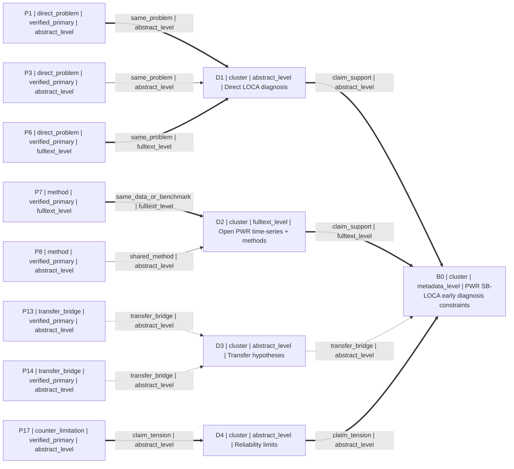
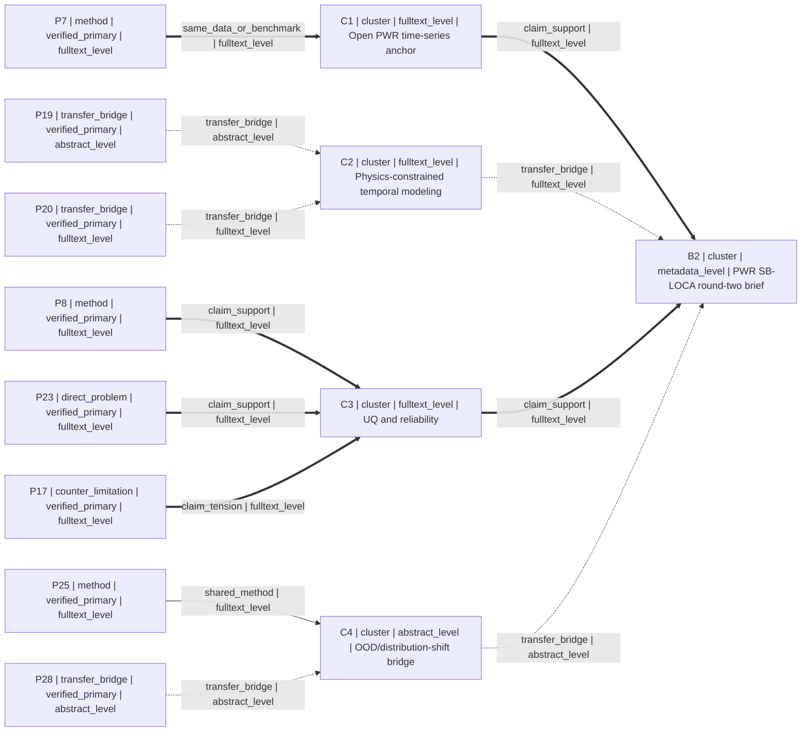

# M1 Fresh-context Forward Test — PWR small-break LOCA

## Capture metadata

- `case_input_scope`: intake + round one only
- `skill_revision`: `2291357`
- `executed_at_beijing`: `2026-08-04T18:23:47.1616565+08:00`
- `branch_id`: `branch-a`
- `brief_version`: `1`
- `terminal_state`: `WAITING_FOR_FEEDBACK`
- `stage_result`: `ROUND_ONE_CAPTURED`
- `m1_complete`: `false` (round two has not been requested or run)
- `write_scope`: this file only; no commit

## Complete stage input

> 我正在做核工程与机器学习交叉研究，目标是压水堆（PWR）小破口失水事故（small-break LOCA）的早期诊断。请先进行两轮论文校准，而不是直接给完整实验或仿真路线。我的数据条件仅限公开或开源的仿真数据，不使用私有电厂数据；没有实验设备；计算资源是一张 24 GB 显存的 GPU；总周期为 12 周。请围绕这些硬约束构建检索边界，核验引用，并给出第一轮论文证据图谱。若可靠证据不足，请明确标记证据缺口，不要用弱相关论文补位。

## Intake

```yaml
research_brief:
  brief_version: 1
  branch_id: "branch-a"
  engineering_object: "pressurized water reactor (PWR) accident monitoring"
  target_problem: "early diagnosis of small-break loss-of-coolant accidents (SB-LOCA)"
  target_metric: ""
  available_data:
    - "public or open simulated data only"
  resources:
    - "one GPU with 24 GB VRAM"
    - "no experimental equipment"
  time_budget: "12 weeks"
  preferred_routes:
    - "data-driven or machine-learning diagnosis grounded in reproducible simulation evidence"
  excluded_routes:
    - "private nuclear power plant data"
    - "new physical experiments"
    - "full experimental or simulation route before direction confirmation"
  hard_constraints:
    - "PWR and SB-LOCA relevance must remain visible"
    - "use only public or open simulated data for any later executable work"
    - "do not assume access to proprietary plant data or experimental equipment"
    - "method must be plausible on one 24 GB GPU within 12 weeks"
    - "perform two-round paper calibration before route planning"
  soft_preferences: []
  open_questions:
    - "What operational definition of early diagnosis is required (seconds after break, before a specific alarm, or another horizon)?"
    - "Which primary metric matters most: detection delay, event classification, break-size classification/regression, false-alarm rate, or calibration?"
    - "Is the target a generic PWR, a named design, or the PCTRAN-PWR3LP configuration represented by NPPAD?"
  evidence_needs:
    - "direct evidence that ML has been used for LOCA/SB-LOCA detection or break-size diagnosis"
    - "an actually accessible public PWR accident simulation dataset"
    - "methods suitable for multivariate transient time series and limited compute"
    - "evidence on robustness, uncertainty, explainability, and transfer limits"
```

The open questions did not block a bounded first-round search. They do block claims about a final metric, an exact early-warning horizon, or a complete experimental/simulation route.

## Round-one search boundary

```yaml
search_plan:
  round: 1
  brief_version: 1
  branch_id: "branch-a"
  time_boundary: "No publication-year cutoff; current metadata checked on 2026-08-04 Asia/Shanghai. Search is bounded, not exhaustive."
  language_boundary: ["English"]
  source_boundary:
    - "Discovery: SciSpace attempt, then OpenAlex public API fallback"
    - "Verification: Crossref DOI registry; official publisher landing pages for selected records"
    - "Excluded as final truth: snippets, citation counts, model memory, and unverified aggregator metadata"
  queries:
    - query_id: "Q1"
      purpose: "direct_problem"
      query_text: "small break LOCA PWR machine learning diagnosis"
      expected_evidence_role: "direct_problem"
      inclusion_terms: ["PWR", "LOCA", "small break", "early diagnosis", "break size"]
      exclusion_terms: ["private plant data as required input", "purely unrelated component faults"]
    - query_id: "Q2"
      purpose: "direct_problem"
      query_text: "PWR small break LOCA diagnosis neural network"
      expected_evidence_role: "direct_problem"
      inclusion_terms: ["LOCA", "neural network", "diagnosis or estimation"]
      exclusion_terms: ["large-break-only as sole target evidence"]
    - query_id: "Q3"
      purpose: "method_and_open_data"
      query_text: "nuclear power plant accident diagnosis machine learning simulator dataset"
      expected_evidence_role: "method"
      inclusion_terms: ["open dataset", "simulator", "time series", "nuclear accident diagnosis"]
      exclusion_terms: ["private operational data as a prerequisite"]
    - query_id: "Q4"
      purpose: "transfer_and_limits"
      query_text: "nuclear reactor accident diagnosis explainability uncertainty machine learning"
      expected_evidence_role: "counter_limitation"
      inclusion_terms: ["uncertainty", "reliability", "explainability", "transfer", "limited samples"]
      exclusion_terms: ["weakly related generic ML without an engineering bridge"]
  limitations:
    - "The academic-search MCP named by the literature-search Skill was not callable in this environment."
    - "SciSpace was available only as a discovery source and its four-query batch did not return before termination."
    - "OpenAlex fallback coverage is broad but is not an authoritative bibliographic truth source."
    - "Publisher full text was inspected only where the official page exposed it; no paywalled full-text claims were inferred."
```

## Discovery, verification, and deduplication audit

Discovery observations remained `unverified_candidate` until DOI resolution. Four OpenAlex fallback searches returned overlapping and off-topic hits. Eighteen strong-fit records with DOI were admitted after current Crossref lookup. Deduplication used normalized DOI as the decisive key; all 18 normalized DOIs were distinct. No title/author fuzzy merge was needed.

```yaml
counts:
  discovery_queries_planned: 4
  scispace_queries_returned: 0
  openalex_queries_successful: 4
  strong_fit_doi_candidates: 18
  crossref_registry_matches: 18
  verified_deduplicated_candidates: 18
  verified_primary_candidates: 8
  verified_registry_candidates: 10
  blocked_or_partial_in_candidate_pool: 0
  selected: 8
  selection_allocation:
    direct_problem: 3
    method: 2
    transfer_bridge: 2
    counter_limitation: 1
```

### Tool/source log (Beijing time)

| Tool/source | Purpose | Beijing timestamp | Result |
|---|---|---|---|
| SciSpace academic search | Discovery, four natural-language queries | capture window ended before `2026-08-04T18:23:47+08:00`; connector emitted no per-call timestamp | Timed out/no usable records; call terminated and preserved as a failure. |
| `academic_search.py` → OpenAlex API | Fallback discovery | capture window ended before `2026-08-04T18:23:47+08:00`; script emitted no response timestamp | Four searches succeeded after two local invocation failures described below. |
| Crossref REST `api.crossref.org/works/{doi}` | DOI registry verification | per-record `checked_at` values are listed below, `2026-08-04T18:21:52+08:00`–`18:22:00+08:00` | 18/18 matched. |
| Official publisher pages (ScienceDirect, Frontiers, MDPI, Nature/Scientific Data) | Selected-record title/author/DOI/work-type cross-check and abstract/full-text basis | inspected in the same live run; evidence captured at `2026-08-04T18:23:47+08:00` | 8/8 selected records matched. |
| DOI resolver through web opener | Direct publisher redirect attempt | before capture at `2026-08-04T18:23:47+08:00` | Seven URLs rejected by safe-open policy and one returned HTTP 403; official-domain searches were used instead. |

Timestamps not emitted by a connector or script are explicitly reported as capture-window timestamps, not fabricated per-request times.

## Candidate pool (18 verified, deduplicated records)

All records have `alternate_id: null`; no alternate identifier was needed or inferred. For `verified_registry`, publisher landing-page cross-check was not performed in this run and this limitation is explicit. Each Crossref source is the canonical DOI URL shown.

```yaml
candidate_pool:
  - candidate_id: P1
    verification_status: verified_primary
    recommendation_eligible: true
    evidence_roles: [direct_problem]
    selection_role: direct_problem
    basis_level: abstract_level
    verified_record: {title: "Real-time estimation of break sizes during LOCA in nuclear power plants using NARX neural network", authors: ["Mahdi Saghafi", "Mohammad B. Ghofrani"], year_issue: 2019, venue: "Nuclear Engineering and Technology", publication_type: journal-article, doi: "10.1016/j.net.2018.11.017", canonical_url: "https://doi.org/10.1016/j.net.2018.11.017", alternate_id: null, verification: {status: verified_primary, checked_sources: [{source_type: doi_registry, canonical_record: "https://api.crossref.org/works/10.1016%2Fj.net.2018.11.017", checked_at: "2026-08-04T18:21:52.0458264+08:00", result: match}, {source_type: publisher_landing, canonical_record: "https://www.sciencedirect.com/science/article/pii/S1738573318303012", checked_at: "2026-08-04T18:23:47.1616565+08:00", result: match}], title_match: exact, author_match: exact, version_relation: same_work, recommendation_eligible: true, blocking_reasons: []}}
  - candidate_id: P2
    verification_status: verified_registry
    recommendation_eligible: true
    evidence_roles: [method]
    selection_role: method
    basis_level: metadata_level
    verified_record: {title: "An accident diagnosis algorithm using long short-term memory", authors: ["Jaemin Yang", "Jonghyun Kim"], year_issue: 2018, venue: "Nuclear Engineering and Technology", publication_type: journal-article, doi: "10.1016/j.net.2018.03.010", canonical_url: "https://doi.org/10.1016/j.net.2018.03.010", alternate_id: null, verification: {status: verified_registry, checked_sources: [{source_type: doi_registry, canonical_record: "https://api.crossref.org/works/10.1016%2Fj.net.2018.03.010", checked_at: "2026-08-04T18:21:53.4085649+08:00", result: match}], title_match: exact, author_match: exact, version_relation: same_work, recommendation_eligible: true, blocking_reasons: []}}
  - candidate_id: P3
    verification_status: verified_primary
    recommendation_eligible: true
    evidence_roles: [direct_problem]
    selection_role: direct_problem
    basis_level: abstract_level
    verified_record: {title: "Diagnosis and Prediction for Loss of Coolant Accidents in Nuclear Power Plants Using Deep Learning Methods", authors: ["Jingke She", "Tianzi Shi", "Shiyu Xue", "Yan Zhu", "Shaofei Lu", "Peiwei Sun", "Huasong Cao"], year_online: 2021, venue: "Frontiers in Energy Research", publication_type: journal-article, doi: "10.3389/fenrg.2021.665262", canonical_url: "https://doi.org/10.3389/fenrg.2021.665262", alternate_id: null, verification: {status: verified_primary, checked_sources: [{source_type: doi_registry, canonical_record: "https://api.crossref.org/works/10.3389%2Ffenrg.2021.665262", checked_at: "2026-08-04T18:21:53.8485070+08:00", result: match}, {source_type: publisher_landing, canonical_record: "https://www.frontiersin.org/journals/energy-research/articles/10.3389/fenrg.2021.665262/full", checked_at: "2026-08-04T18:23:47.1616565+08:00", result: match}], title_match: exact, author_match: exact, version_relation: same_work, recommendation_eligible: true, blocking_reasons: []}}
  - candidate_id: P4
    verification_status: verified_registry
    recommendation_eligible: true
    evidence_roles: [method]
    selection_role: method
    basis_level: metadata_level
    verified_record: {title: "Neural-based time series forecasting of loss of coolant accidents in nuclear power plants", authors: ["Majdi I. Radaideh", "Connor Pigg", "Tomasz Kozlowski", "Yujia Deng", "Annie Qu"], year_issue: 2020, venue: "Expert Systems with Applications", publication_type: journal-article, doi: "10.1016/j.eswa.2020.113699", canonical_url: "https://doi.org/10.1016/j.eswa.2020.113699", alternate_id: null, verification: {status: verified_registry, checked_sources: [{source_type: doi_registry, canonical_record: "https://api.crossref.org/works/10.1016%2Fj.eswa.2020.113699", checked_at: "2026-08-04T18:21:54.3023926+08:00", result: match}], title_match: exact, author_match: exact, version_relation: same_work, recommendation_eligible: true, blocking_reasons: []}}
  - candidate_id: P5
    verification_status: verified_registry
    recommendation_eligible: true
    evidence_roles: [direct_problem]
    selection_role: direct_problem
    basis_level: metadata_level
    verified_record: {title: "A constraint-based genetic algorithm for optimizing neural network architectures for detection of loss of coolant accidents of nuclear power plants", authors: ["David Tian", "Jiamei Deng", "Gopika Vinod", "T.V. Santhosh", "Hissam Tawfik"], year_issue: 2018, venue: "Neurocomputing", publication_type: journal-article, doi: "10.1016/j.neucom.2018.09.014", canonical_url: "https://doi.org/10.1016/j.neucom.2018.09.014", alternate_id: null, verification: {status: verified_registry, checked_sources: [{source_type: doi_registry, canonical_record: "https://api.crossref.org/works/10.1016%2Fj.neucom.2018.09.014", checked_at: "2026-08-04T18:21:54.7586698+08:00", result: match}], title_match: exact, author_match: exact, version_relation: same_work, recommendation_eligible: true, blocking_reasons: []}}
  - candidate_id: P6
    verification_status: verified_primary
    recommendation_eligible: true
    evidence_roles: [direct_problem, method]
    selection_role: direct_problem
    basis_level: fulltext_level
    verified_record: {title: "Enhancing LOCA Breach Size Diagnosis with Fundamental Deep Learning Models and Optimized Dataset Construction", authors: ["Xingyu Xiao", "Ben Qi", "Jingang Liang", "Jiejuan Tong", "Qing Deng", "Peng Chen"], year_online: 2023, venue: "Energies", publication_type: journal-article, doi: "10.3390/en17010159", canonical_url: "https://doi.org/10.3390/en17010159", alternate_id: null, verification: {status: verified_primary, checked_sources: [{source_type: doi_registry, canonical_record: "https://api.crossref.org/works/10.3390%2Fen17010159", checked_at: "2026-08-04T18:21:55.1971442+08:00", result: match}, {source_type: publisher_landing, canonical_record: "https://www.mdpi.com/1996-1073/17/1/159", checked_at: "2026-08-04T18:23:47.1616565+08:00", result: match}], title_match: exact, author_match: exact, version_relation: same_work, recommendation_eligible: true, blocking_reasons: []}}
  - candidate_id: P7
    verification_status: verified_primary
    recommendation_eligible: true
    evidence_roles: [method, direct_problem]
    selection_role: method
    basis_level: fulltext_level
    verified_record: {title: "An open time-series simulated dataset covering various accidents for nuclear power plants", authors: ["Ben Qi", "Xingyu Xiao", "Jingang Liang", "Li-chi Cliff Po", "Liguo Zhang", "Jiejuan Tong"], year_online: 2022, venue: "Scientific Data", publication_type: journal-article, doi: "10.1038/s41597-022-01879-1", canonical_url: "https://doi.org/10.1038/s41597-022-01879-1", alternate_id: null, verification: {status: verified_primary, checked_sources: [{source_type: doi_registry, canonical_record: "https://api.crossref.org/works/10.1038%2Fs41597-022-01879-1", checked_at: "2026-08-04T18:21:55.6515734+08:00", result: match}, {source_type: publisher_landing, canonical_record: "https://www.nature.com/articles/s41597-022-01879-1", checked_at: "2026-08-04T18:23:47.1616565+08:00", result: match}], title_match: exact, author_match: exact, version_relation: same_work, recommendation_eligible: true, blocking_reasons: []}}
  - candidate_id: P8
    verification_status: verified_primary
    recommendation_eligible: true
    evidence_roles: [method, transfer_bridge]
    selection_role: method
    basis_level: abstract_level
    verified_record: {title: "Robust on-line diagnosis tool for the early accident detection in nuclear power plants", authors: ["Silvia Tolo", "Xiange Tian", "Nils Bausch", "Victor Becerra", "T.V. Santhosh", "G. Vinod", "Edoardo Patelli"], year_issue: 2019, venue: "Reliability Engineering & System Safety", publication_type: journal-article, doi: "10.1016/j.ress.2019.02.015", canonical_url: "https://doi.org/10.1016/j.ress.2019.02.015", alternate_id: null, verification: {status: verified_primary, checked_sources: [{source_type: doi_registry, canonical_record: "https://api.crossref.org/works/10.1016%2Fj.ress.2019.02.015", checked_at: "2026-08-04T18:21:56.1037366+08:00", result: match}, {source_type: publisher_landing, canonical_record: "https://www.sciencedirect.com/science/article/pii/S0951832018304253", checked_at: "2026-08-04T18:23:47.1616565+08:00", result: match}], title_match: exact, author_match: exact, version_relation: same_work, recommendation_eligible: true, blocking_reasons: []}}
  - candidate_id: P9
    verification_status: verified_registry
    recommendation_eligible: true
    evidence_roles: [method, counter_limitation]
    selection_role: method
    basis_level: metadata_level
    verified_record: {title: "RNN-based integrated system for real-time sensor fault detection and fault-informed accident diagnosis in nuclear power plant accidents", authors: ["Jeonghun Choi", "Seung Jun Lee"], year_issue: 2023, venue: "Nuclear Engineering and Technology", publication_type: journal-article, doi: "10.1016/j.net.2022.10.035", canonical_url: "https://doi.org/10.1016/j.net.2022.10.035", alternate_id: null, verification: {status: verified_registry, checked_sources: [{source_type: doi_registry, canonical_record: "https://api.crossref.org/works/10.1016%2Fj.net.2022.10.035", checked_at: "2026-08-04T18:21:56.5427311+08:00", result: match}], title_match: exact, author_match: exact, version_relation: same_work, recommendation_eligible: true, blocking_reasons: []}}
  - candidate_id: P10
    verification_status: verified_registry
    recommendation_eligible: true
    evidence_roles: [method, counter_limitation]
    selection_role: counter_limitation
    basis_level: abstract_level
    verified_record: {title: "A Sensor Fault-Tolerant Accident Diagnosis System", authors: ["Jeonghun Choi", "Seung Jun Lee"], year_online: 2020, venue: "Sensors", publication_type: journal-article, doi: "10.3390/s20205839", canonical_url: "https://doi.org/10.3390/s20205839", alternate_id: null, verification: {status: verified_registry, checked_sources: [{source_type: doi_registry, canonical_record: "https://api.crossref.org/works/10.3390%2Fs20205839", checked_at: "2026-08-04T18:21:56.9527106+08:00", result: match}], title_match: exact, author_match: exact, version_relation: same_work, recommendation_eligible: true, blocking_reasons: []}}
  - candidate_id: P11
    verification_status: verified_registry
    recommendation_eligible: true
    evidence_roles: [method]
    selection_role: method
    basis_level: metadata_level
    verified_record: {title: "Graph neural network based multiple accident diagnosis in nuclear power plants: Data optimization to represent the system configuration", authors: ["Young Ho Chae", "Chanyoung Lee", "Sang Min Han", "Poong Hyun Seong"], year_issue: 2022, venue: "Nuclear Engineering and Technology", publication_type: journal-article, doi: "10.1016/j.net.2022.02.024", canonical_url: "https://doi.org/10.1016/j.net.2022.02.024", alternate_id: null, verification: {status: verified_registry, checked_sources: [{source_type: doi_registry, canonical_record: "https://api.crossref.org/works/10.1016%2Fj.net.2022.02.024", checked_at: "2026-08-04T18:21:57.4232435+08:00", result: match}], title_match: exact, author_match: exact, version_relation: same_work, recommendation_eligible: true, blocking_reasons: []}}
  - candidate_id: P12
    verification_status: verified_registry
    recommendation_eligible: true
    evidence_roles: [method]
    selection_role: method
    basis_level: metadata_level
    verified_record: {title: "Abnormality diagnosis model for nuclear power plants using two-stage gated recurrent units", authors: ["Jae Min Kim", "Gyumin Lee", "Changyong Lee", "Seung Jun Lee"], year_issue: 2020, venue: "Nuclear Engineering and Technology", publication_type: journal-article, doi: "10.1016/j.net.2020.02.002", canonical_url: "https://doi.org/10.1016/j.net.2020.02.002", alternate_id: null, verification: {status: verified_registry, checked_sources: [{source_type: doi_registry, canonical_record: "https://api.crossref.org/works/10.1016%2Fj.net.2020.02.002", checked_at: "2026-08-04T18:21:57.8323103+08:00", result: match}], title_match: exact, author_match: exact, version_relation: same_work, recommendation_eligible: true, blocking_reasons: []}}
  - candidate_id: P13
    verification_status: verified_primary
    recommendation_eligible: true
    evidence_roles: [transfer_bridge, method]
    selection_role: transfer_bridge
    basis_level: abstract_level
    verified_record: {title: "Pre-trained network-based transfer learning: A small-sample machine learning approach to nuclear power plant classification problem", authors: ["Xianping Zhong", "Heng Ban"], year_issue: 2022, venue: "Annals of Nuclear Energy", publication_type: journal-article, doi: "10.1016/j.anucene.2022.109201", canonical_url: "https://doi.org/10.1016/j.anucene.2022.109201", alternate_id: null, verification: {status: verified_primary, checked_sources: [{source_type: doi_registry, canonical_record: "https://api.crossref.org/works/10.1016%2Fj.anucene.2022.109201", checked_at: "2026-08-04T18:21:58.2577945+08:00", result: match}, {source_type: publisher_landing, canonical_record: "https://www.sciencedirect.com/science/article/pii/S0306454922002365", checked_at: "2026-08-04T18:23:47.1616565+08:00", result: match}], title_match: exact, author_match: exact, version_relation: same_work, recommendation_eligible: true, blocking_reasons: []}}
  - candidate_id: P14
    verification_status: verified_primary
    recommendation_eligible: true
    evidence_roles: [transfer_bridge, method]
    selection_role: transfer_bridge
    basis_level: abstract_level
    verified_record: {title: "Model-Based Deep Transfer Learning Method to Fault Detection and Diagnosis in Nuclear Power Plants", authors: ["Yuantao Yao", "Daochuan Ge", "Jie Yu", "Min Xie"], year_online: 2022, venue: "Frontiers in Energy Research", publication_type: journal-article, doi: "10.3389/fenrg.2022.823395", canonical_url: "https://doi.org/10.3389/fenrg.2022.823395", alternate_id: null, verification: {status: verified_primary, checked_sources: [{source_type: doi_registry, canonical_record: "https://api.crossref.org/works/10.3389%2Ffenrg.2022.823395", checked_at: "2026-08-04T18:21:58.7107642+08:00", result: match}, {source_type: publisher_landing, canonical_record: "https://www.frontiersin.org/journals/energy-research/articles/10.3389/fenrg.2022.823395/full", checked_at: "2026-08-04T18:23:47.1616565+08:00", result: match}], title_match: exact, author_match: exact, version_relation: same_work, recommendation_eligible: true, blocking_reasons: []}}
  - candidate_id: P15
    verification_status: verified_registry
    recommendation_eligible: true
    evidence_roles: [method, counter_limitation]
    selection_role: method
    basis_level: metadata_level
    verified_record: {title: "A reliable intelligent diagnostic assistant for nuclear power plants using explainable artificial intelligence of GRU-AE, LightGBM and SHAP", authors: ["Ji Hun Park", "Hye Seon Jo", "Sang Hyun Lee", "Sang Won Oh", "Man Gyun Na"], year_issue: 2022, venue: "Nuclear Engineering and Technology", publication_type: journal-article, doi: "10.1016/j.net.2021.10.024", canonical_url: "https://doi.org/10.1016/j.net.2021.10.024", alternate_id: null, verification: {status: verified_registry, checked_sources: [{source_type: doi_registry, canonical_record: "https://api.crossref.org/works/10.1016%2Fj.net.2021.10.024", checked_at: "2026-08-04T18:21:59.1380139+08:00", result: match}], title_match: exact, author_match: exact, version_relation: same_work, recommendation_eligible: true, blocking_reasons: []}}
  - candidate_id: P16
    verification_status: verified_registry
    recommendation_eligible: true
    evidence_roles: [counter_limitation]
    selection_role: counter_limitation
    basis_level: abstract_level
    verified_record: {title: "Data-Driven Machine Learning for Fault Detection and Diagnosis in Nuclear Power Plants: A Review", authors: ["Guang Hu", "Taotao Zhou", "Qianfeng Liu"], year_online: 2021, venue: "Frontiers in Energy Research", publication_type: journal-article, doi: "10.3389/fenrg.2021.663296", canonical_url: "https://doi.org/10.3389/fenrg.2021.663296", alternate_id: null, verification: {status: verified_registry, checked_sources: [{source_type: doi_registry, canonical_record: "https://api.crossref.org/works/10.3389%2Ffenrg.2021.663296", checked_at: "2026-08-04T18:21:59.6088329+08:00", result: match}], title_match: exact, author_match: exact, version_relation: same_work, recommendation_eligible: true, blocking_reasons: []}}
  - candidate_id: P17
    verification_status: verified_primary
    recommendation_eligible: true
    evidence_roles: [counter_limitation]
    selection_role: counter_limitation
    basis_level: abstract_level
    verified_record: {title: "Deep learning for safety assessment of nuclear power reactors: Reliability, explainability, and research opportunities", authors: ["Abiodun Ayodeji", "Muritala Alade Amidu", "Samuel Abiodun Olatubosun", "Yacine Addad", "Hafiz Ahmed"], year_issue: 2022, venue: "Progress in Nuclear Energy", publication_type: review-article, doi: "10.1016/j.pnucene.2022.104339", canonical_url: "https://doi.org/10.1016/j.pnucene.2022.104339", alternate_id: null, verification: {status: verified_primary, checked_sources: [{source_type: doi_registry, canonical_record: "https://api.crossref.org/works/10.1016%2Fj.pnucene.2022.104339", checked_at: "2026-08-04T18:22:00.0629630+08:00", result: match}, {source_type: publisher_landing, canonical_record: "https://www.sciencedirect.com/science/article/pii/S0149197022002141", checked_at: "2026-08-04T18:23:47.1616565+08:00", result: match}], title_match: exact, author_match: exact, version_relation: same_work, recommendation_eligible: true, blocking_reasons: []}}
  - candidate_id: P18
    verification_status: verified_registry
    recommendation_eligible: true
    evidence_roles: [method, counter_limitation]
    selection_role: counter_limitation
    basis_level: metadata_level
    verified_record: {title: "Unsupervised learning algorithm for signal validation in emergency situations at nuclear power plants", authors: ["Younhee Choi", "Gyeongmin Yoon", "Jonghyun Kim"], year_issue: 2022, venue: "Nuclear Engineering and Technology", publication_type: journal-article, doi: "10.1016/j.net.2021.10.006", canonical_url: "https://doi.org/10.1016/j.net.2021.10.006", alternate_id: null, verification: {status: verified_registry, checked_sources: [{source_type: doi_registry, canonical_record: "https://api.crossref.org/works/10.1016%2Fj.net.2021.10.006", checked_at: "2026-08-04T18:22:00.5649180+08:00", result: match}], title_match: exact, author_match: exact, version_relation: same_work, recommendation_eligible: true, blocking_reasons: []}}
```

## Round-one selection

```yaml
round_bundle:
  schema_version: "m1.1"
  round: 1
  research_brief: "complete object reproduced in Intake"
  search_plan: "complete object reproduced in Round-one search boundary"
  candidate_pool: "18 complete records reproduced above"
  selected_ids: [P1, P3, P6, P7, P8, P13, P14, P17]
  outcome: round_one_ready
  next_state: WAITING_FOR_FEEDBACK
  evidence_gaps:
    - "No selected source, including NPPAD, was verified here to isolate an agreed SB-LOCA-only benchmark with a community-standard early-warning horizon."
    - "The user has not yet defined the primary endpoint or acceptable false-alarm/delay trade-off."
    - "Only NPPAD was confirmed in this run as a directly accessible open PWR accident time-series dataset; public availability of the selected papers' own training data was not assumed."
    - "P8 validates uncertainty-aware online LOCA diagnosis on a 220 MWe pressurized heavy-water reactor, not a PWR; its transfer to PWR SB-LOCA remains a hypothesis."
    - "P13 validates transfer learning on rotating-machine fault datasets, not reactor transient diagnosis; it is bridge evidence only."
    - "P14 supports cross-condition/cross-facility transfer, but its simulation platform data were not verified as public in this run."
  search_limitations:
    - "No configured Crossref/PubMed/arXiv academic MCP was available; public API and official web fallbacks were used."
    - "Ten pool records are registry-verified only; their publisher pages were not checked in this bounded run."
    - "Abstract-level evidence cannot establish full implementation details, leakage controls, compute cost, or external validity."
```

Selection rationale is constraint-aware but not a research-direction ranking. P1/P3/P6 show that real-time LOCA break sizing, LOCA diagnosis/prediction, and breach-size classification are established target-problem formulations. P7 anchors the only currently verified open PWR accident dataset. P8 contributes uncertainty-aware low-latency diagnosis but is explicitly non-PWR transfer. P13 and P14 are transfer hypotheses for limited samples and changing operating conditions. P17 prevents the map from treating high reported accuracy as sufficient safety evidence.

## Static paper evidence map

```yaml
paper_map:
  round: 1
  node_size_basis: user_fit
  legend:
    evidence_roles: [direct_problem, method, transfer_bridge, counter_limitation]
    basis_levels: [metadata_level, abstract_level, fulltext_level]
  nodes:
    - {id: B0, node_type: cluster, basis_level: metadata_level, short_note: "PWR SB-LOCA early diagnosis under public-data, no-experiment, 24-GB-GPU, 12-week constraints"}
    - {id: D1, node_type: cluster, basis_level: abstract_level, short_note: "Direct LOCA diagnosis and break-size estimation"}
    - {id: D2, node_type: cluster, basis_level: fulltext_level, short_note: "Open PWR accident time-series and resource-bounded methods"}
    - {id: D3, node_type: cluster, basis_level: abstract_level, short_note: "Limited-sample and cross-condition transfer hypotheses"}
    - {id: D4, node_type: cluster, basis_level: abstract_level, short_note: "Reliability, uncertainty, and explainability limits"}
    - {id: P1, node_type: paper, fit_score: 0.94, evidence_role: direct_problem, verification_status: verified_primary, basis_level: abstract_level, short_note: "Real-time LOCA break-size estimation from time-dependent signals"}
    - {id: P3, node_type: paper, fit_score: 0.88, evidence_role: direct_problem, verification_status: verified_primary, basis_level: abstract_level, short_note: "CNN/LSTM/ConvLSTM for LOCA diagnosis and post-accident prediction"}
    - {id: P6, node_type: paper, fit_score: 0.97, evidence_role: direct_problem, verification_status: verified_primary, basis_level: fulltext_level, short_note: "LOCA breach-size classes; preprocessing and simple-model ablations"}
    - {id: P7, node_type: paper, fit_score: 1.00, evidence_role: method, verification_status: verified_primary, basis_level: fulltext_level, short_note: "Open 15.1-GB PCTRAN-PWR3LP multivariate accident time series plus code"}
    - {id: P8, node_type: paper, fit_score: 0.78, evidence_role: method, verification_status: verified_primary, basis_level: abstract_level, short_note: "Bayesian ANN ensemble gives online LOCA estimates and confidence bounds; non-PWR reactor"}
    - {id: P13, node_type: paper, fit_score: 0.68, evidence_role: transfer_bridge, verification_status: verified_primary, basis_level: abstract_level, short_note: "Small-sample CNN transfer evidence from rotating-machine classification"}
    - {id: P14, node_type: paper, fit_score: 0.76, evidence_role: transfer_bridge, verification_status: verified_primary, basis_level: abstract_level, short_note: "Cross-condition/cross-facility fine-tuning with fewer epochs"}
    - {id: P17, node_type: paper, fit_score: 0.84, evidence_role: counter_limitation, verification_status: verified_primary, basis_level: abstract_level, short_note: "Nuclear-safety review flags explainability, sensitivity, uncertainty, reliability, and trustworthiness"}
  edges:
    - {source: P1, target: D1, relation: same_problem, strength: strong, confidence: high, basis_level: abstract_level, note: "Direct real-time LOCA break-size estimation"}
    - {source: P3, target: D1, relation: same_problem, strength: medium, confidence: medium, basis_level: abstract_level, note: "Direct LOCA classification/prediction; SB-only scope not established"}
    - {source: P6, target: D1, relation: same_problem, strength: strong, confidence: high, basis_level: fulltext_level, note: "Direct breach-size diagnostic-scale evidence"}
    - {source: P7, target: D2, relation: same_data_or_benchmark, strength: strong, confidence: high, basis_level: fulltext_level, note: "Open PWR simulation dataset and processing code"}
    - {source: P8, target: D2, relation: shared_method, strength: medium, confidence: medium, basis_level: abstract_level, note: "Uncertainty-aware fast diagnosis; reactor-type transfer required"}
    - {source: P13, target: D3, relation: transfer_bridge, strength: weak, confidence: low, basis_level: abstract_level, note: "Small-sample transfer is plausible but validated on rotating machinery"}
    - {source: P14, target: D3, relation: transfer_bridge, strength: medium, confidence: medium, basis_level: abstract_level, note: "Cross-condition/facility transfer is relevant; public-data fit unverified"}
    - {source: P17, target: D4, relation: claim_tension, strength: strong, confidence: high, basis_level: abstract_level, note: "Accuracy alone does not settle safety reliability or trustworthiness"}
    - {source: D1, target: B0, relation: claim_support, strength: strong, confidence: high, basis_level: abstract_level, note: "Target problem is directly represented in verified literature"}
    - {source: D2, target: B0, relation: claim_support, strength: strong, confidence: high, basis_level: fulltext_level, note: "At least one public PWR accident dataset is available"}
    - {source: D3, target: B0, relation: transfer_bridge, strength: medium, confidence: medium, basis_level: abstract_level, note: "Transfer remains hypothetical until tested on target-domain public data"}
    - {source: D4, target: B0, relation: claim_tension, strength: strong, confidence: high, basis_level: abstract_level, note: "Safety-facing claims require robustness, uncertainty, and explainability evidence"}
```

### Mermaid rendering



### Semantically equivalent text fallback

```yaml
text_fallback:
  - {entry_type: node, id: B0, node_type: cluster, basis_level: metadata_level, text: "B0: PWR SB-LOCA early diagnosis under public-data, no-experiment, 24-GB-GPU, 12-week constraints"}
  - {entry_type: node, id: D1, node_type: cluster, basis_level: abstract_level, text: "D1: Direct LOCA diagnosis and break-size estimation"}
  - {entry_type: node, id: D2, node_type: cluster, basis_level: fulltext_level, text: "D2: Open PWR accident time-series and resource-bounded methods"}
  - {entry_type: node, id: D3, node_type: cluster, basis_level: abstract_level, text: "D3: Limited-sample and cross-condition transfer hypotheses"}
  - {entry_type: node, id: D4, node_type: cluster, basis_level: abstract_level, text: "D4: Reliability, uncertainty, and explainability limits"}
  - {entry_type: node, id: P1, node_type: paper, evidence_role: direct_problem, verification_status: verified_primary, basis_level: abstract_level, text: "P1: Real-time LOCA break-size estimation from time-dependent signals"}
  - {entry_type: node, id: P3, node_type: paper, evidence_role: direct_problem, verification_status: verified_primary, basis_level: abstract_level, text: "P3: CNN/LSTM/ConvLSTM for LOCA diagnosis and post-accident prediction"}
  - {entry_type: node, id: P6, node_type: paper, evidence_role: direct_problem, verification_status: verified_primary, basis_level: fulltext_level, text: "P6: LOCA breach-size classes; preprocessing and simple-model ablations"}
  - {entry_type: node, id: P7, node_type: paper, evidence_role: method, verification_status: verified_primary, basis_level: fulltext_level, text: "P7: Open PCTRAN-PWR3LP accident time series and code"}
  - {entry_type: node, id: P8, node_type: paper, evidence_role: method, verification_status: verified_primary, basis_level: abstract_level, text: "P8: Bayesian ANN ensemble for online LOCA estimates and confidence bounds; non-PWR"}
  - {entry_type: node, id: P13, node_type: paper, evidence_role: transfer_bridge, verification_status: verified_primary, basis_level: abstract_level, text: "P13: Small-sample CNN transfer evidence from rotating-machine classification"}
  - {entry_type: node, id: P14, node_type: paper, evidence_role: transfer_bridge, verification_status: verified_primary, basis_level: abstract_level, text: "P14: Cross-condition/cross-facility fine-tuning with fewer epochs"}
  - {entry_type: node, id: P17, node_type: paper, evidence_role: counter_limitation, verification_status: verified_primary, basis_level: abstract_level, text: "P17: Nuclear-safety limits for explainability, sensitivity, uncertainty, reliability, and trustworthiness"}
  - {entry_type: edge, source: P1, target: D1, relation: same_problem, basis_level: abstract_level, text: "P1 --same_problem--> D1: Direct real-time LOCA break-size estimation"}
  - {entry_type: edge, source: P3, target: D1, relation: same_problem, basis_level: abstract_level, text: "P3 --same_problem--> D1: Direct LOCA classification/prediction; SB-only scope not established"}
  - {entry_type: edge, source: P6, target: D1, relation: same_problem, basis_level: fulltext_level, text: "P6 --same_problem--> D1: Direct breach-size diagnostic-scale evidence"}
  - {entry_type: edge, source: P7, target: D2, relation: same_data_or_benchmark, basis_level: fulltext_level, text: "P7 --same_data_or_benchmark--> D2: Open PWR simulation dataset and processing code"}
  - {entry_type: edge, source: P8, target: D2, relation: shared_method, basis_level: abstract_level, text: "P8 --shared_method--> D2: Uncertainty-aware fast diagnosis; reactor-type transfer required"}
  - {entry_type: edge, source: P13, target: D3, relation: transfer_bridge, basis_level: abstract_level, text: "P13 --transfer_bridge--> D3: Small-sample transfer is plausible but validated on rotating machinery"}
  - {entry_type: edge, source: P14, target: D3, relation: transfer_bridge, basis_level: abstract_level, text: "P14 --transfer_bridge--> D3: Cross-condition/facility transfer is relevant; public-data fit unverified"}
  - {entry_type: edge, source: P17, target: D4, relation: claim_tension, basis_level: abstract_level, text: "P17 --claim_tension--> D4: Accuracy alone does not settle safety reliability or trustworthiness"}
  - {entry_type: edge, source: D1, target: B0, relation: claim_support, basis_level: abstract_level, text: "D1 --claim_support--> B0: Target problem is directly represented in verified literature"}
  - {entry_type: edge, source: D2, target: B0, relation: claim_support, basis_level: fulltext_level, text: "D2 --claim_support--> B0: At least one public PWR accident dataset is available"}
  - {entry_type: edge, source: D3, target: B0, relation: transfer_bridge, basis_level: abstract_level, text: "D3 --transfer_bridge--> B0: Transfer remains hypothetical until tested on target-domain public data"}
  - {entry_type: edge, source: D4, target: B0, relation: claim_tension, basis_level: abstract_level, text: "D4 --claim_tension--> B0: Safety-facing claims require robustness, uncertainty, and explainability evidence"}
```

## Exact citation index for selected papers

1. **P1 — direct_problem — abstract_level — verified_primary.** Mahdi Saghafi; Mohammad B. Ghofrani. “Real-time estimation of break sizes during LOCA in nuclear power plants using NARX neural network.” *Nuclear Engineering and Technology* 51(3) (2019), 702–708. DOI: [10.1016/j.net.2018.11.017](https://doi.org/10.1016/j.net.2018.11.017). Registry checked `2026-08-04T18:21:52.0458264+08:00`; [publisher record](https://www.sciencedirect.com/science/article/pii/S1738573318303012) checked at capture. Supports real-time dynamic break-size estimation in the Bushehr PWR. Does not establish an open dataset, an agreed SB-only early-warning horizon, or external-plant generalization.
2. **P3 — direct_problem — abstract_level — verified_primary.** Jingke She; Tianzi Shi; Shiyu Xue; Yan Zhu; Shaofei Lu; Peiwei Sun; Huasong Cao. “Diagnosis and Prediction for Loss of Coolant Accidents in Nuclear Power Plants Using Deep Learning Methods.” *Frontiers in Energy Research* 9 (2021), 665262. DOI: [10.3389/fenrg.2021.665262](https://doi.org/10.3389/fenrg.2021.665262). Registry checked `2026-08-04T18:21:53.8485070+08:00`; [publisher record](https://www.frontiersin.org/journals/energy-research/articles/10.3389/fenrg.2021.665262/full) checked at capture. Supports LOCA classification plus post-accident prediction with CNN/LSTM/ConvLSTM. Does not by itself verify an open dataset, SB-only performance, or 24-GB-GPU training cost.
3. **P6 — direct_problem — fulltext_level.** Xingyu Xiao; Ben Qi; Jingang Liang; Jiejuan Tong; Qing Deng; Peng Chen. “Enhancing LOCA Breach Size Diagnosis with Fundamental Deep Learning Models and Optimized Dataset Construction.” *Energies* 17(1) (online 2023), 159. DOI: [10.3390/en17010159](https://doi.org/10.3390/en17010159). Registry checked `2026-08-04T18:21:55.1971442+08:00`; [publisher full text](https://www.mdpi.com/1996-1073/17/1/159), especially Methods §3.1 and diagnostic-scale analysis §5.2.2, checked at capture. Supports simple MLP/RNN/LSTM/GRU/CNN/transformer comparisons and the importance of windowing and label construction for breach-size diagnosis. It does not establish that reported accuracy transfers to a new PWR or to a user-defined early-warning horizon.
4. **P7 — method — fulltext_level — verified_primary.** Ben Qi; Xingyu Xiao; Jingang Liang; Li-chi Cliff Po; Liguo Zhang; Jiejuan Tong. “An open time-series simulated dataset covering various accidents for nuclear power plants.” *Scientific Data* 9 (2022), 766. DOI: [10.1038/s41597-022-01879-1](https://doi.org/10.1038/s41597-022-01879-1). Registry checked `2026-08-04T18:21:55.6515734+08:00`; [publisher full text](https://www.nature.com/articles/s41597-022-01879-1), including Usage Notes and Code availability, checked at capture. Supports an open ~15.1 GB PCTRAN-PWR3LP time-series dataset, processing code, accident types and severity parameters. It does not establish a standard SB-LOCA split, early-diagnosis endpoint, or safety validation against a real plant.
5. **P8 — method — abstract_level — verified_primary.** Silvia Tolo; Xiange Tian; Nils Bausch; Victor Becerra; T.V. Santhosh; G. Vinod; Edoardo Patelli. “Robust on-line diagnosis tool for the early accident detection in nuclear power plants.” *Reliability Engineering & System Safety* 186 (2019), 110–119. DOI: [10.1016/j.ress.2019.02.015](https://doi.org/10.1016/j.ress.2019.02.015). Registry checked `2026-08-04T18:21:56.1037366+08:00`; [publisher record](https://www.sciencedirect.com/science/article/pii/S0951832018304253) checked at capture. Supports Bayesian combination of ANN architectures, uncertainty absorption, confidence bounds, and short-latency online LOCA diagnosis. Its case study is a 220 MWe pressurized heavy-water reactor; transfer to PWR SB-LOCA is not established.
6. **P13 — transfer_bridge — abstract_level — verified_primary.** Xianping Zhong; Heng Ban. “Pre-trained network-based transfer learning: A small-sample machine learning approach to nuclear power plant classification problem.” *Annals of Nuclear Energy* 175 (2022), 109201. DOI: [10.1016/j.anucene.2022.109201](https://doi.org/10.1016/j.anucene.2022.109201). Registry checked `2026-08-04T18:21:58.2577945+08:00`; [publisher record](https://www.sciencedirect.com/science/article/pii/S0306454922002365) checked at capture. Supports a limited-sample transfer-learning strategy. Validation is on rotating-machine datasets rather than reactor transients, so PWR SB-LOCA applicability is only a transfer hypothesis.
7. **P14 — transfer_bridge — abstract_level — verified_primary.** Yuantao Yao; Daochuan Ge; Jie Yu; Min Xie. “Model-Based Deep Transfer Learning Method to Fault Detection and Diagnosis in Nuclear Power Plants.” *Frontiers in Energy Research* 10 (2022), 823395. DOI: [10.3389/fenrg.2022.823395](https://doi.org/10.3389/fenrg.2022.823395). Registry checked `2026-08-04T18:21:58.7107642+08:00`; [publisher record](https://www.frontiersin.org/journals/energy-research/articles/10.3389/fenrg.2022.823395/full) checked at capture. Supports layer freezing/fine-tuning for cross-condition and cross-facility FDD with fewer training epochs. The platform data were not verified public here, and no SB-LOCA target-domain decisive test was established.
8. **P17 — counter_limitation — abstract_level — verified_primary.** Abiodun Ayodeji; Muritala Alade Amidu; Samuel Abiodun Olatubosun; Yacine Addad; Hafiz Ahmed. “Deep learning for safety assessment of nuclear power reactors: Reliability, explainability, and research opportunities.” *Progress in Nuclear Energy* 151 (2022), 104339. DOI: [10.1016/j.pnucene.2022.104339](https://doi.org/10.1016/j.pnucene.2022.104339). Registry checked `2026-08-04T18:22:00.0629630+08:00`; [publisher record](https://www.sciencedirect.com/science/article/pii/S0149197022002141) checked at capture. Supports treating explainability, sensitivity, uncertainty, reliability, and trustworthiness as nuclear-safety evaluation requirements. It is a review and does not validate a particular SB-LOCA detector.

## Evidence interpretation under the hard constraints

- **Public/open simulation data:** P7 is the anchor. Its official full text confirms NPPAD, PCTRAN-PWR3LP, dataset size, processing scripts, and code availability. No claim is made that every selected method's original data are open.
- **No experimental equipment:** all selected evidence is simulation/data/method literature; no experimental route is proposed.
- **One 24 GB GPU and 12 weeks:** P6's comparison of foundational models and P14's reduced-epoch transfer strategy are compatible in principle, but no selected paper reports a currently verified end-to-end resource audit matching this exact budget. Feasibility therefore remains an evidence need, not a completed result.
- **PWR SB-LOCA specificity:** P1 is PWR LOCA break sizing, P6 is LOCA breach-size diagnosis, and P7 is an open PWR accident dataset. The exact SB-LOCA subset, break-size thresholds, and early-warning horizon still require round-two calibration or dataset inspection after user feedback.
- **Safety boundary:** these papers support research calibration only. They do not establish deployment safety, licensing acceptability, real-plant validation, or an operational decision aid.

## Preserved failures, blockers, and limitations

1. The configured environment exposed no callable Crossref/PubMed/arXiv academic MCP specified by `nature-academic-search`; current public API and official web fallbacks were therefore used.
2. A four-query SciSpace discovery batch remained running without results and was terminated. No SciSpace record was admitted or treated as verified evidence.
3. The first OpenAlex fallback invocation used an unsupported sort token (`relevance`) and exited with an argument error. The corrected invocation used `relevance_score`.
4. The next OpenAlex invocation reached results but failed while printing a non-GBK author character. The same query was rerun once with UTF-8 console encoding; this changed output encoding only, not query semantics or evidence.
5. The first batch Crossref extraction incorrectly recorded 18 local `RuntimeException` outcomes because optional date fields were dereferenced unsafely. A direct one-record probe showed the registry was reachable. The extraction was corrected to tolerate absent fields and rerun; 18/18 registry responses matched. The failed batch is not counted as authoritative unavailability.
6. Direct DOI opening through the web tool was rejected by safe-open policy for seven records and returned HTTP 403 for one. Official-domain searches recovered the eight selected publisher pages.
7. An initial DOI-constrained Frontiers web search returned an unrelated article. The result was discarded; an exact-title/DOI search located the correct official page. No false match entered the pool.
8. Ten non-selected candidates remain `verified_registry`, not `verified_primary`, because their publisher pages were not checked during this bounded run.
9. Abstract-only evidence cannot resolve train/test leakage, preprocessing fidelity, full compute use, or external validity. P6 and P7 alone received `fulltext_level`, with exact official-page section anchors stated above.
10. The bounded English-language query set cannot prove novelty, priority, or the absence of other SB-LOCA work. Citation counts from discovery were not used as truth or eligibility evidence.
11. No second-round feedback was supplied. No feedback delta, second-round search, direction ranking, direction card, experiment/simulation route, model download, service, RRC use, M2, or M3 work was performed.

## Round-one handoff

Status: **ROUND_ONE_CAPTURED**. The verified pool and fixed eight-paper allocation are complete for round one, but the two-round calibration remains in `WAITING_FOR_FEEDBACK`, not `M1_COMPLETE`.

Useful feedback can be concise, for example: retain or reject named paper IDs; define “early” as a concrete time horizon; prioritize detection delay versus breach-size error; require only papers demonstrably using NPPAD; or ask round two to emphasize uncertainty, transfer, or lightweight baselines. No round-two choices are inferred here.

---

# Frozen round-two continuation

## Feedback receipt

- `feedback_received_at_beijing`: `2026-08-04T18:34:03.3985937+08:00`
- Timestamp note: the task transport did not expose a message-arrival timestamp; this is the exact local handling timestamp, not an invented transport time.
- `from_brief_version`: `1`
- `to_brief_version`: `2`
- `branch_id`: `branch-a` (the target problem and hard resource/data constraints remain unchanged)

> 第一轮之后，我希望第二轮更偏向物理约束的时序建模，并把不确定性量化（UQ）与分布外（OOD）检测作为重要筛选维度。继续排除依赖私有电厂数据、实验设备或超出单张 24 GB GPU 与 12 周预算的路线。请先显示约束如何继承、拒绝、重置或新增，以及检索式如何因此改变，再给第二轮结果。

## Visible feedback delta before search

```yaml
feedback_delta:
  from_brief_version: 1
  to_brief_version: 2
  inherited:
    - object_id: "C_TARGET"
      value: "PWR SB-LOCA early diagnosis remains the target problem"
    - object_id: "C_PUBLIC_DATA"
      value: "public or open simulated data only; no private plant data"
    - object_id: "C_NO_EXPERIMENT"
      value: "no experimental equipment"
    - object_id: "C_COMPUTE_TIME"
      value: "one 24 GB GPU and 12 weeks"
    - object_id: "C_M1_BOUNDARY"
      value: "paper calibration only; no full experiment or simulation route"
  rejected: []
  reset:
    - object_id: "R1_BROAD_METHOD_PRIORITY"
      reason: "Broad data-driven relevance alone is no longer sufficient for second-round preference; physics constraints, UQ, or OOD relevance must drive the new search and selection."
  added:
    - object_id: "C_PHYSICS_TEMPORAL"
      value: "prefer physics-constrained or physics-guided temporal modeling"
    - object_id: "C_UQ"
      value: "treat uncertainty quantification as an important screening dimension"
    - object_id: "C_OOD"
      value: "treat out-of-distribution detection or a clearly labeled distribution-shift/anomaly-detection bridge as an important screening dimension"
  allocation:
    exploit: 40
    explore: 60
  query_changes:
    - query_id: "Q1-R2"
      reason: "Replace the broad direct-problem formulation with physics-guided temporal modeling while keeping the target-domain terms."
      cause_refs: ["feedback_delta.reset[0]", "feedback_delta.added[0]"]
      before: "PWR small break LOCA diagnosis neural network"
      after: "physics-informed OR physics-guided temporal model nuclear reactor PWR LOCA transient prognosis"
    - query_id: "Q2-R2"
      reason: "Make predictive uncertainty, confidence intervals, Bayesian evidence, and calibration explicit rather than incidental."
      cause_refs: ["feedback_delta.added[1]"]
      before: "nuclear reactor accident diagnosis explainability uncertainty machine learning"
      after: "uncertainty quantification Bayesian confidence interval calibrated nuclear reactor LOCA time-series diagnosis prognosis"
    - query_id: "Q3-R2"
      reason: "Add a dedicated OOD/distribution-shift branch; keep generic anomaly literature only as a labeled transfer bridge."
      cause_refs: ["feedback_delta.added[2]"]
      before: ""
      after: "out-of-distribution OR distribution shift anomaly detection multivariate time series nuclear power plant fault diagnosis"
    - query_id: "Q4-R2"
      reason: "Retain the public-data and bounded-resource gate while jointly screening new physics, UQ, and OOD candidates."
      cause_refs: ["feedback_delta.reset[0]", "feedback_delta.added[0]", "feedback_delta.added[1]", "feedback_delta.added[2]"]
      before: "nuclear power plant accident diagnosis machine learning simulator dataset"
      after: "public open simulated nuclear power plant accident time series physics-informed uncertainty anomaly detection lightweight"
```

Visible summary before the search:

- **Inherited:** target PWR SB-LOCA early diagnosis; public/open simulated data only; no experiments; one 24 GB GPU; 12 weeks; M1-only boundary.
- **Rejected:** none explicitly. No paper was silently treated as user-rejected.
- **Reset:** broad ML relevance ceased to be a sufficient second-round ranking preference.
- **Added:** physics-constrained temporal modeling, UQ, and OOD/distribution-shift screening.
- **Search allocation:** 40% exploit the verified first-round domain/data core; 60% explore the new physics/UQ/OOD branches.

## Revised brief and implemented search plan

```yaml
research_brief:
  brief_version: 2
  branch_id: "branch-a"
  engineering_object: "pressurized water reactor (PWR) accident monitoring"
  target_problem: "early diagnosis of small-break loss-of-coolant accidents (SB-LOCA)"
  target_metric: ""
  available_data: ["public or open simulated data only"]
  resources: ["one GPU with 24 GB VRAM", "no experimental equipment"]
  time_budget: "12 weeks"
  preferred_routes:
    - "physics-constrained or physics-guided temporal modeling"
    - "models with explicit UQ, predictive intervals, calibrated confidence, or Bayesian uncertainty handling"
    - "OOD or distribution-shift detection for multivariate transient data"
  excluded_routes:
    - "private nuclear power plant data"
    - "new physical experiments"
    - "routes exceeding one 24 GB GPU or 12 weeks"
    - "full route generation before user direction confirmation"
  hard_constraints:
    - "preserve PWR SB-LOCA relevance"
    - "use only public/open simulated data for later executable work"
    - "no experimental equipment"
    - "one 24 GB GPU and 12 weeks"
  soft_preferences:
    - "physics constraints, UQ, and OOD are second-round screening priorities"
  open_questions:
    - "exact early-diagnosis horizon and primary endpoint remain unspecified"
    - "acceptable OOD definition is unspecified: unseen break size, unseen operating condition, unseen sensor degradation, or unseen reactor design"
  evidence_needs:
    - "target-domain physical constraints that can be evaluated on open PWR time series"
    - "UQ evaluated for LOCA transient prediction or diagnosis"
    - "OOD detection evaluated on a public PWR/SB-LOCA benchmark"

search_plan:
  round: 2
  brief_version: 2
  branch_id: "branch-a"
  time_boundary: "No publication-year cutoff; metadata rechecked on 2026-08-04 Asia/Shanghai; bounded search, not exhaustive"
  language_boundary: ["English"]
  source_boundary:
    - "Discovery: OpenAlex public API fallback"
    - "Verification: current Crossref DOI registry"
    - "Selected-record cross-check: official ScienceDirect, Frontiers, MDPI, Nature, and IEEE pages when accessible"
  queries:
    - query_id: "Q1-R2"
      purpose: "physics_constrained_temporal"
      query_text: "physics-informed OR physics-guided temporal model nuclear reactor PWR LOCA transient prognosis"
      expected_evidence_role: "method"
      inclusion_terms: ["physics-informed", "physics-guided", "temporal", "reactor accident"]
      exclusion_terms: ["no credible nuclear or time-series bridge"]
    - query_id: "Q2-R2"
      purpose: "uncertainty_quantification"
      query_text: "uncertainty quantification Bayesian confidence interval calibrated nuclear reactor LOCA time-series diagnosis prognosis"
      expected_evidence_role: "counter_limitation"
      inclusion_terms: ["uncertainty", "confidence interval", "Bayesian", "quantile"]
      exclusion_terms: ["accuracy-only without uncertainty evidence"]
    - query_id: "Q3-R2"
      purpose: "ood_distribution_shift"
      query_text: "out-of-distribution OR distribution shift anomaly detection multivariate time series nuclear power plant fault diagnosis"
      expected_evidence_role: "transfer_bridge"
      inclusion_terms: ["OOD", "distribution shift", "anomaly detection", "multivariate time series"]
      exclusion_terms: ["generic anomaly detection without an industrial time-series bridge"]
    - query_id: "Q4-R2"
      purpose: "public_data_feasibility"
      query_text: "public open simulated nuclear power plant accident time series physics-informed uncertainty anomaly detection lightweight"
      expected_evidence_role: "method"
      inclusion_terms: ["public", "open", "simulated", "nuclear accident time series"]
      exclusion_terms: ["private-data-only", "experiment-required", "unbounded compute"]
  limitations:
    - "The configured academic-search MCP remained unavailable; the permitted OpenAlex fallback was used for discovery."
    - "Explicit PWR/SB-LOCA OOD literature remained sparse; transfer evidence was not relabeled as direct evidence."
```

## Round-two live discovery, verification, and counts

Eight focused fallback queries were run across the physics-guided, UQ, OOD/anomaly, and public-data branches. Weak generic results were discarded before the pool. The 18 admitted records were rechecked individually against Crossref and deduplicated by normalized DOI.

```yaml
round_two_counts:
  openalex_queries_successful: 8
  strong_fit_doi_candidates_admitted: 18
  crossref_registry_matches: 18
  verified_deduplicated_candidates: 18
  verified_primary_candidates: 8
  verified_registry_candidates: 10
  conflicted: 0
  partial: 0
  selected: 8
  retained_from_round_one_selection: 3
  replacements: 5
  dropped_without_replacement: 0
```

Source/time audit:

| Source | Beijing time | Result |
|---|---|---|
| OpenAlex through the Skill fallback script | run completed before `2026-08-04T18:34:03.3985937+08:00`; API did not emit response timestamps | 8/8 focused queries returned; off-topic hits were excluded. |
| Crossref REST | per-record checks from `2026-08-04T18:32:16.4604991+08:00` to `2026-08-04T18:32:29.4429944+08:00` | 18/18 DOI records matched. |
| Official publisher pages | inspected before `2026-08-04T18:34:03.3985937+08:00`; web search did not emit request timestamps | All 8 selected records had a matching official landing page; reasoning basis varied by page access. |

## Round-two candidate pool

`verification_status` is `verified_primary` only for records checked both at Crossref and at the publisher in this run. The other records are recommendation-eligible `verified_registry` records but were not selected. No DOI, author, title, venue, or publication status was inferred from memory.

| ID | Exact verified citation | Selection role | Basis | Verification | Second-round fit and limit |
|---|---|---|---|---|---|
| P4 | Majdi I. Radaideh; Connor Pigg; Tomasz Kozlowski; Yujia Deng; Annie Qu. “Neural-based time series forecasting of loss of coolant accidents in nuclear power plants.” *Expert Systems with Applications* 160 (2020), 113699. [DOI](https://doi.org/10.1016/j.eswa.2020.113699) | direct_problem | metadata_level | verified_registry; `2026-08-04T18:32:16.4604991+08:00` | Direct LOCA time series, but no explicit physics/UQ/OOD evidence verified here. |
| P7 | Ben Qi; Xingyu Xiao; Jingang Liang; Li-chi Cliff Po; Liguo Zhang; Jiejuan Tong. “An open time-series simulated dataset covering various accidents for nuclear power plants.” *Scientific Data* 9 (2022), 766. [DOI](https://doi.org/10.1038/s41597-022-01879-1) | method | fulltext_level | verified_primary; `2026-08-04T18:32:19.6977740+08:00` | Public PCTRAN-PWR3LP anchor; does not itself define OOD or UQ protocol. |
| P8 | Silvia Tolo; Xiange Tian; Nils Bausch; Victor Becerra; T.V. Santhosh; G. Vinod; Edoardo Patelli. “Robust on-line diagnosis tool for the early accident detection in nuclear power plants.” *Reliability Engineering & System Safety* 186 (2019), 110–119. [DOI](https://doi.org/10.1016/j.ress.2019.02.015) | method | fulltext_level | verified_primary; `2026-08-04T18:32:20.2312610+08:00` | Bayesian ANN ensemble and confidence bounds; heavy-water reactor, not PWR. |
| P10 | Jeonghun Choi; Seung Jun Lee. “A Sensor Fault-Tolerant Accident Diagnosis System.” *Sensors* 20(20) (2020), 5839. [DOI](https://doi.org/10.3390/s20205839) | counter_limitation | abstract_level | verified_registry; `2026-08-04T18:32:20.8125258+08:00` | Sensor-error robustness is OOD-adjacent, not explicit OOD detection. |
| P14 | Yuantao Yao; Daochuan Ge; Jie Yu; Min Xie. “Model-Based Deep Transfer Learning Method to Fault Detection and Diagnosis in Nuclear Power Plants.” *Frontiers in Energy Research* 10 (2022), 823395. [DOI](https://doi.org/10.3389/fenrg.2022.823395) | transfer_bridge | abstract_level | verified_registry; `2026-08-04T18:32:21.3439342+08:00` | Cross-condition/facility shift bridge; public availability of its data was not verified. |
| P17 | Abiodun Ayodeji; Muritala Alade Amidu; Samuel Abiodun Olatubosun; Yacine Addad; Hafiz Ahmed. “Deep learning for safety assessment of nuclear power reactors: Reliability, explainability, and research opportunities.” *Progress in Nuclear Energy* 151 (2022), 104339. [DOI](https://doi.org/10.1016/j.pnucene.2022.104339) | counter_limitation | fulltext_level | verified_primary; `2026-08-04T18:32:21.8289322+08:00` | Direct nuclear-safety UQ/reliability boundary; review, not an SB-LOCA test. |
| P19 | Anil Gurgen; Nam T. Dinh. “Development and assessment of a reactor system prognosis model with physics-guided machine learning.” *Nuclear Engineering and Design* 398 (2022), 111976. [DOI](https://doi.org/10.1016/j.nucengdes.2022.111976) | transfer_bridge | abstract_level | verified_primary; `2026-08-04T18:32:22.4650995+08:00` | Physics-guided time-series prognosis; validated on EBR-II loss-of-flow, so PWR LOCA transfer remains hypothetical. |
| P20 | Federico Antonello; Jacopo Buongiorno; Enrico Zio. “Physics informed neural networks for surrogate modeling of accidental scenarios in nuclear power plants.” *Nuclear Engineering and Technology* 55(9) (2023), 3409–3416. [DOI](https://doi.org/10.1016/j.net.2023.06.027) | transfer_bridge | fulltext_level | verified_primary; `2026-08-04T18:32:22.9802664+08:00` | Physics loss applied to accident transient surrogate; LOHS microreactor, not PWR SB-LOCA. |
| P21 | JinHo Song; KwangSoon Ha. “A simulation and machine learning informed diagnosis of the severe accidents.” *Nuclear Engineering and Design* 395 (2022), 111881. [DOI](https://doi.org/10.1016/j.nucengdes.2022.111881) | method | metadata_level | verified_registry; `2026-08-04T18:32:23.5119004+08:00` | Simulation-informed diagnosis, but no explicit selected physics/UQ/OOD basis verified. |
| P22 | K. Hossny; W. Villanueva; H. D. Wang. “Distinctive physical insights driven from machine learning modelling of nuclear power plant severe accident scenario propagation.” *Scientific Reports* 13 (2023). [DOI](https://doi.org/10.1038/s41598-023-28205-y) | method | abstract_level | verified_registry; `2026-08-04T18:32:24.1045846+08:00` | Physical insight from interpretable classification; severe accident rather than SB-LOCA. |
| P23 | Chengyuan Li; Meifu Li; Zhifang Qiu. “A long-term dependable and reliable method for reactor accident prognosis using temporal fusion transformer.” *Frontiers in Nuclear Engineering* 3 (2024), 1339457. [DOI](https://doi.org/10.3389/fnuen.2024.1339457) | direct_problem | fulltext_level | verified_primary; `2026-08-04T18:32:24.6366086+08:00` | HPR1000 LOCA temporal prediction with quantile-regression uncertainty intervals; diagnosis coupling and data openness remain unresolved. |
| P24 | Yongjie Fu; Dazhi Zhang; Yunlong Xiao; Zhihui Wang; Huabing Zhou. “An Interpretable Time Series Data Prediction Framework for Severe Accidents in Nuclear Power Plants.” *Entropy* 25(8) (2023), 1160. [DOI](https://doi.org/10.3390/e25081160) | method | fulltext_level | verified_registry; `2026-08-04T18:32:25.1054053+08:00` | Interpretable GRU/SHAP on LOCA and MSLB breach data; not explicit UQ or OOD. |
| P25 | Shuang Yi; Sheng Zheng; Senquan Yang; Guangrong Zhou; Jiajun Cai. “Anomaly Detection for Asynchronous Multivariate Time Series of Nuclear Power Plants Using a Temporal-Spatial Transformer.” *Sensors* 24(9) (2024), 2845. [DOI](https://doi.org/10.3390/s24092845) | method | fulltext_level | verified_primary; `2026-08-04T18:32:25.6205348+08:00` | NPP multivariate anomaly detection and early detection; not explicitly OOD, and its real-NPP component cannot be assumed public. |
| P26 | Gaojun Liu; Haixia Gu; Xiaocheng Shen; Dongdong You. “Bayesian Long Short-Term Memory Model for Fault Early Warning of Nuclear Power Turbine.” *IEEE Access* 8 (2020). [DOI](https://doi.org/10.1109/access.2020.2980244) | transfer_bridge | metadata_level | verified_registry; `2026-08-04T18:32:26.3638503+08:00` | Bayesian temporal early warning, but component-level rather than reactor accident diagnosis. |
| P27 | Yuantao Yao; Minghan Yang; Jianye Wang; Min Xie. “Multivariate Time-Series Prediction in Industrial Processes via a Deep Hybrid Network Under Data Uncertainty.” *IEEE Transactions on Industrial Informatics* 19(2) (2023), 1977–1987. [DOI](https://doi.org/10.1109/tii.2022.3198670) | transfer_bridge | abstract_level | verified_registry; `2026-08-04T18:32:26.8647918+08:00` | Data-uncertainty time-series bridge; not nuclear target evidence. |
| P28 | Peng Yan; Ahmed Abdulkadir; Paul-Philipp Luley; Matthias Rosenthal; Gerrit A. Schatte; Benjamin F. Grewe; Thilo Stadelmann. “A Comprehensive Survey of Deep Transfer Learning for Anomaly Detection in Industrial Time Series: Methods, Applications, and Directions.” *IEEE Access* 12 (2024), 3768–3789. [DOI](https://doi.org/10.1109/access.2023.3349132) | transfer_bridge | abstract_level | verified_primary; `2026-08-04T18:32:27.8517755+08:00` | Distribution-variation/anomaly-transfer framework; not direct PWR OOD validation. |
| P29 | Linyu Lin; Anil Gurgen; Nam Dinh. “Development and assessment of prognosis digital twin in a NAMAC system.” *Annals of Nuclear Energy* 180 (2022), 109439. [DOI](https://doi.org/10.1016/j.anucene.2022.109439) | method | metadata_level | verified_registry; `2026-08-04T18:32:28.7002063+08:00` | Reactor prognosis/digital-twin bridge; public data and bounded-resource fit not verified. |
| P30 | Andy Rivas; Gregory Kyriakos Delipei; Ian Davis; Satyan Bhongale; Jason Hou. “A system diagnostic and prognostic framework based on deep learning for advanced reactors.” *Progress in Nuclear Energy* 171 (2024), 105114. [DOI](https://doi.org/10.1016/j.pnucene.2024.105114) | method | metadata_level | verified_registry; `2026-08-04T18:32:29.4429944+08:00` | Integrated diagnosis/prognosis, but advanced-reactor rather than PWR SB-LOCA evidence. |

DOI deduplication retained the six carried IDs (`P4`, `P7`, `P8`, `P10`, `P14`, `P17`) and assigned new IDs `P19`–`P30` only to newly admitted works. No ID was reused for a different work.

## Round-two selection and exact citation basis

```yaml
round_bundle:
  schema_version: "m1.1"
  round: 2
  brief_version: 2
  branch_id: "branch-a"
  candidate_count: 18
  selected_ids: [P7, P8, P17, P19, P20, P23, P25, P28]
  round_two_request:
    explicit_user_request: true
    requested_count: 8
  outcome: round_two_ready
  m1_workflow_state: M1_COMPLETE
```

The eight selected citations are exactly the P7, P8, P17, P19, P20, P23, P25, and P28 records in the table above. Their current verification, ordered authors, venue, DOI, basis, support, and limitation are all stated there. Selection does **not** authorize using private data: P25 is included only as target-domain anomaly-detection evidence; any later route would have to reproduce the relevant test on public NPPAD data.

## Round-one dispositions

The Skill-contract token is preserved in `disposition`; `user_facing` supplies the requested kept/replaced/dropped wording.

```yaml
round_one_dispositions:
  - round_one_id: P1
    disposition: replaced
    user_facing: replaced
    round_two_id: P19
    reason: "Physics-guided temporal prognosis now matches the added physics constraint more directly than a purely data-driven NARX estimator."
    cause_type: feedback_delta
    cause_ref: "feedback_delta.added[0]"
  - round_one_id: P3
    disposition: replaced
    user_facing: replaced
    round_two_id: P23
    reason: "P23 adds LOCA temporal modeling with quantile-regression confidence intervals, materially responding to the UQ priority."
    cause_type: feedback_delta
    cause_ref: "feedback_delta.added[1]"
  - round_one_id: P6
    disposition: replaced
    user_facing: replaced
    round_two_id: P20
    reason: "P20 explicitly embeds a physics equation in the loss and documents physics-consistent accident transients."
    cause_type: feedback_delta
    cause_ref: "feedback_delta.added[0]"
  - round_one_id: P7
    disposition: retained
    user_facing: kept
    round_two_id: P7
    reason: "It remains the verified public PWR accident time-series anchor required by the inherited data constraint."
    cause_type: feedback_delta
    cause_ref: "feedback_delta.inherited[1]"
  - round_one_id: P8
    disposition: retained
    user_facing: kept
    round_two_id: P8
    reason: "Its Bayesian ensemble and output confidence bounds directly support the added UQ screen."
    cause_type: feedback_delta
    cause_ref: "feedback_delta.added[1]"
  - round_one_id: P13
    disposition: replaced
    user_facing: replaced
    round_two_id: P28
    reason: "The new survey addresses distribution variation and anomaly transfer in industrial time series, a closer bridge to the added OOD screen than image-pretrained rotating-machine classification."
    cause_type: feedback_delta
    cause_ref: "feedback_delta.added[2]"
  - round_one_id: P14
    disposition: replaced
    user_facing: replaced
    round_two_id: P25
    reason: "P25 moves the distribution-shift concern into NPP multivariate time-series anomaly detection, while remaining explicitly OOD-adjacent rather than claimed as OOD proof."
    cause_type: feedback_delta
    cause_ref: "feedback_delta.added[2]"
  - round_one_id: P17
    disposition: retained
    user_facing: kept
    round_two_id: P17
    reason: "The nuclear-safety review keeps UQ, sensitivity, reliability, explainability, and trustworthiness as hard interpretive limits."
    cause_type: feedback_delta
    cause_ref: "feedback_delta.added[1]"
```

Disposition totals: `kept=3`, `replaced=5`, `dropped=0`. Replacement targets are non-null, unique, selected, and not shared with retained targets.

## Round-two evidence map



```yaml
text_fallback:
  - {entry_type: node, id: B2, node_type: cluster, basis_level: metadata_level, text: "B2: PWR SB-LOCA round-two brief"}
  - {entry_type: node, id: C1, node_type: cluster, basis_level: fulltext_level, text: "C1: Open PWR time-series anchor"}
  - {entry_type: node, id: C2, node_type: cluster, basis_level: fulltext_level, text: "C2: Physics-constrained temporal modeling"}
  - {entry_type: node, id: C3, node_type: cluster, basis_level: fulltext_level, text: "C3: UQ and reliability"}
  - {entry_type: node, id: C4, node_type: cluster, basis_level: abstract_level, text: "C4: OOD/distribution-shift bridge"}
  - {entry_type: node, id: P7, node_type: paper, evidence_role: method, verification_status: verified_primary, basis_level: fulltext_level, text: "P7: public PWR accident time series"}
  - {entry_type: node, id: P8, node_type: paper, evidence_role: method, verification_status: verified_primary, basis_level: fulltext_level, text: "P8: Bayesian online LOCA diagnosis and confidence bounds"}
  - {entry_type: node, id: P17, node_type: paper, evidence_role: counter_limitation, verification_status: verified_primary, basis_level: fulltext_level, text: "P17: nuclear-safety UQ and reliability boundary"}
  - {entry_type: node, id: P19, node_type: paper, evidence_role: transfer_bridge, verification_status: verified_primary, basis_level: abstract_level, text: "P19: physics-guided reactor prognosis transfer"}
  - {entry_type: node, id: P20, node_type: paper, evidence_role: transfer_bridge, verification_status: verified_primary, basis_level: fulltext_level, text: "P20: physics-loss accident-transient surrogate transfer"}
  - {entry_type: node, id: P23, node_type: paper, evidence_role: direct_problem, verification_status: verified_primary, basis_level: fulltext_level, text: "P23: HPR1000 LOCA temporal prediction with quantile intervals"}
  - {entry_type: node, id: P25, node_type: paper, evidence_role: method, verification_status: verified_primary, basis_level: fulltext_level, text: "P25: NPP multivariate anomaly detection, OOD-adjacent"}
  - {entry_type: node, id: P28, node_type: paper, evidence_role: transfer_bridge, verification_status: verified_primary, basis_level: abstract_level, text: "P28: distribution variation and industrial time-series anomaly transfer"}
  - {entry_type: edge, source: P7, target: C1, relation: same_data_or_benchmark, basis_level: fulltext_level, text: "P7 --same_data_or_benchmark--> C1: verified open PWR dataset"}
  - {entry_type: edge, source: P19, target: C2, relation: transfer_bridge, basis_level: abstract_level, text: "P19 --transfer_bridge--> C2: physics-guided but non-PWR accident"}
  - {entry_type: edge, source: P20, target: C2, relation: transfer_bridge, basis_level: fulltext_level, text: "P20 --transfer_bridge--> C2: explicit physics loss but microreactor LOHS"}
  - {entry_type: edge, source: P8, target: C3, relation: claim_support, basis_level: fulltext_level, text: "P8 --claim_support--> C3: Bayesian confidence bounds"}
  - {entry_type: edge, source: P23, target: C3, relation: claim_support, basis_level: fulltext_level, text: "P23 --claim_support--> C3: LOCA quantile-regression intervals"}
  - {entry_type: edge, source: P17, target: C3, relation: claim_tension, basis_level: fulltext_level, text: "P17 --claim_tension--> C3: safety trustworthiness needs more than accuracy"}
  - {entry_type: edge, source: P25, target: C4, relation: shared_method, basis_level: fulltext_level, text: "P25 --shared_method--> C4: NPP anomaly detection is not explicit OOD detection"}
  - {entry_type: edge, source: P28, target: C4, relation: transfer_bridge, basis_level: abstract_level, text: "P28 --transfer_bridge--> C4: distribution-aware industrial anomaly transfer"}
  - {entry_type: edge, source: C1, target: B2, relation: claim_support, basis_level: fulltext_level, text: "C1 --claim_support--> B2: public-data hard constraint is supportable"}
  - {entry_type: edge, source: C2, target: B2, relation: transfer_bridge, basis_level: fulltext_level, text: "C2 --transfer_bridge--> B2: target-domain physics test still required"}
  - {entry_type: edge, source: C3, target: B2, relation: claim_support, basis_level: fulltext_level, text: "C3 --claim_support--> B2: UQ has direct and boundary evidence"}
  - {entry_type: edge, source: C4, target: B2, relation: transfer_bridge, basis_level: abstract_level, text: "C4 --transfer_bridge--> B2: explicit SB-LOCA OOD evidence remains missing"}
```

The Mermaid graph and fallback contain the same 13 nodes and 12 edges with identical IDs, roles, verification states, relations, and basis levels.

## Second-round blockers and evidence gaps

1. **Target-domain OOD evidence remains incomplete.** No currently verified paper in this bounded search directly tests OOD detection for PWR SB-LOCA on a public dataset. P25 is NPP anomaly detection and P28 is industrial distribution-shift transfer evidence; neither is relabeled as a decisive target-domain OOD result.
2. **Physics-to-target transfer is unresolved.** P19 uses EBR-II loss-of-flow and P20 uses a nuclear-battery LOHS transient. Their physics-guided/PINN mechanisms are relevant, but PWR SB-LOCA benefit remains `transfer-supported`, not established.
3. **Public-data fit is narrow.** P7/NPPAD is the only selected source whose open PWR accident data and code were verified here. P25 includes simulated and real NPP data, but its real-data portion is not presumed accessible and cannot be a later-route dependency.
4. **UQ meaning is heterogeneous.** P8 supplies Bayesian ensemble confidence bounds, P23 quantile-regression intervals, and P17 a safety-oriented UQ/reliability review. This does not prove calibration, coverage under shift, or epistemic/aleatoric separation on SB-LOCA.
5. **Compute feasibility is not measured.** No selected record supplies a current, reproducible audit proving end-to-end training within the exact 24 GB/12-week budget. Papers were screened for plausible bounded models, but no execution was authorized.
6. **Metric definition is still open.** Detection delay, false-alarm rate, break-size error, interval coverage, and OOD AUROC/FPR95 have not been prioritized by the user.
7. **Source/tool limits persist.** The academic-search MCP was unavailable; Crossref and official publisher pages supplied current verification. Publisher access was bounded and not every candidate received full-text review.

These gaps do not invalidate the 18-record verified pool or the eight-paper calibrated view, but they prevent any claim that physics+UQ+OOD is already validated for the exact public-data PWR SB-LOCA task.

## Final M1 classification

```yaml
final_status:
  pass:
    - "feedback delta displayed before search with exact inherited/rejected/reset/added fields"
    - "all material reset/added entries covered by traceable query_changes"
    - "8 live second-round searches completed"
    - "18 current Crossref-verified, DOI-deduplicated candidates assembled"
    - "8 selected records satisfy the explicit requested count"
    - "all 8 round-one selected IDs have exactly one valid disposition"
    - "round-two Mermaid and text fallback are semantically equivalent"
  fail: []
  evidence_incomplete:
    - "no direct public-data PWR SB-LOCA OOD validation found"
    - "target-domain benefit of physics-guided transfer not yet decisively tested"
    - "exact 24 GB GPU and 12-week cost not empirically audited"
    - "early-diagnosis and OOD metrics remain undefined"
  not_run:
    - "direction ranking or direction cards"
    - "full experiment or simulation route"
    - "model or dataset download"
    - "service, runtime, deployment, RRC, M2, or M3 work"
  workflow_state: "M1_COMPLETE"
  repository_milestone_claimed_complete: false
  ended_at_beijing: "2026-08-04T18:34:03.3985937+08:00"
```

Second-round result: **PASS with explicit evidence gaps**. The two-round paper-calibration cycle reached `M1_COMPLETE`; later direction selection or route planning still requires user confirmation and remains outside this run.
